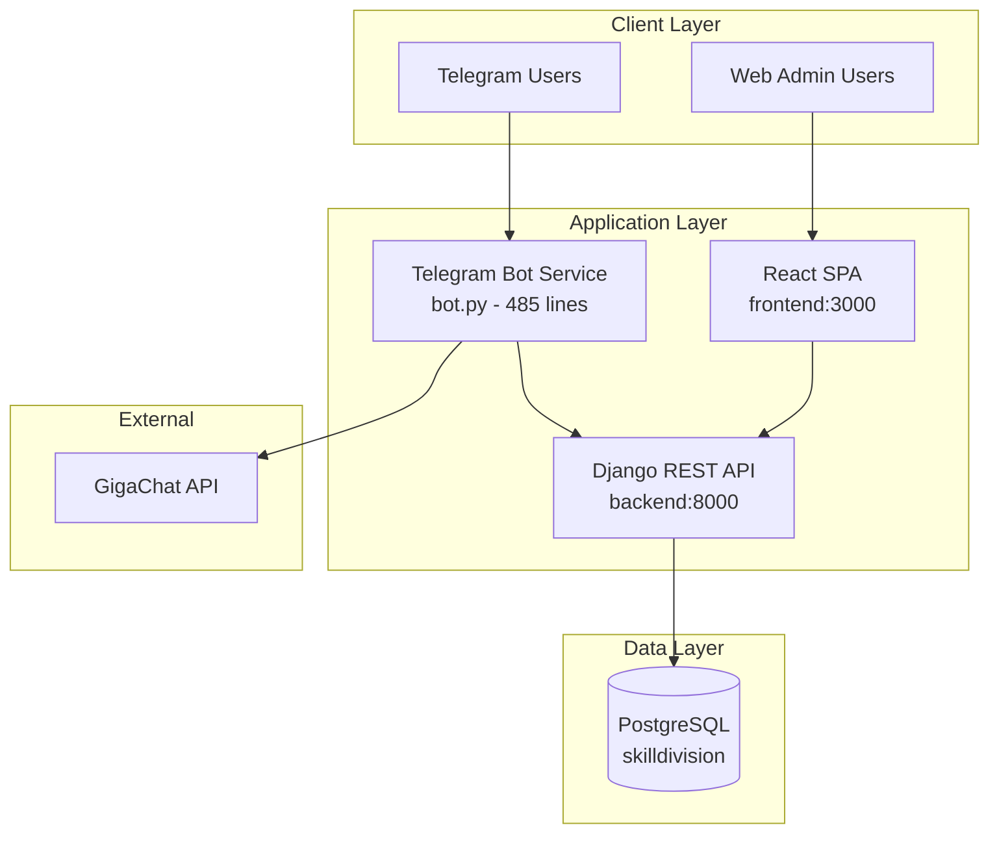
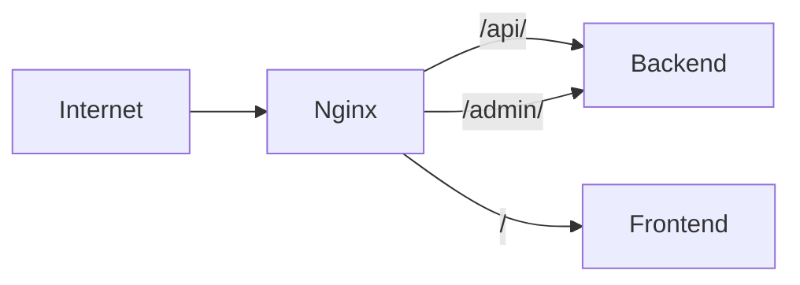
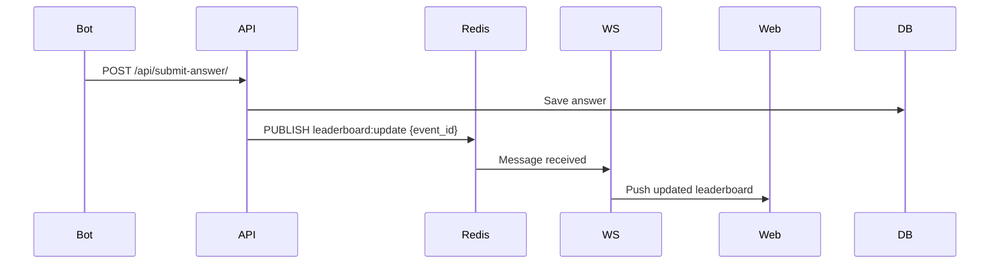
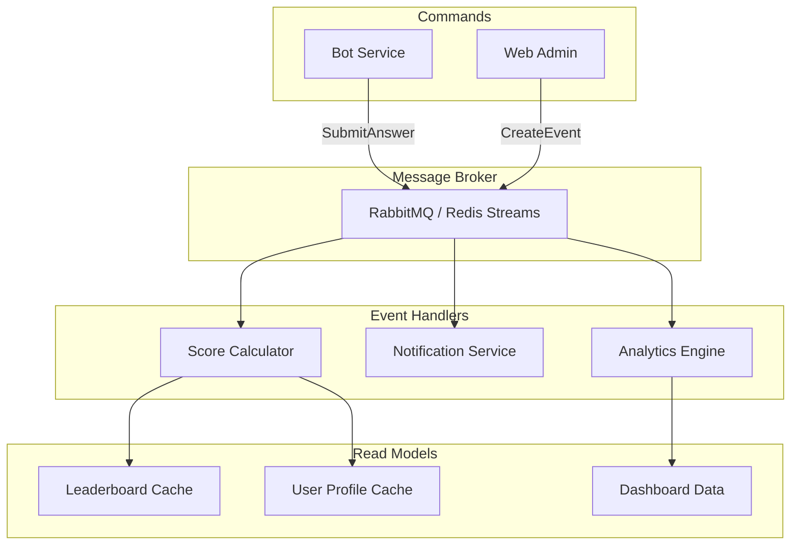

# Skill Division — Architecture & Stack Assessment for MVP Suitability

**Date:** 2026-04-03
**Assessed by:** Senior System Architect
**Scope:** MVP evaluation for IT quiz platform (Telegram bot + Web admin dashboard)

---

## 1. Stack Assessment

| Component            | Current Version             | Suitability (MVP) | Rating | Justification                                                                                                                                                                                                       | Alternatives                                                                                                               |
| -------------------- | --------------------------- | ----------------- | ------ | ------------------------------------------------------------------------------------------------------------------------------------------------------------------------------------------------------------------- | -------------------------------------------------------------------------------------------------------------------------- |
| **Python**           | 3.11.9                      | Excellent         | ✅ 5/5  | LTS support until 2027, mature ecosystem, strong Django compatibility                                                                                                                                               | 3.12 (newer, but less battle-tested with Django 5)                                                                         |
| **Django**           | 5.x (documented 4.2.16 LTS) | Good              | ⚠️ 4/5  | Rapid development, built-in admin, ORM, auth. Version mismatch between docs (4.2.16 LTS) and requirements (`>=5.0`) is a risk. 4.2 LTS has support until April 2026.                                                | FastAPI (better for async, but lacks admin/ORM), Flask (lighter, but more boilerplate)                                     |
| **DRF**              | >=3.14                      | Excellent         | ✅ 5/5  | Mature REST framework, serializers, viewsets, token auth built-in. Perfect fit for Django-based API.                                                                                                                | Django Ninja (faster, Pydantic-based, but less mature ecosystem)                                                           |
| **PostgreSQL**       | 14.12                       | Excellent         | ✅ 5/5  | Reliable, ACID-compliant, JSONB support, mature. Well-suited for quiz data, user profiles, results.                                                                                                                 | SQLite (dev only), MySQL (less feature-rich for JSON)                                                                      |
| **React**            | 18.2.0                      | Good              | ✅ 4/5  | Component-based, large ecosystem, SPA fits admin dashboard well. Overkill for simple CRUD admin, but justified for real-time dashboard with charts.                                                                 | Next.js (SSR, better SEO), HTMX + Django templates (simpler, less JS)                                                      |
| **Vite**             | 5.x                         | Excellent         | ✅ 5/5  | Fast dev server, HMR, modern bundler. Perfect DX for React development.                                                                                                                                             | Webpack (slower, more config), esbuild (less plugin ecosystem)                                                             |
| **TypeScript**       | ~5.8.2                      | Excellent         | ✅ 5/5  | Type safety, better refactoring, catches errors at compile time. Essential for maintainable frontend.                                                                                                               | JavaScript (faster prototyping, but higher bug risk)                                                                       |
| **pyTelegramBotAPI** | 4.22.1                      | Poor              | ❌ 2/5  | **Critical mismatch**: Documented as `python-telegram-bot 20.7` in VERSIONS.md, but actual code uses `pyTelegramBotAPI (telebot)`. This library uses synchronous blocking calls, no async support, harder to scale. | `python-telegram-bot 20.x` (async, official, better architecture), `aiogram 3.x` (async, modern, best for production bots) |
| **GigaChat SDK**     | 0.1.21                      | Acceptable        | ⚠️ 3/5  | Russian LLM integration for AI question generation. Vendor lock-in risk, but acceptable for MVP.                                                                                                                    | OpenAI API, YandexGPT, local LLM (Ollama)                                                                                  |
| **docker-compose**   | 3.9                         | Good              | ⚠️ 3/5  | Good for local dev, but `version` key is deprecated. Missing Nginx reverse proxy, no health checks for backend/bot, no resource limits.                                                                             | Docker Compose v2 (implicit), Kubernetes (overkill for MVP)                                                                |

### Stack Summary

**Overall Stack Rating: 7/10 for MVP**

The stack is well-chosen for rapid MVP development. Django + DRF + PostgreSQL is a proven combination for data-driven APIs. React + TypeScript + Vite provides excellent developer experience. The primary concern is the Telegram bot library mismatch and the lack of production-ready infrastructure (Nginx, Gunicorn, health checks).

---

## 2. Architecture Analysis

### 2.1 Current Architecture Pattern



### 2.2 Service Boundary Assessment

| Service                    | Responsibility                                             | Boundary Clarity | Issues                                                                                                                                                                                                                   |
| -------------------------- | ---------------------------------------------------------- | ---------------- | ------------------------------------------------------------------------------------------------------------------------------------------------------------------------------------------------------------------------ |
| **Backend (Django)**       | REST API, data persistence, auth, admin panel              | ✅ Clear          | All API endpoints use `AllowAny` permissions — no auth enforcement on most endpoints. `DEBUG=True` and `ALLOWED_HOSTS=["*"]` hardcoded.                                                                                  |
| **Bot (pyTelegramBotAPI)** | User interaction, quiz flow, duel matching, AI integration | ❌ Blurred        | **Violates "thin client" pattern** documented in [`1_concept.md`](docs/ru/1_concept.md:312). All game logic, state management, and AI calls are in [`bot.py`](bot/bot.py:1). The `utils/` directory files are all empty. |
| **Frontend (React)**       | Admin dashboard, event management, analytics visualization | ✅ Clear          | Uses `HashRouter` instead of `BrowserRouter` — suggests no server-side routing support. Calls API directly with token auth.                                                                                              |
| **Database (PostgreSQL)**  | Persistent storage                                         | ✅ Clear          | Single database for all services — appropriate for MVP scope.                                                                                                                                                            |

### 2.3 Data Flow Analysis

**Quiz Flow (Single Player):**

```
User → Telegram → Bot → API (get questions) → DB → Bot → User answers → Bot calculates score → API (submit score) → DB
```

**Issues identified:**

1. **Score calculation happens in the bot** ([`bot.py:463`](bot/bot.py:463)) — business logic is split between bot and backend
2. **No idempotency** — if bot crashes mid-quiz, all progress is lost (in-memory `user_data = {}`)
3. **No validation** — bot sends scores to API, but API accepts any value without verifying answers
4. **Race conditions** — `threading.Timer` used for question delays ([`bot.py:465`](bot/bot.py:465)), not thread-safe with mutable global state

**Auth Flow:**

```
Bot → API (bot-auth) → DB (create/find user) → Bot
Web → API (login) → DB (token auth) → Web
```

**Issues identified:**

1. Bot auth has no token — any client can impersonate any user by sending their `tg_id`
2. Web auth uses Token auth (stateless), but no rate limiting on login endpoint
3. No session management or token refresh mechanism

### 2.4 REST API Design Review

| Endpoint                        | Method         | Purpose               | Auth     | Issues                                                         |
| ------------------------------- | -------------- | --------------------- | -------- | -------------------------------------------------------------- |
| `/api/events/`                  | GET/POST       | List/create events    | AllowAny | No pagination, no auth                                         |
| `/api/events/{id}/`             | GET/PUT/DELETE | Event CRUD            | AllowAny | No auth, no validation                                         |
| `/api/events/{id}/questions/`   | GET            | Get quiz questions    | AllowAny | Returns correct_index in response — **security vulnerability** |
| `/api/events/{id}/stats/`       | GET            | Dashboard analytics   | AllowAny | Computed on every request, no caching                          |
| `/api/events/{id}/leaderboard/` | GET            | Leaderboard           | AllowAny | No pagination, no caching                                      |
| `/api/bot-auth/`                | POST           | Bot user registration | None     | No verification, trust-based                                   |
| `/api/submit-score/`            | POST           | Submit quiz results   | None     | No validation, accepts any score                               |
| `/api/login/`                   | POST           | Web user auth         | None     | Token auth, no rate limiting                                   |
| `/api/bot-profile/{tg_id}/`     | GET            | User profile          | None     | Exposes user data without auth                                 |

**Critical API Design Issues:**

1. **`QuestionSerializer` exposes `correct_index`** ([`serializers.py:29`](backend/api/serializers.py:29)) — the `/questions/` endpoint returns the correct answer to any caller. This is a **critical security flaw**.
2. **No pagination** on any endpoint — will fail at scale
3. **No filtering/query parameters** — cannot filter events by date, active status, etc.
4. **No input validation** beyond Django model validation
5. **No API versioning** — breaking changes will break clients

---

## 3. Scalability Bottlenecks (Ranked by Impact)

### Critical (Will Fail at 50+ Concurrent Users)

| #   | Bottleneck                                 | Location                                       | Impact                                                                                                                      | Root Cause                                                                                  |
| --- | ------------------------------------------ | ---------------------------------------------- | --------------------------------------------------------------------------------------------------------------------------- | ------------------------------------------------------------------------------------------- |
| 1   | **In-memory game state**                   | [`bot.py:148-150`](bot/bot.py:148)             | **Data loss on restart** — all active quizzes, duels, and scores are lost if bot restarts. Not shared across bot instances. | `user_data = {}`, `rooms = {}`, `quick_queue = []` are Python dicts/lists in process memory |
| 2   | **Thread-unsafe mutable state**            | [`bot.py:465,478`](bot/bot.py:465)             | Race conditions in duel mode — two players answering simultaneously can corrupt room state.                                 | `threading.Timer` callbacks modify shared dicts without locks                               |
| 3   | **No answer validation on backend**        | [`views.py:173-210`](backend/api/views.py:173) | **Cheating possible** — bot or malicious client can submit any score. Backend trusts the score value blindly.               | `ResultView` accepts `score` from request body without verifying answers                    |
| 4   | **Blocking synchronous HTTP calls in bot** | [`bot.py:30-102`](bot/bot.py:30)               | Bot becomes unresponsive during API calls. One slow request blocks all users.                                               | `requests.get/post` are synchronous and block the bot's polling thread                      |

### High (Will Degrade at 100+ Users)

| #   | Bottleneck                           | Location                                       | Impact                                                                                                     | Root Cause                                                                                                                               |
| --- | ------------------------------------ | ---------------------------------------------- | ---------------------------------------------------------------------------------------------------------- | ---------------------------------------------------------------------------------------------------------------------------------------- |
| 5   | **No caching on stats endpoint**     | [`views.py:100-160`](backend/api/views.py:100) | Dashboard stats perform 6+ database queries per request. At 10 concurrent dashboard users, DB load spikes. | `EventViewSet.stats` aggregates data on every request with no caching layer                                                              |
| 6   | **N+1 query patterns**               | [`views.py:118-126`](backend/api/views.py:118) | Leaderboard fetches user data in a loop. Each result triggers a separate user lookup.                      | No `select_related('user')` on QuizResult queries                                                                                        |
| 7   | **No database indexing**             | [`models.py`](backend/api/models.py)           | Queries on `tg_id`, `event_code`, `user` foreign keys will slow down as data grows.                        | Only `tg_id` and `event_code` have `unique=True` (implicit index). No indexes on `QuizResult.user`, `QuizResult.event`, `Question.event` |
| 8   | **Random question selection in API** | [`views.py:97`](backend/api/views.py:97)       | `random.sample()` loads all questions into memory, then samples. Inefficient for large question banks.     | Questions fetched via ORM, then sampled in Python                                                                                        |

### Medium (Will Limit Growth)

| #   | Bottleneck                | Location     | Impact                                                                                | Root Cause                                         |
| --- | ------------------------- | ------------ | ------------------------------------------------------------------------------------- | -------------------------------------------------- |
| 9   | **No rate limiting**      | Global       | API abuse possible — brute force login, spam score submissions, DOS stats endpoint.   | No `django-ratelimit` or DRF throttling configured |
| 10  | **No connection pooling** | Database     | Each API request opens a new DB connection. Under load, connection exhaustion occurs. | Django's default connection handling, no PgBouncer |
| 11  | **No async support**      | Bot + API    | Bot handles one message at a time. API blocks on I/O.                                 | Synchronous Django + synchronous bot library       |
| 12  | **No message queue**      | Architecture | No way to handle background tasks (AI generation, notifications, exports).            | All processing is synchronous and inline           |

---

## 4. Database Design Review

### 4.1 Schema Analysis

```mermaid
erDiagram
    User ||--o| Profile : has
    User ||--o{ QuizResult : submits
    Event ||--o{ Question : contains
    Event ||--o{ QuizResult : records
    User }|--|| User : created_by

    User {
        int id PK
        string username UK
        string email
        datetime date_joined
    }

    Profile {
        int id PK
        int user_id FK UK
        bigint tg_id UK
        string role
        string avatar
    }

    Event {
        int id PK
        string title
        date date
        string event_code UK
        text description
        bool is_active
        datetime created_at
    }

    Question {
        int id PK
        int event_id FK
        text text
        jsonb options
        int correct_index
        string topic
        string difficulty
    }

    QuizResult {
        int id PK
        int user_id FK
        int event_id FK
        int score
        int max_score
        datetime completed_at
    }
```

### 4.2 Normalization Assessment

| Model          | Normalization | Issues                                                                                                                                                                                                                                              |
| -------------- | ------------- | --------------------------------------------------------------------------------------------------------------------------------------------------------------------------------------------------------------------------------------------------- |
| **Profile**    | 3NF ✅         | Good. One-to-one with User, stores Telegram-specific data.                                                                                                                                                                                          |
| **Event**      | 3NF ✅         | Good. Self-contained event data.                                                                                                                                                                                                                    |
| **Question**   | 2NF ⚠️         | `options` as JSONB is acceptable, but `correct_index` creates a dependency on the JSON structure. If options order changes, correct_index becomes invalid. Consider storing `correct_option` as a separate field or using a `QuestionOption` model. |
| **QuizResult** | 2NF ⚠️         | Missing individual answer records. Cannot audit which questions were answered correctly. Cannot detect cheating. Cannot provide per-question analytics.                                                                                             |

### 4.3 Missing Constraints

| Constraint            | Missing On                            | Impact                                                                         | Recommendation                                                                                |
| --------------------- | ------------------------------------- | ------------------------------------------------------------------------------ | --------------------------------------------------------------------------------------------- |
| **Check constraint**  | `Question.correct_index`              | Can store invalid index (e.g., 5 for 4 options)                                | `CHECK (correct_index >= 0 AND correct_index < jsonb_array_length(options))`                  |
| **Check constraint**  | `QuizResult.score`                    | Can store negative scores or scores exceeding max                              | `CHECK (score >= 0 AND score <= max_score)`                                                   |
| **Check constraint**  | `Event.date`                          | Can create events in the past                                                  | `CHECK (date >= CURRENT_DATE)`                                                                |
| **Unique constraint** | `QuizResult(user, event)`             | User can submit multiple results for same event — leaderboard shows duplicates | Add `UniqueConstraint(fields=['user', 'event'])` or handle in application logic               |
| **NOT NULL**          | `Question.event`                      | Questions can exist without an event (orphaned questions)                      | `null=True, blank=True` is intentional for AI-generated questions, but needs a `pool` concept |
| **Foreign key index** | `QuizResult.user`, `QuizResult.event` | Slow JOINs on leaderboard and stats                                            | Django auto-indexes FKs, but explicit `db_index=True` is clearer                              |

### 4.4 Indexing Strategy

**Current indexes (implicit):**

- `Profile.tg_id` (unique)
- `Event.event_code` (unique)
- All FK fields (Django auto-creates indexes)

**Missing indexes (by priority):**

| Index                           | Columns                  | Query Pattern                     | Priority |
| ------------------------------- | ------------------------ | --------------------------------- | -------- |
| `idx_quizresult_user_score`     | `(user_id, score DESC)`  | User's best scores, profile stats | High     |
| `idx_quizresult_event_score`    | `(event_id, score DESC)` | Leaderboard per event             | High     |
| `idx_quizresult_completed_at`   | `(completed_at DESC)`    | Recent activity feed              | Medium   |
| `idx_question_event_difficulty` | `(event_id, difficulty)` | Filter questions by difficulty    | Medium   |
| `idx_question_topic`            | `(topic)`                | Filter questions by topic         | Low      |
| `idx_event_is_active_date`      | `(is_active, date DESC)` | Find active events                | Low      |

### 4.5 Missing Models

| Model            | Purpose                                   | MVP Priority                                           |
| ---------------- | ----------------------------------------- | ------------------------------------------------------ |
| **UserAnswer**   | Track individual answers per quiz attempt | High — needed for audit, analytics, cheating detection |
| **DuelRoom**     | Persistent duel state                     | Medium — currently in-memory, needed for reliability   |
| **QuizSession**  | Track active quiz attempts                | Medium — needed to resume interrupted quizzes          |
| **Notification** | Queue for bot notifications               | Low — currently inline                                 |

---

## 5. Architectural Recommendations

### 5.1 Immediate Fixes (Pre-Production)

#### R1: Fix Question API Security Vulnerability

**Pattern:** Separate read models for different consumers

```python
# serializers.py
class QuestionSerializer(serializers.ModelSerializer):
    """For admin/internal use — includes correct answer"""
    class Meta:
        model = Question
        fields = ["id", "text", "options", "correct_index", "topic", "difficulty"]

class QuizQuestionSerializer(serializers.ModelSerializer):
    """For quiz participants — excludes correct answer"""
    class Meta:
        model = Question
        fields = ["id", "text", "options", "topic"]  # No correct_index
```

Create a separate endpoint `/api/events/{id}/quiz/` that uses `QuizQuestionSerializer`.

#### R2: Move Game State to Persistent Storage

**Pattern:** State Machine with Redis-backed state

```
Current: user_data = {}  (in-memory, lost on restart)
Target:  Redis hash per user session
```

**Implementation:**

- Add Redis to docker-compose
- Use `redis-py` to store session state: `HSET quiz:session:{tg_id} mode score index event_id`
- Set TTL of 30 minutes on session keys
- On bot restart, sessions survive

#### R3: Add Answer Validation on Backend

**Pattern:** Server-side validation with idempotent score submission

```python
# New endpoint: POST /api/events/{id}/submit-answer/
class SubmitAnswerView(views.APIView):
    def post(self, request, event_id):
        question_id = request.data.get('question_id')
        answer_index = request.data.get('answer_index')

        question = Question.objects.get(id=question_id, event_id=event_id)
        is_correct = answer_index == question.correct_index

        # Atomically update or create session
        session, _ = QuizSession.objects.get_or_create(
            user=request.user, event_id=event_id,
            defaults={'score': 0, 'current_question': 0}
        )

        if is_correct:
            session.score += 5

        UserAnswer.objects.create(
            session=session, question=question,
            answer=answer_index, is_correct=is_correct
        )

        return Response({'correct': is_correct, 'score': session.score})
```

#### R4: Add Authentication to API Endpoints

**Pattern:** Role-based permissions with DRF

```python
# settings.py
REST_FRAMEWORK = {
    'DEFAULT_PERMISSION_CLASSES': [
        'rest_framework.permissions.IsAuthenticated',
    ],
    'DEFAULT_AUTHENTICATION_CLASSES': [
        'rest_framework.authentication.TokenAuthentication',
    ],
    'DEFAULT_THROTTLE_CLASSES': [
        'rest_framework.throttling.AnonRateThrottle',
        'rest_framework.throttling.UserRateThrottle',
    ],
    'DEFAULT_THROTTLE_RATES': {
        'anon': '100/day',
        'user': '1000/day',
    },
}

# views.py
class EventViewSet(viewsets.ModelViewSet):
    permission_classes = [IsAuthenticated]

    @action(detail=True, methods=['get'])
    def questions(self, request, pk=None):
        # Only return questions for authenticated users
        ...
```

### 5.2 Medium-Term Improvements (Post-MVP)

#### R5: Replace Bot Library with Async Alternative

**Pattern:** Async event-driven bot

| Current                             | Target                                  |
| ----------------------------------- | --------------------------------------- |
| `pyTelegramBotAPI` (sync, blocking) | `aiogram 3.x` (async, middleware-based) |
| `threading.Timer` for delays        | `asyncio.sleep()`                       |
| Global mutable state                | Redis-backed FSM (aiogram built-in)     |
| Inline handlers                     | Separate handler modules                |

**Why aiogram over python-telegram-bot:**

- Native async/await support
- Built-in FSM (Finite State Machine) for multi-step conversations
- Middleware pipeline (auth, rate limiting, logging)
- Better error handling and recovery

#### R6: Add Nginx Reverse Proxy

**Pattern:** API Gateway



```nginx
# nginx.conf
upstream backend {
    server backend:8000;
}

upstream frontend {
    server frontend:3000;
}

server {
    listen 80;
    server_name skilldivision.example.com;

    # API requests
    location /api/ {
        proxy_pass http://backend;
        proxy_set_header Host $host;
        proxy_set_header X-Real-IP $remote_addr;
        proxy_set_header X-Forwarded-For $proxy_add_x_forwarded_for;

        # Rate limiting
        limit_req zone=api burst=20 nodelay;
    }

    # Admin panel
    location /admin/ {
        proxy_pass http://backend;
        # Add IP whitelist for admin
    }

    # Frontend SPA
    location / {
        proxy_pass http://frontend;
        proxy_http_version 1.1;
        proxy_set_header Upgrade $http_upgrade;
        proxy_set_header Connection 'upgrade';
    }

    # Static files
    location /static/ {
        alias /app/static/;
        expires 30d;
    }
}
```

#### R7: Add Real-Time Leaderboard with WebSockets

**Pattern:** WebSocket push for live updates



**Implementation options:**

- **Django Channels** — native Django WebSocket support, integrates with existing auth
- **Server-Sent Events (SSE)** — simpler, one-way push, sufficient for leaderboard
- **Redis Pub/Sub + polling fallback** — simplest, but less real-time

**Recommendation:** Start with SSE (simpler to implement), upgrade to Django Channels if bidirectional communication is needed later.

#### R8: Add Caching Layer

**Pattern:** Cache-aside with Redis

| Data                 | Cache Strategy              | TTL        |
| -------------------- | --------------------------- | ---------- |
| Event stats          | Cache-aside                 | 60 seconds |
| Leaderboard          | Cache-aside                 | 30 seconds |
| Active event         | Cache-aside                 | 5 minutes  |
| User profile         | Cache-aside                 | 5 minutes  |
| Questions (for quiz) | No cache (random selection) | N/A        |

```python
# views.py
from django.core.cache import cache

class EventViewSet(viewsets.ModelViewSet):
    @action(detail=True, methods=['get'])
    def stats(self, request, pk=None):
        cache_key = f'event_stats_{pk}'
        data = cache.get(cache_key)

        if not data:
            # ... compute stats ...
            cache.set(cache_key, data, timeout=60)

        return Response(data)
```

### 5.3 Long-Term Architecture (Scale Beyond MVP)

#### R9: Event-Driven Architecture with Message Queue

**Pattern:** CQRS with event sourcing for quiz results



#### R10: Separate Quiz Engine as Microservice

When quiz complexity grows (timed questions, multiple game modes, anti-cheating), extract the quiz engine:

```
Current:  Bot handles quiz flow + state + scoring
Target:   Quiz Engine Service (stateless) + Bot (thin client) + Redis (state)
```

```
POST /quiz/start     → Returns session_id, first question
POST /quiz/answer    → Returns correct?, new score, next question
POST /quiz/end       → Returns final score, saves to DB
GET  /quiz/session   → Resume interrupted quiz
```

### 5.4 Django vs FastAPI vs Flask Assessment

| Criteria              | Django + DRF (Current)                            | FastAPI                         | Flask                                |
| --------------------- | ------------------------------------------------- | ------------------------------- | ------------------------------------ |
| **Development Speed** | ⭐⭐⭐⭐⭐ Built-in admin, ORM, auth                   | ⭐⭐⭐ Need to assemble components | ⭐⭐ Most boilerplate                  |
| **Admin Panel**       | ⭐⭐⭐⭐⭐ Free, production-ready                      | ⭐ Need third-party              | ⭐ Need third-party                   |
| **Async Support**     | ⭐⭐ (Django 4.2+ has async views, but ORM is sync) | ⭐⭐⭐⭐⭐ Native async              | ⭐⭐⭐ (with Quart or async extensions) |
| **Performance**       | ⭐⭐⭐ (good enough for MVP)                         | ⭐⭐⭐⭐⭐ (Starlette-based)         | ⭐⭐⭐                                  |
| **Type Safety**       | ⭐⭐⭐ (DRF serializers)                             | ⭐⭐⭐⭐⭐ (Pydantic)                | ⭐⭐                                   |
| **Ecosystem**         | ⭐⭐⭐⭐⭐ Mature, 15+ years                           | ⭐⭐⭐⭐ Growing fast               | ⭐⭐⭐⭐ Mature                          |
| **Learning Curve**    | ⭐⭐⭐ (Django conventions)                          | ⭐⭐⭐⭐ (async concepts)           | ⭐⭐⭐⭐⭐ (simple)                       |
| **MVP Suitability**   | ✅ **Best choice**                                 | ⚠️ Good, but more setup          | ⚠️ Too much boilerplate               |

**Verdict:** Django + DRF is the **right choice for this MVP**. The built-in admin panel alone saves weeks of development. The async limitation is not critical for MVP scope (100 concurrent users max). Consider FastAPI only when:

- You need WebSocket support natively
- You're building a high-throughput API (>1000 req/s)
- Your team prefers Pydantic over DRF serializers

### 5.5 React SPA vs SSR Assessment

| Criteria                | React SPA (Current)           | Next.js (SSR)                      | Django Templates + HTMX |
| ----------------------- | ----------------------------- | ---------------------------------- | ----------------------- |
| **Development Speed**   | ⭐⭐⭐⭐                          | ⭐⭐⭐                                | ⭐⭐⭐⭐⭐                   |
| **SEO**                 | ⭐⭐ (HashRouter)               | ⭐⭐⭐⭐⭐                              | ⭐⭐⭐⭐⭐                   |
| **Real-time Updates**   | ⭐⭐⭐⭐ (polling/WebSocket)      | ⭐⭐⭐⭐                               | ⭐⭐⭐                     |
| **Complexity**          | ⭐⭐⭐ (separate deploy)         | ⭐⭐⭐⭐                               | ⭐⭐ (single deploy)      |
| **Admin Dashboard Fit** | ⭐⭐⭐⭐⭐ (charts, interactivity) | ⭐⭐⭐⭐                               | ⭐⭐⭐                     |
| **Team Skills**         | Depends on team               | Requires React + Next.js knowledge | Python-only             |

**Verdict:** React SPA is **appropriate for an admin dashboard** with charts and real-time data. The current use of `HashRouter` suggests no server-side routing — this is fine for an internal admin tool but should be upgraded to `BrowserRouter` with proper server configuration when going to production.

Consider Django Templates + HTMX if:

- The dashboard is simple (tables, forms, basic charts)
- You want to reduce deployment complexity
- Your team is more comfortable with Python than TypeScript

---

## 6. Docker Compose Production Readiness Gaps

| Gap                        | Current State       | Required for Production                  | Priority |
| -------------------------- | ------------------- | ---------------------------------------- | -------- |
| **Nginx reverse proxy**    | Missing             | Required for routing, SSL, rate limiting | Critical |
| **Gunicorn**               | Using `runserver`   | Required for production WSGI             | Critical |
| **Health checks**          | Only for DB         | Needed for all services                  | High     |
| **Resource limits**        | None                | Prevent resource exhaustion              | High     |
| **Secrets management**     | `.env` file         | Use Docker secrets or vault              | High     |
| **Database port exposure** | `5432:5432` exposed | Remove port mapping, internal only       | Critical |
| **pgAdmin exposure**       | `5050:80` exposed   | Remove or add auth/IP whitelist          | Critical |
| **Static files**           | No collection       | `python manage.py collectstatic` + Nginx | High     |
| **Database migrations**    | Manual              | Auto-run on startup or init container    | High     |
| **Logging**                | Console only        | Structured logging, log aggregation      | Medium   |
| **Backup strategy**        | None                | Automated DB backups                     | High     |
| **SSL/TLS**                | None                | Let's Encrypt via Nginx                  | Critical |

---

## 7. Summary & Prioritized Action Plan

### Phase 1: Critical Fixes (Before Any Production Use)

1. **Fix Question API security vulnerability** — remove `correct_index` from public endpoint
2. **Add authentication to API endpoints** — enforce `IsAuthenticated` on all non-public endpoints
3. **Add answer validation on backend** — move score calculation from bot to server
4. **Replace `runserver` with Gunicorn** — production WSGI server
5. **Add Nginx reverse proxy** — routing, SSL, rate limiting
6. **Remove database and pgAdmin port exposure** — internal network only
7. **Set `DEBUG = False`** — use environment variable

### Phase 2: Reliability Improvements (Pre-Launch)

1. **Add Redis for session state** — replace in-memory `user_data`, `rooms`
2. **Add database indexes** — on foreign keys and frequently queried fields
3. **Add rate limiting** — DRF throttling on all endpoints
4. **Add caching** — on stats and leaderboard endpoints
5. **Add health checks** — for all services in docker-compose
6. **Fix version mismatches** — align VERSIONS.md with actual requirements.txt

### Phase 3: Architecture Improvements (Post-MVP)

1. **Migrate bot to aiogram 3.x** — async, built-in FSM
2. **Add UserAnswer model** — audit trail, analytics, cheating detection
3. **Add WebSocket/SSE for real-time leaderboard** — push updates to dashboard
4. **Add message queue** — for background tasks (AI generation, notifications)
5. **Implement proper CI/CD** — automated testing, staging deployment

---

*This assessment is based on the current codebase state as of 2026-04-03. The project demonstrates solid foundational architecture for an MVP but requires critical security and reliability fixes before production deployment.*
