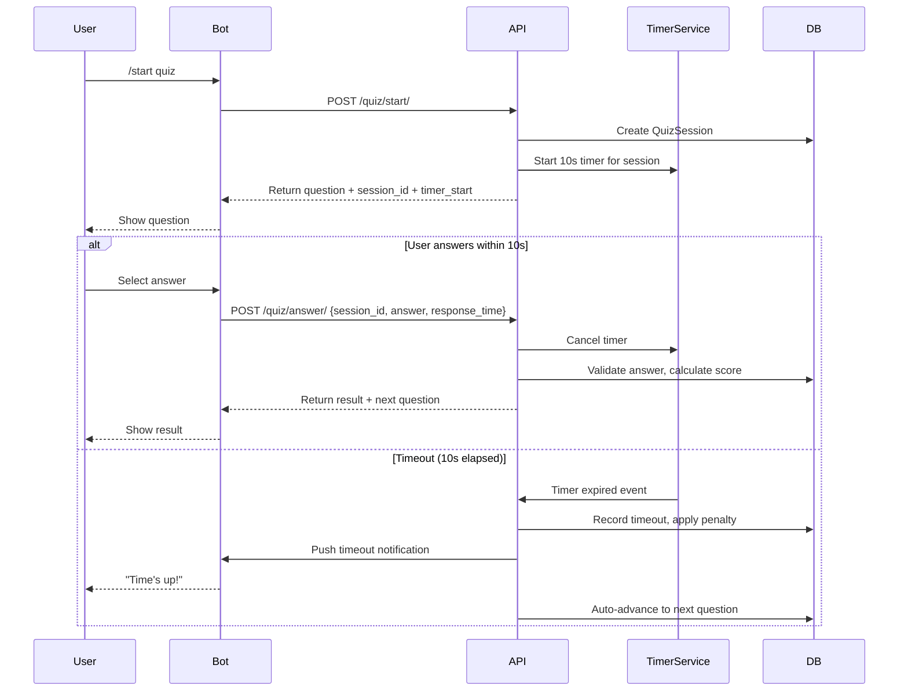
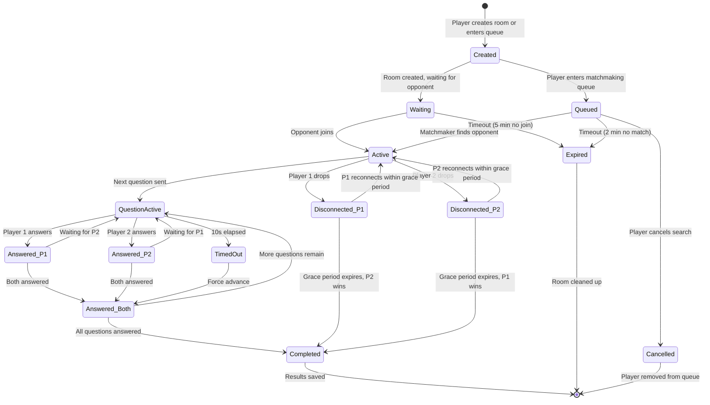
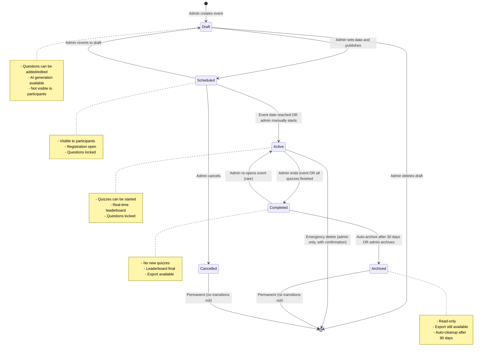
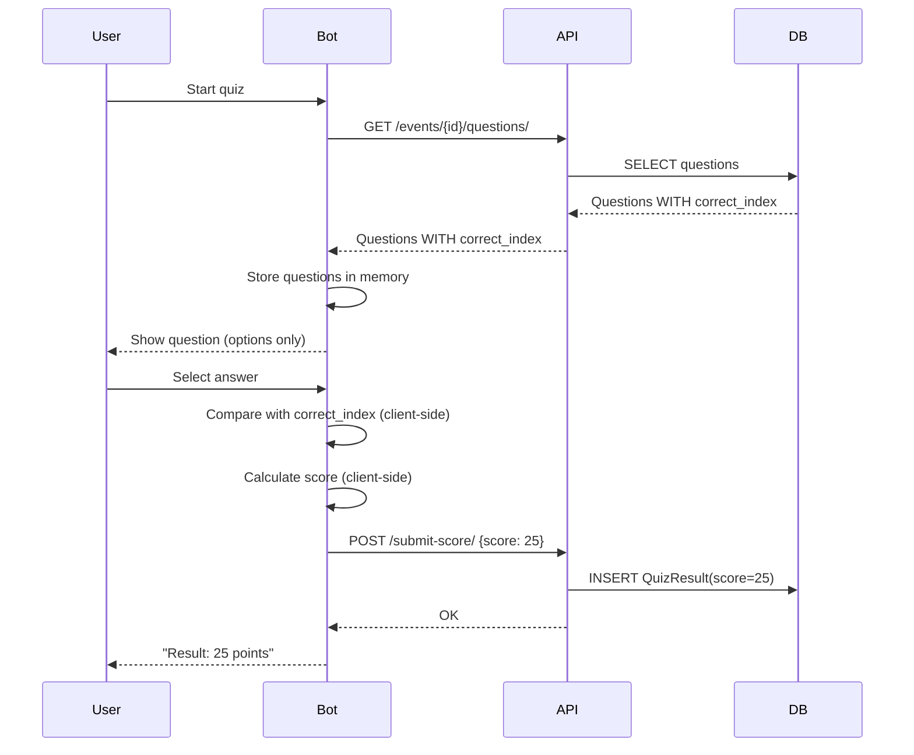
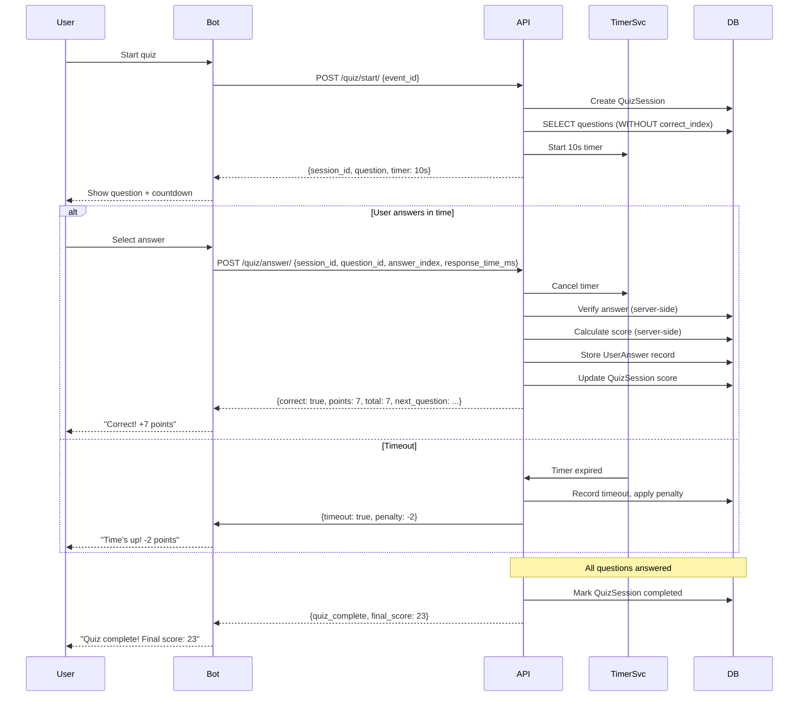

# Skill Division — Business Logic & Functional Requirements Analysis

**Date:** 2026-04-03  
**Analyzed by:** Senior Business Analyst & Systems Architect  
**Scope:** Deep analysis of business logic, functional requirements, contradictions, and gaps  
**Sources:** [`bot/bot.py`](bot/bot.py), [`backend/api/views.py`](backend/api/views.py), [`backend/api/models.py`](backend/api/models.py), [`backend/api/serializers.py`](backend/api/serializers.py), [`frontend/pages/EventDetails.tsx`](frontend/pages/EventDetails.tsx), [`docs/ru/1_concept.md`](docs/ru/1_concept.md), [`docs/ru/2_structure.md`](docs/ru/2_structure.md)

---

## 1. Scoring Formula Analysis

### 1.1 Documented Formula

Per [`1_concept.md:250`](docs/ru/1_concept.md:250):

```
Rating = (Correct Answers × Question Difficulty) + Speed Bonus
```

This implies a weighted formula where:

- Each correct answer is multiplied by a difficulty coefficient (e.g., easy=1, medium=2, hard=3)
- A speed bonus is added based on response time (faster = more bonus)
- Maximum theoretical score varies per quiz based on question difficulty mix

### 1.2 Actual Implementation

**Bot-side scoring** ([`bot.py:462-463`](bot/bot.py:462)):

```python
if choice == q["correct"]:
    udata["score"] += 5
```

**Duel scoring** ([`bot.py:473-474`](bot/bot.py:473)):

```python
if choice == q["correct"]:
    room["scores"][chat_id] += 5
```

**Backend acceptance** ([`views.py:173-210`](backend/api/views.py:173)):

```python
QuizResult.objects.create(
    user=user, event=event, score=score, max_score=max_score
)
```

### 1.3 Contradiction Matrix

| Aspect                   | Documented                           | Implemented                                     | Gap                                             |
| ------------------------ | ------------------------------------ | ----------------------------------------------- | ----------------------------------------------- |
| **Base scoring**         | `Correct × Difficulty`               | Flat `+5` per correct                           | Difficulty multiplier is completely ignored     |
| **Speed bonus**          | Explicit component of formula        | Not implemented                                 | No timer tracking, no response time measurement |
| **Wrong answer penalty** | Not documented                       | Not implemented (score simply doesn't increase) | No penalty for incorrect answers                |
| **Timeout penalty**      | Not documented                       | Not implemented                                 | Timer exists but timeout doesn't penalize       |
| **Max score**            | Variable (depends on difficulty mix) | Fixed: `5 × number_of_questions`                | Predictable, no skill differentiation           |
| **Server validation**    | Implied (server should verify)       | None — server trusts any score value            | Critical security gap                           |

### 1.4 Edge Cases in Current Implementation

| Edge Case                                               | Current Behavior                       | Expected Behavior                           |
| ------------------------------------------------------- | -------------------------------------- | ------------------------------------------- |
| User submits score directly to API (bypassing bot)      | Accepted without validation            | Server should verify against actual answers |
| Bot sends duplicate score for same quiz                 | Creates duplicate `QuizResult` records | Idempotent submission or deduplication      |
| Score is negative or exceeds maximum                    | Accepted as-is                         | Rejected with validation error              |
| User answers after timer expires (bot restart mid-quiz) | Answer accepted (no server-side timer) | Should be rejected or flagged               |
| Duel: both players answer simultaneously                | `room["answers"]` counter may race     | Atomic increment with lock                  |
| AI quiz with no event_id                                | Score sent with `event_id=None`        | Backend may fail or create orphaned record  |

### 1.5 Recommended Scoring Formula

**Server-authoritative formula:**

```
Score = Σ (correct_i × difficulty_weight_i + speed_bonus_i) - penalty_count × penalty_value
```

**Parameters:**

| Parameter                  | Value                 | Configurable    |
| -------------------------- | --------------------- | --------------- |
| `difficulty_weight.easy`   | 1                     | Yes (per event) |
| `difficulty_weight.medium` | 2                     | Yes (per event) |
| `difficulty_weight.hard`   | 3                     | Yes (per event) |
| `speed_bonus.base`         | 5 points              | Yes (per event) |
| `speed_bonus.decay_rate`   | 0.5 points/second     | Yes (per event) |
| `speed_bonus.min`          | 0 (no negative bonus) | Yes             |
| `penalty.wrong_answer`     | -1                    | Yes (per event) |
| `penalty.timeout`          | -2                    | Yes (per event) |

**Server-side validation pattern:**

```python
# POST /api/events/{id}/submit-answer/
class SubmitAnswerView(views.APIView):
    def post(self, request, event_id):
        session_id = request.data.get('session_id')
        question_id = request.data.get('question_id')
        answer_index = request.data.get('answer_index')
        response_time_ms = request.data.get('response_time_ms')
        
        # 1. Validate session exists and is active
        session = QuizSession.objects.select_related('event').get(id=session_id)
        if session.status != 'active':
            return Response({'error': 'Session not active'}, status=400)
        
        # 2. Validate question belongs to session
        question = Question.objects.get(id=question_id)
        if question not in session.questions:
            return Response({'error': 'Question not in session'}, status=400)
        
        # 3. Check for duplicate answer
        if UserAnswer.objects.filter(session=session, question=question).exists():
            return Response({'error': 'Already answered'}, status=409)
        
        # 4. Server-side answer verification
        is_correct = answer_index == question.correct_index
        
        # 5. Calculate score server-side
        difficulty_weights = {'easy': 1, 'medium': 2, 'hard': 3}
        base_score = difficulty_weights[question.difficulty] if is_correct else 0
        
        # Speed bonus: max 5 points, decays at 0.5/sec
        response_time_sec = response_time_ms / 1000
        speed_bonus = max(0, 5 - (0.5 * response_time_sec)) if is_correct else 0
        
        # Penalty for wrong/timeout
        penalty = -1 if not is_correct else 0
        
        total = base_score + speed_bonus + penalty
        
        # 6. Atomic score update
        UserAnswer.objects.create(
            session=session, question=question,
            answer=answer_index, is_correct=is_correct,
            response_time_ms=response_time_ms,
            points_earned=total
        )
        session.score += total
        session.save(update_fields=['score'])
        
        return Response({
            'correct': is_correct,
            'points_earned': total,
            'total_score': session.score
        })
```

---

## 2. Timer Mechanics Analysis

### 2.1 Current Implementation

**Single-player timer** ([`bot.py:465`](bot/bot.py:465)):

```python
threading.Timer(0.5, ask_question, args=[chat_id]).start()
```

**Duel timer** ([`bot.py:478-479`](bot/bot.py:478)):

```python
threading.Timer(0.5, ask_duel_question, args=[udata["room_id"]]).start()
```

**Key observation:** There is NO 10-second countdown timer implemented. The `threading.Timer(0.5, ...)` is a 0.5-second delay between questions, not a question timeout. The documented "10-second timer per question" does not exist in the codebase.

### 2.2 Race Conditions Identified

| Race Condition                           | Location                           | Trigger                                                                 | Impact                                                                    |
| ---------------------------------------- | ---------------------------------- | ----------------------------------------------------------------------- | ------------------------------------------------------------------------- |
| **Concurrent answer in duel**            | [`bot.py:475-476`](bot/bot.py:475) | Both players answer within same millisecond                             | `room["answers"]` counter may skip from 0 to 2, or one answer may be lost |
| **Thread interleaving on user_data**     | [`bot.py:461-465`](bot/bot.py:461) | User answers while timer callback fires                                 | `udata["index"]` may increment twice, skipping a question                 |
| **Room state mutation during iteration** | [`bot.py:426-427`](bot/bot.py:426) | Player disconnects while `ask_duel_question` iterates `room["players"]` | `RuntimeError: dictionary changed size during iteration`                  |
| **Timer callback after game end**        | [`bot.py:465`](bot/bot.py:465)     | User ends game, but timer fires 0.5s later                              | `ask_question` called with stale `chat_id`, may create ghost game state   |
| **No debounce on answer submission**     | [`bot.py:447-479`](bot/bot.py:447) | User double-taps answer button                                          | Callback fires twice, score incremented twice                             |

### 2.3 Missing Timer Functionality

| Requirement                   | Documented              | Implemented | Gap                                    |
| ----------------------------- | ----------------------- | ----------- | -------------------------------------- |
| 10-second question timeout    | Yes (per task context)  | No          | Timer does not exist                   |
| Timeout penalty               | Implied by formula      | No          | No penalty logic                       |
| Server-side timer enforcement | Implied by architecture | No          | All timing is client-side              |
| Visual countdown to user      | Expected UX             | No          | No countdown message sent              |
| Auto-advance on timeout       | Expected behavior       | No          | Questions wait indefinitely for answer |

### 2.4 Server-Authoritative Timer Pattern

**Architecture:**



**Implementation approach (Django + Celery):**

```python
# models.py
class QuizSession(models.Model):
    STATUS_CHOICES = [
        ('active', 'Active'),
        ('paused', 'Paused'),
        ('completed', 'Completed'),
        ('expired', 'Expired'),
    ]
    user = models.ForeignKey(User, on_delete=models.CASCADE)
    event = models.ForeignKey(Event, on_delete=models.CASCADE)
    status = models.CharField(max_length=20, choices=STATUS_CHOICES, default='active')
    score = models.IntegerField(default=0)
    current_question_index = models.IntegerField(default=0)
    question_started_at = models.DateTimeField(null=True)
    timer_expires_at = models.DateTimeField(null=True)
    created_at = models.DateTimeField(auto_now_add=True)

# views.py
class StartQuizView(views.APIView):
    def post(self, request, event_id):
        event = Event.objects.get(id=event_id)
        questions = list(event.questions.all())
        selected = random.sample(questions, k=min(len(questions), 10))
        
        session = QuizSession.objects.create(
            user=request.user, event=event,
            status='active', score=0,
            current_question_index=0
        )
        session.questions.set(selected)
        
        # Start first question timer
        self._start_question_timer(session, selected[0])
        
        return Response({
            'session_id': session.id,
            'question': serialize_question_for_quiz(selected[0]),
            'timer_seconds': 10,
            'total_questions': len(selected)
        })
    
    def _start_question_timer(self, session, question):
        from .tasks import expire_question_timer
        expires_at = timezone.now() + timedelta(seconds=10)
        session.timer_expires_at = expires_at
        session.save(update_fields=['timer_expires_at'])
        
        # Schedule Celery task
        expire_question_timer.apply_async(
            args=[session.id],
            eta=expires_at,
            task_id=f'timer_{session.id}_q{session.current_question_index}'
        )

# tasks.py
from celery import shared_task

@shared_task(bind=True, max_retries=0)
def expire_question_timer(self, session_id):
    session = QuizSession.objects.select_related().get(id=session_id)
    if session.status != 'active':
        return  # Session already ended
    
    # Record timeout
    UserAnswer.objects.create(
        session=session,
        question=session.questions.get(id=session.current_question_index),
        answer=None, is_correct=False,
        timed_out=True, points_earned=-2
    )
    session.score -= 2
    session.save(update_fields=['score'])
    
    # Advance to next question or end quiz
    session.current_question_index += 1
    if session.current_question_index >= session.questions.count():
        session.status = 'completed'
        session.save()
    else:
        session.save(update_fields=['current_question_index'])
        # Start next timer
        # ...
```

---

## 3. Lobby & Matchmaking Analysis

### 3.1 Current Implementation

**Room storage** ([`bot.py:149-150`](bot/bot.py:149)):

```python
rooms = {}
quick_queue = []
```

**Room creation** ([`bot.py:263-270`](bot/bot.py:263)):

```python
elif text == "Создать комнату":
    code = "".join(random.choices(string.digits, k=4))
    rooms[code] = {"players": [chat_id], "waiting": True}
```

**Room joining** ([`bot.py:383-390`](bot/bot.py:383)):

```python
def join_room(m):
    code = m.text.strip()
    if code in rooms and rooms[code]["waiting"]:
        p1 = rooms[code]["players"][0]
        del rooms[code]
        start_duel(p1, m.chat.id)
```

**Quick matchmaking** ([`bot.py:276-284`](bot/bot.py:276)):

```python
elif text == "⚡ Быстрый поиск":
    if chat_id in quick_queue:
        bot.send_message(chat_id, "Ты уже в очереди.")
    elif quick_queue:
        opponent = quick_queue.pop(0)
        start_duel(opponent, chat_id)
    else:
        quick_queue.append(chat_id)
        bot.send_message(chat_id, "Поиск соперника... ⏳")
```

### 3.2 Missing Edge Cases

| Edge Case                                | Current Behavior                                                      | Expected Behavior                                |
| ---------------------------------------- | --------------------------------------------------------------------- | ------------------------------------------------ |
| **Duplicate room code**                  | `random.choices` can generate existing code, overwrites existing room | Validate uniqueness before creation              |
| **Room timeout (abandoned room)**        | Room stays in memory forever                                          | Auto-expire after N minutes of inactivity        |
| **Player disconnects during duel**       | No detection, duel hangs indefinitely                                 | Detect disconnect, award win to remaining player |
| **Player leaves queue**                  | No way to cancel queue entry                                          | Add "cancel search" button                       |
| **Simultaneous queue entry**             | `chat_id in quick_queue` check is not atomic                          | Two identical entries possible                   |
| **Player in active game tries to queue** | No check, creates conflicting state                                   | Reject with "already in game" message            |
| **Room code case sensitivity**           | Codes are digits only (4 chars = 10,000 combinations)                 | Consider alphanumeric for larger space           |
| **Reconnection after disconnect**        | No reconnection mechanism                                             | Allow rejoin within grace period                 |
| **Duel state after bot restart**         | All rooms lost                                                        | Persist rooms to database/Redis                  |
| **Player joins own room**                | No validation                                                         | Reject self-join                                 |
| **Third player tries to join full room** | No check, may corrupt state                                           | Reject with "room full" message                  |

### 3.3 Proposed Duel State Machine



### 3.4 Proposed Duel Room Model

```python
class DuelRoom(models.Model):
    STATUS_CHOICES = [
        ('waiting', 'Waiting for opponent'),
        ('active', 'Duel in progress'),
        ('completed', 'Duel finished'),
        ('expired', 'Timed out'),
        ('cancelled', 'Cancelled'),
    ]
    
    code = models.CharField(max_length=6, unique=True)
    player1 = models.ForeignKey(User, related_name='duels_p1', on_delete=models.CASCADE)
    player2 = models.ForeignKey(User, related_name='duels_p2', on_delete=models.CASCADE, null=True, blank=True)
    status = models.CharField(max_length=20, choices=STATUS_CHOICES, default='waiting')
    event = models.ForeignKey(Event, on_delete=models.CASCADE)
    score_p1 = models.IntegerField(default=0)
    score_p2 = models.IntegerField(default=0)
    current_question = models.IntegerField(default=0)
    answers_received = models.IntegerField(default=0)
    created_at = models.DateTimeField(auto_now_add=True)
    expires_at = models.DateTimeField(null=True)
    completed_at = models.DateTimeField(null=True)
    
    class Meta:
        indexes = [
            models.Index(fields=['code']),
            models.Index(fields=['status', 'expires_at']),
        ]


class MatchmakingQueue(models.Model):
    user = models.ForeignKey(User, on_delete=models.CASCADE)
    event = models.ForeignKey(Event, on_delete=models.CASCADE)
    joined_at = models.DateTimeField(auto_now_add=True)
    expires_at = models.DateTimeField()
    
    class Meta:
        unique_together = ['user', 'event']  # Prevent duplicate entries
        indexes = [
            models.Index(fields=['event', 'expires_at']),
        ]
```

---

## 4. Role & Access Control Analysis

### 4.1 Current Role Model

**Model definition** ([`models.py:8-17`](backend/api/models.py:8)):

```python
ROLES = (
    ("participant", "Участник"),
    ("admin", "Администратор"),
    ("hr", "HR"),
)
role = models.CharField(max_length=20, choices=ROLES, default="participant")
```

### 4.2 Security Gaps

| Gap                                       | Location                                                        | Severity | Description                                                                                                               |
| ----------------------------------------- | --------------------------------------------------------------- | -------- | ------------------------------------------------------------------------------------------------------------------------- |
| **All endpoints use AllowAny**            | [`settings.py:104-107`](backend/skill_division/settings.py:104) | Critical | No authentication required on ANY endpoint. Any unauthenticated user can create events, view leaderboards, submit scores. |
| **Auto-admin on web login**               | [`views.py:227-229`](backend/api/views.py:227)                  | Critical | Any user who authenticates via web login gets `role="admin"` by default. This is an automatic privilege escalation.       |
| **No role-based view enforcement**        | All views                                                       | Critical | No view checks `request.user.profile.role`. A participant can access admin-only endpoints.                                |
| **Bot auth has no token**                 | [`views.py:20-52`](backend/api/views.py:20)                     | High     | Bot sends `tg_id` in plain text. Any client can impersonate any user by sending their `tg_id`.                            |
| **Profile endpoint unauthenticated**      | [`views.py:55-85`](backend/api/views.py:55)                     | High     | `/bot-profile/{tg_id}/` exposes user data to anyone who knows the `tg_id`.                                                |
| **No permission classes on EventViewSet** | [`views.py:88-170`](backend/api/views.py:88)                    | High     | Anyone can POST to `/api/events/` to create events.                                                                       |
| **No role distinction in documentation**  | [`1_concept.md:149`](docs/ru/1_concept.md:149)                  | Medium   | Documentation says "User can have only one role" but doesn't define what each role can/cannot do.                         |
| **No audit trail for role changes**       | N/A                                                             | Medium   | No logging of who changed a user's role or when.                                                                          |

### 4.3 Documented vs Actual Role Permissions

| Permission                | Participant | Admin |  HR   | Documented | Enforced |
| ------------------------- | :---------: | :---: | :---: | :--------: | :------: |
| Play quiz                 |     Yes     |  Yes  |  Yes  |    Yes     |   Yes    |
| View leaderboard          |     Yes     |  Yes  |  Yes  |    Yes     |   Yes    |
| View event info           |     Yes     |  Yes  |  Yes  |    Yes     |   Yes    |
| Create event              |     No      |  Yes  |  No   |    Yes     |    No    |
| Edit event                |     No      |  Yes  |  No   |    Yes     |    No    |
| View dashboard stats      |     No      |  Yes  |  Yes  |    Yes     |    No    |
| Export CSV                |     No      |  Yes  |  Yes  |    Yes     |    No    |
| Mass messaging            |     No      |  Yes  |  No   |    Yes     |    No    |
| View participant contacts |     No      |  Yes  |  Yes  |    Yes     |    No    |
| Manage users              |     No      |  Yes  |  No   |  Implied   |    No    |
| AI question generation    |     No      |  Yes  |  No   |    Yes     |    No    |

### 4.4 Proposed RBAC Implementation

**Permission matrix:**

| Permission Codename         | Participant |   Admin   |  HR   |
| --------------------------- | :---------: | :-------: | :---: |
| `api.view_event`            |     Yes     |    Yes    |  Yes  |
| `api.add_event`             |     No      |    Yes    |  No   |
| `api.change_event`          |     No      |    Yes    |  No   |
| `api.delete_event`          |     No      |    Yes    |  No   |
| `api.view_stats`            |     No      |    Yes    |  Yes  |
| `api.export_csv`            |     No      |    Yes    |  Yes  |
| `api.view_leaderboard`      |     Yes     |    Yes    |  Yes  |
| `api.submit_score`          |  Yes (own)  | Yes (any) |  No   |
| `api.view_contacts`         |     No      |    Yes    |  Yes  |
| `api.send_broadcast`        |     No      |    Yes    |  No   |
| `api.manage_users`          |     No      |    Yes    |  No   |
| `api.generate_ai_questions` |     No      |    Yes    |  No   |

**Implementation:**

```python
# permissions.py
from rest_framework import permissions

class IsAdmin(permissions.BasePermission):
    def has_permission(self, request, view):
        return hasattr(request.user, 'profile') and request.user.profile.role == 'admin'

class IsHR(permissions.BasePermission):
    def has_permission(self, request, view):
        return hasattr(request.user, 'profile') and request.user.profile.role in ['hr', 'admin']

class IsAdminOrHR(permissions.BasePermission):
    def has_permission(self, request, view):
        return hasattr(request.user, 'profile') and request.user.profile.role in ['admin', 'hr']

class IsParticipant(permissions.BasePermission):
    def has_permission(self, request, view):
        return hasattr(request.user, 'profile') and request.user.profile.role == 'participant'

# views.py
class EventViewSet(viewsets.ModelViewSet):
    permission_classes = [permissions.IsAuthenticated]
    
    def get_permissions(self):
        if self.action in ['create', 'update', 'partial_update', 'destroy']:
            return [IsAdmin()]
        if self.action == 'stats':
            return [IsAdminOrHR()]
        return [permissions.IsAuthenticated()]
    
    @action(detail=True, methods=['get'])
    def stats(self, request, pk=None):
        # Only admin and HR can view stats
        ...

# Fix auto-admin escalation
class CustomAuthToken(ObtainAuthToken):
    def post(self, request, *args, **kwargs):
        serializer = self.serializer_class(
            data=request.data, context={"request": request}
        )
        serializer.is_valid(raise_exception=True)
        user = serializer.validated_data["user"]
        token, created = Token.objects.get_or_create(user=user)
        
        # DO NOT auto-create admin profile
        # Profile should be pre-provisioned by an admin
        try:
            profile = user.profile
        except Profile.DoesNotExist:
            return Response(
                {"error": "No profile assigned. Contact administrator."},
                status=403
            )
        
        return Response({
            "token": token.key,
            "user_id": user.pk,
            "username": user.username,
            "email": user.email,
            "role": profile.role,
        })
```

---

## 5. Data Export Analysis

### 5.1 Documented Requirements

From [`1_concept.md:164`](docs/ru/1_concept.md:164):
> "Экспортируют данные об участниках в CSV для дальнейшей работы"

From [`1_concept.md:202`](docs/ru/1_concept.md:202):
> "Экспортировать данных об участниках (отчеты, профили) в CSV-формат"

From [`1_concept.md:243`](docs/ru/1_concept.md:243):
> "Формирование отчёта по компетенциям (Excel/CSV)"

From [`1_concept.md:253`](docs/ru/1_concept.md:253):
> "Экспорт всех данных в CSV с метками (уровень, навыки, контакты)"

### 5.2 Current Implementation

**Frontend** ([`EventDetails.tsx:93`](frontend/pages/EventDetails.tsx:93)):

```tsx
<Button variant="secondary" onClick={() => alert("Функция экспорта в CSV будет доступна в полной версии")}>
    <Download className="w-4 h-4 mr-2" /> Скачать отчет
</Button>
```

**Frontend** ([`EventDetails.tsx:210`](frontend/pages/EventDetails.tsx:210)):

```tsx
<Button size="lg" onClick={() => alert("Скачивание началось...")}>
    Скачать CSV файл
</Button>
```

**Backend:** No endpoint exists for CSV export.

### 5.3 Gap Analysis

| Requirement                    | Documented                 | Implemented | Gap          |
| ------------------------------ | -------------------------- | ----------- | ------------ |
| Export participant data to CSV | Yes                        | No          | Complete gap |
| Export includes skill labels   | Yes (Junior/Middle/Senior) | No          | N/A          |
| Export includes contact info   | Yes                        | No          | N/A          |
| Export per event               | Implied                    | No          | N/A          |
| Excel format option            | Mentioned                  | No          | N/A          |
| HR-only access                 | Implied by role            | No          | N/A          |
| Consent-based export           | Documented requirement     | No          | N/A          |

### 5.4 Proposed Backend Implementation

```python
# views.py
import csv
from django.http import HttpResponse
from rest_framework.decorators import action

class EventViewSet(viewsets.ModelViewSet):
    @action(detail=True, methods=['get'], permission_classes=[IsAdminOrHR])
    def export_csv(self, request, pk=None):
        event = self.get_object()
        results = QuizResult.objects.filter(event=event).select_related('user', 'user__profile')
        
        response = HttpResponse(content_type='text/csv')
        response['Content-Disposition'] = f'attachment; filename="event_{event.id}_report.csv"'
        
        writer = csv.writer(response)
        writer.writerow([
            'Username', 'Telegram ID', 'Role', 'Score', 'Max Score',
            'Skill Level', 'Completed At', 'Consent Given'
        ])
        
        for result in results:
            profile = getattr(result.user, 'profile', None)
            skill_level = self._calculate_skill_level(result.score)
            writer.writerow([
                result.user.username,
                profile.tg_id if profile else '',
                profile.role if profile else '',
                result.score,
                result.max_score,
                skill_level,
                result.completed_at.strftime('%Y-%m-%d %H:%M:%S'),
                'Yes' if getattr(profile, 'data_consent', False) else 'No'
            ])
        
        return response
    
    def _calculate_skill_level(self, score):
        if score <= 10:
            return 'Junior'
        elif score <= 20:
            return 'Middle'
        else:
            return 'Senior'
```

**URL registration:**

```python
# urls.py - auto-registered by DRF router as /api/events/{id}/export_csv/
```

**Frontend integration:**

```tsx
// EventDetails.tsx
const handleExportCSV = async () => {
  const response = await fetch(`/api/events/${id}/export_csv/`, {
    headers: { 'Authorization': `Token ${token}` }
  });
  const blob = await response.blob();
  const url = window.URL.createObjectURL(blob);
  const a = document.createElement('a');
  a.href = url;
  a.download = `event_${id}_report.csv`;
  a.click();
};
```

---

## 6. Logical Contradictions & Missing Scenarios

### 6.1 Contradiction Table

| #   | Contradiction                | Documented                                                                                      | Actual                                              | Impact                                            | Resolution                                              |
| --- | ---------------------------- | ----------------------------------------------------------------------------------------------- | --------------------------------------------------- | ------------------------------------------------- | ------------------------------------------------------- |
| C1  | **Scoring formula**          | `(Correct × Difficulty) + Speed Bonus`                                                          | Flat +5 per correct                                 | No difficulty differentiation, no speed incentive | Implement server-side formula with configurable weights |
| C2  | **10-second timer**          | Documented as core mechanic                                                                     | No timer exists (only 0.5s delay between questions) | Questions wait indefinitely, no time pressure     | Implement server-authoritative 10s timer with Celery    |
| C3  | **Thin client architecture** | "Business logic on server" ([`1_concept.md:312`](docs/ru/1_concept.md:312))                     | All game logic in bot.py                            | Bot is thick client, server is passive data store | Move quiz flow, scoring, timer to backend               |
| C4  | **Role-based access**        | Three roles with distinct permissions ([`1_concept.md:149`](docs/ru/1_concept.md:149))          | All endpoints AllowAny, auto-admin on login         | No access control, privilege escalation           | Implement RBAC with permission classes                  |
| C5  | **Data consent**             | "Participants must consent to data processing" ([`1_concept.md:187`](docs/ru/1_concept.md:187)) | No consent mechanism                                | GDPR violation risk                               | Add `data_consent` field to Profile, require opt-in     |
| C6  | **Mass messaging**           | "Mass and personal notifications via Telegram" ([`1_concept.md:246`](docs/ru/1_concept.md:246)) | Not implemented                                     | HR cannot contact participants                    | Add broadcast endpoint + Celery task                    |
| C7  | **AI question generation**   | Listed as in-scope ([`1_concept.md:106`](docs/ru/1_concept.md:106))                             | Implemented but uses hardcoded fallback             | AI may not be used                                | Add AI toggle per event, track usage                    |
| C8  | **User has one role**        | "User can have only one role" ([`1_concept.md:149`](docs/ru/1_concept.md:149))                  | Model enforces this, but no view checks it          | Role is stored but meaningless                    | Enforce role in all views                               |
| C9  | **Real-time monitoring**     | "Dashboard with real-time activity" ([`1_concept.md:194`](docs/ru/1_concept.md:194))            | Polling-based, no WebSocket                         | Dashboard is stale between polls                  | Add SSE or WebSocket push                               |
| C10 | **Event code uniqueness**    | `event_code` is unique ([`models.py:27`](backend/api/models.py:27))                             | No validation on generation                         | Admin may create duplicate codes                  | Auto-generate codes or validate on save                 |

### 6.2 Missing Scenarios Table

| #   | Scenario                                       | Current Behavior                       | Expected Behavior                               | Priority |
| --- | ---------------------------------------------- | -------------------------------------- | ----------------------------------------------- | -------- |
| M1  | User answers during timer expiry (race)        | No timer, so always accepted           | Server rejects if response_time > 10s           | Critical |
| M2  | Both duel participants answer simultaneously   | Counter may skip or double-count       | Atomic increment with database lock             | Critical |
| M3  | User disconnects mid-duel                      | Duel hangs forever                     | Detect disconnect, award win after grace period | High     |
| M4  | Bot restarts during active quiz                | All progress lost                      | Resume from Redis/database session              | High     |
| M5  | User submits score directly to API (cheating)  | Accepted without validation            | Server verifies against answer records          | Critical |
| M6  | Duplicate score submission for same quiz       | Creates duplicate QuizResult           | Idempotent: return existing result              | High     |
| M7  | User joins queue while already in game         | Creates conflicting state              | Reject with "already in game"                   | Medium   |
| M8  | Room code collision                            | Overwrites existing room               | Validate uniqueness, retry                      | Medium   |
| M9  | Admin creates event in the past                | Accepted                               | Reject or warn                                  | Low      |
| M10 | Question has wrong correct_index (data error)  | Bot shows wrong answer as correct      | Validate on question creation                   | Medium   |
| M11 | User answers same question twice               | Score incremented twice                | Idempotent answer submission                    | Critical |
| M12 | Event has no questions                         | Bot shows fallback hardcoded questions | Warn admin, block quiz start                    | Medium   |
| M13 | HR exports data without participant consent    | No consent check                       | Exclude non-consenting users or flag            | High     |
| M14 | Two users queue simultaneously for matchmaking | Race condition on `quick_queue.pop(0)` | Atomic dequeue with database lock               | High     |
| M15 | Admin deletes event with active quizzes        | Cascading delete, data lost            | Soft delete or block if active                  | Medium   |

---

## 7. Event Lifecycle Proposal

### 7.1 Current State

**Event model** ([`models.py:24-33`](backend/api/models.py:24)):

```python
class Event(models.Model):
    title = models.CharField(max_length=200)
    date = models.DateField()
    event_code = models.CharField(max_length=10, unique=True)
    description = models.TextField(blank=True)
    is_active = models.BooleanField(default=True)
    created_at = models.DateTimeField(auto_now_add=True)
```

**Current lifecycle:** Binary `is_active` flag only. No distinction between:

- Event being prepared (draft)
- Event currently running (active)
- Event finished but data viewable (completed)
- Event archived (read-only)

### 7.2 Proposed State Machine



### 7.3 Proposed Model Changes

```python
class Event(models.Model):
    STATUS_CHOICES = [
        ('draft', 'Draft'),
        ('scheduled', 'Scheduled'),
        ('active', 'Active'),
        ('completed', 'Completed'),
        ('archived', 'Archived'),
        ('cancelled', 'Cancelled'),
    ]
    
    title = models.CharField(max_length=200)
    date = models.DateField()
    event_code = models.CharField(max_length=10, unique=True)
    description = models.TextField(blank=True)
    status = models.CharField(max_length=20, choices=STATUS_CHOICES, default='draft')
    is_active = models.BooleanField(default=False)  # Deprecated, kept for migration
    created_at = models.DateTimeField(auto_now_add=True)
    published_at = models.DateTimeField(null=True, blank=True)
    started_at = models.DateTimeField(null=True, blank=True)
    completed_at = models.DateTimeField(null=True, blank=True)
    archived_at = models.DateTimeField(null=True, blank=True)
    
    class Meta:
        indexes = [
            models.Index(fields=['status', 'date']),
        ]
    
    def can_transition(self, target_status):
        transitions = {
            'draft': ['scheduled', None],  # None = delete
            'scheduled': ['active', 'draft', 'cancelled'],
            'active': ['completed'],
            'completed': ['archived', 'active'],
            'archived': [],
            'cancelled': [],
        }
        return target_status in transitions.get(self.status, [])
    
    def transition_to(self, target_status, user=None):
        if not self.can_transition(target_status):
            raise ValueError(f"Cannot transition from {self.status} to {target_status}")
        
        now = timezone.now()
        if target_status == 'scheduled':
            self.published_at = now
        elif target_status == 'active':
            self.started_at = now
        elif target_status == 'completed':
            self.completed_at = now
        elif target_status == 'archived':
            self.archived_at = now
        
        self.status = target_status
        self.save()
        
        # Log transition
        EventTransitionLog.objects.create(
            event=self, from_status=self.status,
            to_status=target_status, user=user
        )


class EventTransitionLog(models.Model):
    event = models.ForeignKey(Event, on_delete=models.CASCADE)
    from_status = models.CharField(max_length=20)
    to_status = models.CharField(max_length=20)
    user = models.ForeignKey(User, on_delete=models.SET_NULL, null=True)
    timestamp = models.DateTimeField(auto_now_add=True)
```

### 7.4 State Transition API

```python
class EventViewSet(viewsets.ModelViewSet):
    @action(detail=True, methods=['post'], permission_classes=[IsAdmin])
    def transition(self, request, pk=None):
        event = self.get_object()
        target_status = request.data.get('status')
        
        if target_status not in dict(Event.STATUS_CHOICES):
            return Response({'error': 'Invalid status'}, status=400)
        
        try:
            event.transition_to(target_status, user=request.user)
        except ValueError as e:
            return Response({'error': str(e)}, status=400)
        
        return Response({'status': event.status, 'message': f'Event {target_status}'})
```

---

## 8. Answer Validation Flow

### 8.1 Current Flow (Vulnerable)



**Vulnerabilities:**

1. Correct answer exposed to bot (and potentially intercepted)
2. Score calculated client-side (trivially cheatable)
3. No answer record stored (no audit trail)
4. No idempotency (duplicate submissions)
5. No timer enforcement

### 8.2 Proposed Flow (Server-Authoritative)



### 8.3 Server-Side Verification Pattern

```python
# models.py
class QuizSession(models.Model):
    user = models.ForeignKey(User, on_delete=models.CASCADE)
    event = models.ForeignKey(Event, on_delete=models.CASCADE)
    status = models.CharField(max_length=20, choices=[
        ('active', 'Active'),
        ('completed', 'Completed'),
        ('abandoned', 'Abandoned'),
    ], default='active')
    score = models.IntegerField(default=0)
    current_question_index = models.IntegerField(default=0)
    questions = models.ManyToManyField(Question, through='SessionQuestion')
    started_at = models.DateTimeField(auto_now_add=True)
    completed_at = models.DateTimeField(null=True)
    
    class Meta:
        constraints = [
            # One active session per user per event
            models.UniqueConstraint(
                fields=['user', 'event', 'status'],
                condition=models.Q(status='active'),
                name='unique_active_session'
            )
        ]


class SessionQuestion(models.Model):
    session = models.ForeignKey(QuizSession, on_delete=models.CASCADE)
    question = models.ForeignKey(Question, on_delete=models.CASCADE)
    order = models.IntegerField()
    
    class Meta:
        unique_together = ['session', 'question']
        ordering = ['order']


class UserAnswer(models.Model):
    session = models.ForeignKey(QuizSession, on_delete=models.CASCADE)
    question = models.ForeignKey(Question, on_delete=models.CASCADE)
    answer_index = models.IntegerField(null=True)  # Null if timed out
    is_correct = models.BooleanField()
    timed_out = models.BooleanField(default=False)
    response_time_ms = models.IntegerField(null=True)
    points_earned = models.IntegerField(default=0)
    answered_at = models.DateTimeField(auto_now_add=True)
    
    class Meta:
        unique_together = ['session', 'question']  # Idempotency constraint
        ordering = ['answered_at']
```

**Answer submission endpoint:**

```python
class SubmitAnswerView(views.APIView):
    permission_classes = [permissions.IsAuthenticated]
    
    def post(self, request):
        session_id = request.data.get('session_id')
        question_id = request.data.get('question_id')
        answer_index = request.data.get('answer_index')
        response_time_ms = request.data.get('response_time_ms')
        
        # 1. Validate session
        try:
            session = QuizSession.objects.select_related('event').get(
                id=session_id, user=request.user, status='active'
            )
        except QuizSession.DoesNotExist:
            return Response({'error': 'Invalid or expired session'}, status=404)
        
        # 2. Validate question belongs to session
        try:
            sq = SessionQuestion.objects.get(
                session=session, question_id=question_id,
                order=session.current_question_index
            )
        except SessionQuestion.DoesNotExist:
            return Response({'error': 'Invalid question'}, status=400)
        
        # 3. Check idempotency (already answered)
        if UserAnswer.objects.filter(session=session, question_id=question_id).exists():
            existing = UserAnswer.objects.get(session=session, question_id=question_id)
            return Response({
                'duplicate': True,
                'correct': existing.is_correct,
                'points_earned': existing.points_earned,
                'total_score': session.score
            }, status=200)
        
        # 4. Validate timer (server-side check)
        if response_time_ms and response_time_ms > 10000:
            # Answer arrived after timeout — treat as timeout
            return self._handle_timeout(session, sq.question)
        
        # 5. Verify answer (server-side, never exposed to client)
        question = sq.question
        is_correct = answer_index == question.correct_index
        
        # 6. Calculate score
        points = self._calculate_points(question, is_correct, response_time_ms)
        
        # 7. Atomic update
        with transaction.atomic():
            UserAnswer.objects.create(
                session=session, question=question,
                answer_index=answer_index, is_correct=is_correct,
                response_time_ms=response_time_ms, points_earned=points
            )
            session.score += points
            session.current_question_index += 1
            session.save(update_fields=['score', 'current_question_index'])
        
        # 8. Check if quiz is complete
        if session.current_question_index >= session.questions.count():
            session.status = 'completed'
            session.completed_at = timezone.now()
            session.save(update_fields=['status', 'completed_at'])
            
            # Create QuizResult record
            QuizResult.objects.create(
                user=session.user, event=session.event,
                score=session.score, max_score=self._max_possible_score(session)
            )
            
            return Response({
                'correct': is_correct,
                'points_earned': points,
                'total_score': session.score,
                'quiz_complete': True,
                'final_score': session.score
            })
        
        # 9. Return next question
        next_sq = SessionQuestion.objects.filter(
            session=session, order=session.current_question_index
        ).first()
        
        if next_sq:
            # Start timer for next question
            self._start_question_timer(session, next_sq.question)
            
            return Response({
                'correct': is_correct,
                'points_earned': points,
                'total_score': session.score,
                'quiz_complete': False,
                'next_question': serialize_question_for_quiz(next_sq.question),
                'timer_seconds': 10
            })
        
        return Response({'error': 'No next question'}, status=500)
    
    def _calculate_points(self, question, is_correct, response_time_ms):
        if not is_correct:
            return -1  # Penalty for wrong answer
        
        difficulty_weights = {'easy': 1, 'medium': 2, 'hard': 3}
        base = difficulty_weights.get(question.difficulty, 2)
        
        # Speed bonus: max 5, decays 0.5/sec
        if response_time_ms:
            seconds = response_time_ms / 1000
            speed_bonus = max(0, 5 - (0.5 * seconds))
        else:
            speed_bonus = 0
        
        return base + speed_bonus
```

---

## 9. Summary of Critical Issues

| Priority | Issue                              | Risk                             | Effort | Recommendation                |
| -------- | ---------------------------------- | -------------------------------- | ------ | ----------------------------- |
| P0       | No server-side answer validation   | Cheating trivial                 | Medium | Move all scoring to backend   |
| P0       | All endpoints use AllowAny         | Data breach, unauthorized access | Low    | Add authentication + RBAC     |
| P0       | Auto-admin on web login            | Privilege escalation             | Low    | Remove auto-provisioning      |
| P0       | Correct answer exposed in API      | Answers visible to anyone        | Low    | Separate serializers          |
| P1       | No timer enforcement               | No time pressure, cheating       | Medium | Server-side timer with Celery |
| P1       | In-memory game state               | Data loss on restart             | Medium | Redis-backed sessions         |
| P1       | No idempotency on score submission | Duplicate records                | Low    | Unique constraints + checks   |
| P1       | No data consent mechanism          | GDPR violation                   | Low    | Add consent field             |
| P2       | No CSV export                      | Missing documented feature       | Low    | Implement export endpoint     |
| P2       | No event lifecycle management      | Cannot manage event states       | Medium | Implement state machine       |
| P2       | No duel disconnect handling        | Hung duels                       | Medium | Add timeout + reconnection    |
| P3       | No mass messaging                  | Missing documented feature       | Medium | Add broadcast endpoint        |

---

*This analysis is based on the codebase state as of 2026-04-03. All findings are derived from direct code inspection and documentation comparison.*
