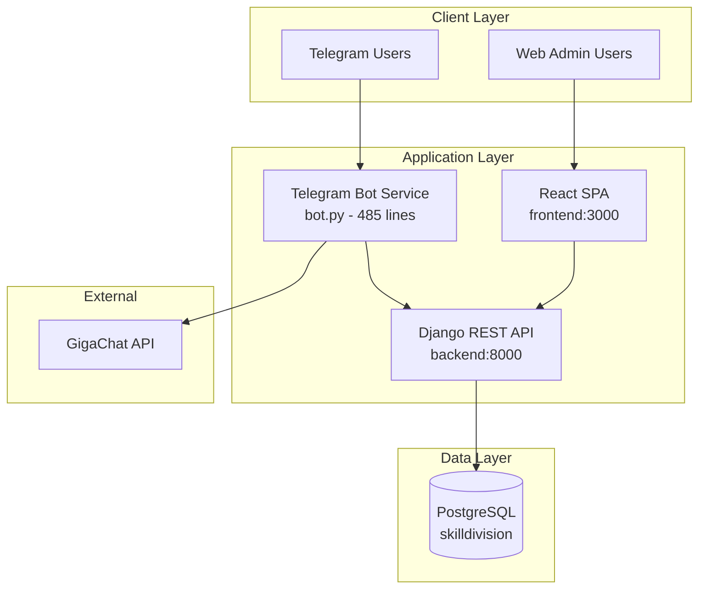
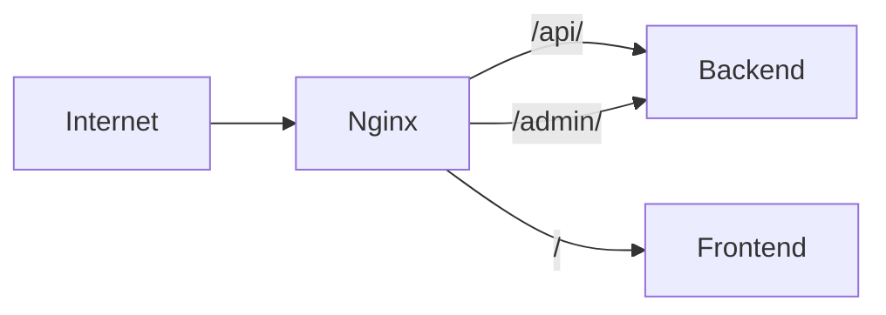
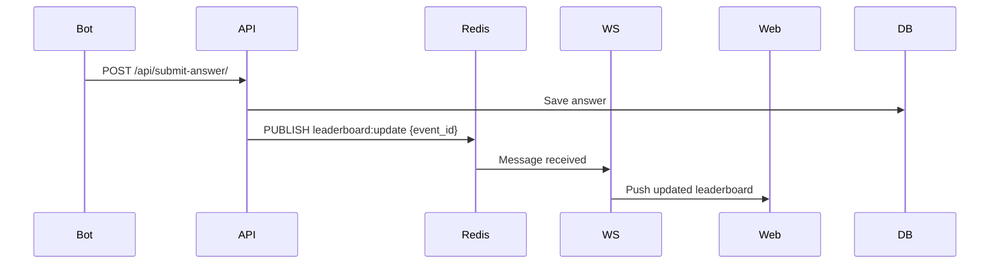
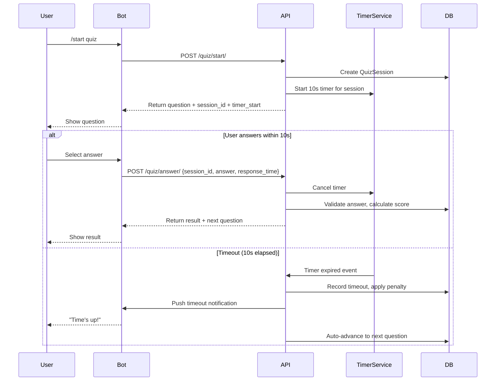
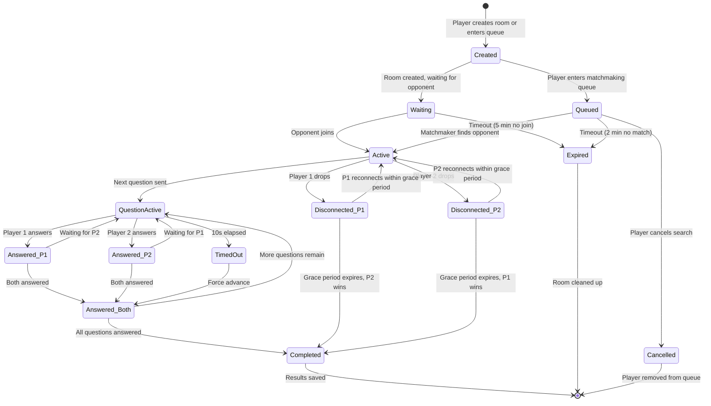
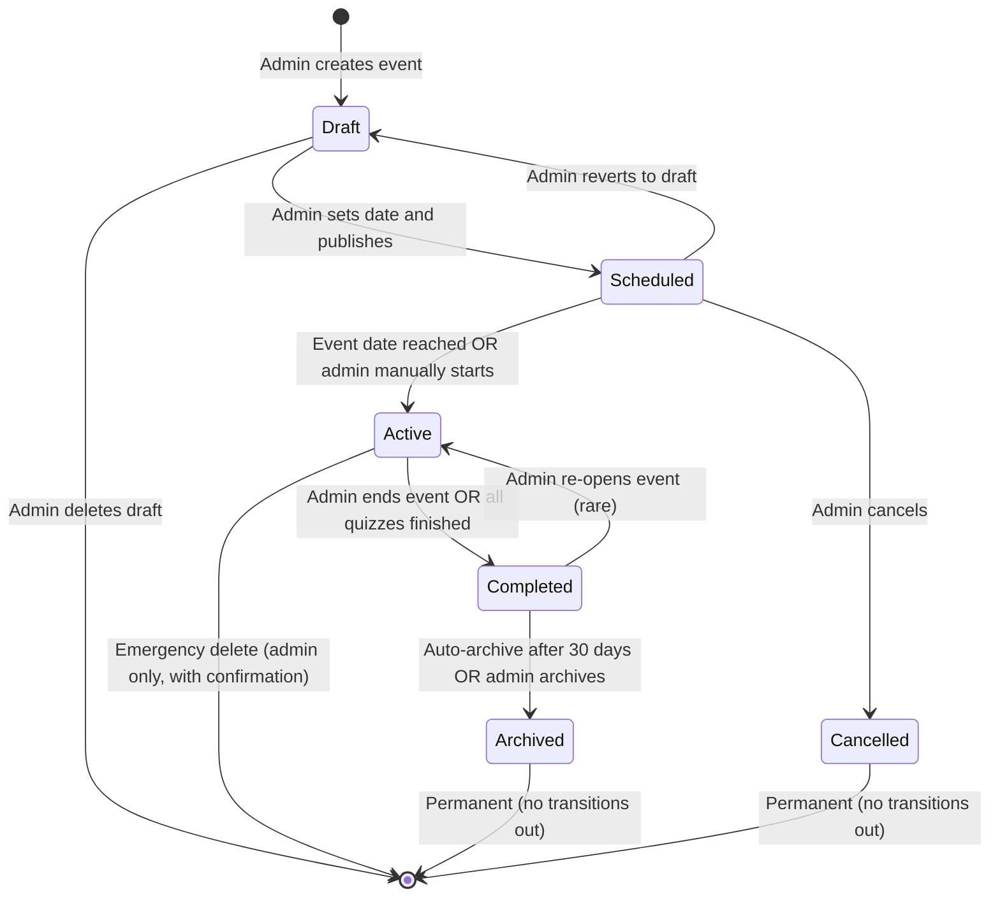

# Skill Division — Comprehensive Technical Audit Report

**Date:** 2026-04-03
**Prepared by:** Senior Technical Audit Team
**Audience:** Engineering Team, Stakeholders, Product Owners
**Team Size:** 4 developers (Backend, Frontend, Bot, DevOps)
**Sprint Cadence:** 2-week sprints
**Source Reports:** Architecture Assessment, Business Logic Analysis, Security & Infrastructure Review, Team Organization & CI/CD Assessment, Prioritized Action Plan

---

## Table of Contents

- [Executive Summary](#executive-summary)
- [1. Stack & Architecture Assessment](#1-stack--architecture-assessment)
  - [1.1 Technology Stack Evaluation](#11-technology-stack-evaluation)
  - [1.2 Architecture Analysis](#12-architecture-analysis)
  - [1.3 Scalability Bottlenecks](#13-scalability-bottlenecks)
  - [1.4 Architectural Recommendations](#14-architectural-recommendations)
- [2. Business Logic & Functional Requirements](#2-business-logic--functional-requirements)
  - [2.1 Scoring Formula Analysis](#21-scoring-formula-analysis)
  - [2.2 Timer Mechanics](#22-timer-mechanics)
  - [2.3 Lobby & Matchmaking](#23-lobby--matchmaking)
  - [2.4 Role & Access Control](#24-role--access-control)
  - [2.5 Data Export & Event Lifecycle](#25-data-export--event-lifecycle)
  - [2.6 Logical Contradictions & Missing Scenarios](#26-logical-contradictions--missing-scenarios)
- [3. Security & Infrastructure Review](#3-security--infrastructure-review)
  - [3.1 Critical Vulnerabilities](#31-critical-vulnerabilities)
  - [3.2 Docker Compose Security](#32-docker-compose-security)
  - [3.3 Django Settings Security](#33-django-settings-security)
  - [3.4 API Security](#34-api-security)
  - [3.5 Frontend & Bot Security](#35-frontend--bot-security)
  - [3.6 Secrets Management](#36-secrets-management)
  - [3.7 Nginx Configuration](#37-nginx-configuration)
  - [3.8 Container Security Hardening](#38-container-security-hardening)
- [4. Team Organization & CI/CD](#4-team-organization--cicd)
  - [4.1 Team Responsibility Matrix](#41-team-responsibility-matrix)
  - [4.2 CI/CD Pipeline Design](#42-cicd-pipeline-design)
  - [4.3 Testing Strategy](#43-testing-strategy)
  - [4.4 Branching Strategy & Release Management](#44-branching-strategy--release-management)
  - [4.5 Documentation Workflow](#45-documentation-workflow)
- [5. Prioritized Action Plan & Roadmap](#5-prioritized-action-plan--roadmap)
  - [5.1 Quick Wins (<1 day, high impact)](#51-quick-wins-1-day-high-impact)
  - [5.2 Technical Debt Register](#52-technical-debt-register)
  - [5.3 Phase 1: Critical Fixes (P0)](#53-phase-1-critical-fixes-p0)
  - [5.4 Phase 2: MVP Readiness (P1)](#54-phase-2-mvp-readiness-p1)
  - [5.5 Phase 3: Quality & Reliability (P2)](#55-phase-3-quality--reliability-p2)
  - [5.6 Phase 4: Post-MVP Enhancements (P3)](#56-phase-4-post-mvp-enhancements-p3)
  - [5.7 Sprint-by-Sprint Roadmap](#57-sprint-by-sprint-roadmap)
  - [5.8 Monitoring & Logging Strategy](#58-monitoring--logging-strategy)
  - [5.9 Scaling Roadmap (100 → 1000 → 10000 users)](#59-scaling-roadmap-100--1000--10000-users)
  - [5.10 Risk Register](#510-risk-register)
- [Appendix A: Configuration Examples](#appendix-a-configuration-examples)
- [Appendix B: Code Fixes](#appendix-b-code-fixes)
- [Appendix C: Database Schema Proposals](#appendix-c-database-schema-proposals)

---

## Executive Summary

### Project Overview

Skill Division is an IT quiz platform designed for corporate skill assessment. The platform consists of three main components:

1. **Telegram Bot** — Primary user interface for quiz participation (single-player and duel modes), AI-powered question generation via GigaChat
2. **Django REST API Backend** — Data persistence, event management, analytics, authentication
3. **React SPA Admin Dashboard** — Event creation, real-time analytics visualization, leaderboard management, CSV export

The platform targets corporate HR teams who need to assess IT competencies across Junior/Middle/Senior skill levels through gamified quizzes.

### Overall Health Assessment: 🔴 RED — NO-GO for Production

| Dimension                | Status     | Summary                                                                                 |
| ------------------------ | ---------- | --------------------------------------------------------------------------------------- |
| **Security**             | 🔴 CRITICAL | 17+ vulnerabilities including exposed API keys, no authentication, privilege escalation |
| **Architecture**         | 🟡 AMBER    | Solid foundation (Django + DRF + PostgreSQL) but in-memory state, no caching            |
| **Business Logic**       | 🔴 CRITICAL | Scoring formula mismatch, no timer enforcement, no server-side validation               |
| **Testing**              | 🔴 CRITICAL | 0% test coverage across all components                                                  |
| **CI/CD**                | 🟡 AMBER    | Workflow files exist but reference non-existent tests                                   |
| **Infrastructure**       | 🔴 CRITICAL | `DEBUG=True`, `ALLOWED_HOSTS=["*"]`, no Nginx, no SSL, exposed database                 |
| **Documentation**        | 🟡 AMBER    | Core docs exist; test specification empty; ADRs missing                                 |
| **Code Quality Tooling** | 🟢 GREEN    | Pre-commit, Ruff, ESLint configured                                                     |

### Go/No-Go Determination

**Decision: NO-GO for Production**

The application is **NOT production-ready** and must not be exposed to external users until Phase 1 (Critical Fixes) is complete. The combination of zero authentication, exposed correct answers, and trivial cheating vectors makes the current state unsuitable for any form of assessment or competition.

| Go/No-Go Criteria                      | Status    | Details                                               |
| -------------------------------------- | --------- | ----------------------------------------------------- |
| Security vulnerabilities (P0) resolved | ❌ FAIL    | 5 critical vulnerabilities unaddressed                |
| Authentication & Authorization         | ❌ FAIL    | All endpoints use `AllowAny`; auto-admin escalation   |
| Test coverage                          | ❌ FAIL    | 0% across all components                              |
| CI/CD pipelines functional             | ❌ FAIL    | Workflows reference non-existent tests                |
| Data integrity                         | ❌ FAIL    | No answer validation; cheating trivial                |
| Infrastructure readiness               | ❌ FAIL    | `DEBUG=True`, `ALLOWED_HOSTS=["*"]`, no Nginx, no SSL |
| Documentation                          | ⚠️ PARTIAL | Core docs exist; test spec empty; ADRs missing        |
| Code quality tooling                   | ✅ PASS    | Pre-commit, Ruff, ESLint configured                   |

### Key Statistics

| Metric                            | Value                                              |
| --------------------------------- | -------------------------------------------------- |
| **Critical Security Issues**      | 5                                                  |
| **High Severity Issues**          | 7                                                  |
| **Medium Severity Issues**        | 5                                                  |
| **Total Vulnerabilities**         | 17+                                                |
| **Test Coverage**                 | 0% (all components)                                |
| **Estimated Effort to MVP-Ready** | ~10 weeks (5 sprints), ~176 story points           |
| **Lines of Code**                 | ~1,500+ (backend: ~240, bot: ~485, frontend: ~800) |
| **Database Models**               | 4 (Profile, Event, Question, QuizResult)           |
| **API Endpoints**                 | 9 (all unauthenticated)                            |
| **Docker Services**               | 4 (backend, frontend, bot, db, pgAdmin)            |

---

## 1. Stack & Architecture Assessment

### 1.1 Technology Stack Evaluation

| Component            | Current Version             | Suitability (MVP) | Rating | Justification                                                                                                                              | Alternatives                                                                   |
| -------------------- | --------------------------- | ----------------- | ------ | ------------------------------------------------------------------------------------------------------------------------------------------ | ------------------------------------------------------------------------------ |
| **Python**           | 3.11.9                      | Excellent         | ✅ 5/5  | LTS support until 2027, mature ecosystem, strong Django compatibility                                                                      | 3.12 (newer, less battle-tested with Django 5)                                 |
| **Django**           | 5.x (documented 4.2.16 LTS) | Good              | ⚠️ 4/5  | Rapid development, built-in admin, ORM, auth. **Version mismatch** between docs (4.2.16) and requirements (`>=5.0`) is a risk              | FastAPI (better async, no admin), Flask (more boilerplate)                     |
| **DRF**              | >=3.14                      | Excellent         | ✅ 5/5  | Mature REST framework, serializers, viewsets, token auth. Perfect fit for Django-based API                                                 | Django Ninja (faster, Pydantic-based, less mature)                             |
| **PostgreSQL**       | 14.12                       | Excellent         | ✅ 5/5  | Reliable, ACID-compliant, JSONB support. Well-suited for quiz data                                                                         | SQLite (dev only), MySQL (less JSON features)                                  |
| **React**            | 18.2.0                      | Good              | ✅ 4/5  | Component-based, large ecosystem. SPA fits admin dashboard well. Overkill for simple CRUD                                                  | Next.js (SSR, better SEO), HTMX + Django templates (simpler)                   |
| **Vite**             | 5.x                         | Excellent         | ✅ 5/5  | Fast dev server, HMR, modern bundler. Perfect DX for React                                                                                 | Webpack (slower), esbuild (less plugins)                                       |
| **TypeScript**       | ~5.8.2                      | Excellent         | ✅ 5/5  | Type safety, better refactoring, catches errors at compile time                                                                            | JavaScript (faster prototyping, higher bug risk)                               |
| **pyTelegramBotAPI** | 4.22.1                      | Poor              | ❌ 2/5  | **Critical mismatch**: Documented as `python-telegram-bot 20.7`, actual code uses `pyTelegramBotAPI`. Synchronous blocking calls, no async | `python-telegram-bot 20.x` (async), `aiogram 3.x` (async, best for production) |
| **GigaChat SDK**     | 0.1.21                      | Acceptable        | ⚠️ 3/5  | Russian LLM for AI question generation. Vendor lock-in risk, acceptable for MVP                                                            | OpenAI API, YandexGPT, local LLM (Ollama)                                      |
| **docker-compose**   | 3.9                         | Good              | ⚠️ 3/5  | Good for local dev, but `version` key deprecated. Missing Nginx, no health checks, no resource limits                                      | Docker Compose v2, Kubernetes (overkill for MVP)                               |

**Overall Stack Rating: 7/10 for MVP**

The stack is well-chosen for rapid MVP development. Django + DRF + PostgreSQL is a proven combination for data-driven APIs. React + TypeScript + Vite provides excellent developer experience. The primary concern is the Telegram bot library mismatch and the lack of production-ready infrastructure.

### 1.2 Architecture Analysis

#### Current Architecture Pattern



#### Service Boundary Assessment

| Service                    | Responsibility                                             | Boundary Clarity | Issues                                                                                                                                                         |
| -------------------------- | ---------------------------------------------------------- | ---------------- | -------------------------------------------------------------------------------------------------------------------------------------------------------------- |
| **Backend (Django)**       | REST API, data persistence, auth, admin panel              | ✅ Clear          | All API endpoints use `AllowAny` permissions — no auth enforcement. `DEBUG=True` and `ALLOWED_HOSTS=["*"]` hardcoded                                           |
| **Bot (pyTelegramBotAPI)** | User interaction, quiz flow, duel matching, AI integration | ❌ Blurred        | **Violates "thin client" pattern**. All game logic, state management, and AI calls are in [`bot.py`](bot/bot.py:1). The `utils/` directory files are all empty |
| **Frontend (React)**       | Admin dashboard, event management, analytics visualization | ✅ Clear          | Uses `HashRouter` instead of `BrowserRouter` — suggests no server-side routing support                                                                         |
| **Database (PostgreSQL)**  | Persistent storage                                         | ✅ Clear          | Single database for all services — appropriate for MVP scope                                                                                                   |

#### Data Flow Analysis

**Quiz Flow (Single Player):**

```
User → Telegram → Bot → API (get questions) → DB → Bot → User answers → Bot calculates score → API (submit score) → DB
```

**Critical Issues:**

1. **Score calculation happens in the bot** ([`bot.py:463`](bot/bot.py:463)) — business logic is split between bot and backend
2. **No idempotency** — if bot crashes mid-quiz, all progress is lost (in-memory `user_data = {}`)
3. **No validation** — bot sends scores to API, but API accepts any value without verifying answers
4. **Race conditions** — `threading.Timer` used for question delays ([`bot.py:465`](bot/bot.py:465)), not thread-safe with mutable global state

**Auth Flow:**

```
Bot → API (bot-auth) → DB (create/find user) → Bot
Web → API (login) → DB (token auth) → Web
```

**Critical Issues:**

1. Bot auth has no token — any client can impersonate any user by sending their `tg_id`
2. Web auth uses Token auth (stateless), but no rate limiting on login endpoint
3. No session management or token refresh mechanism

#### REST API Design Review

| Endpoint                        | Method         | Purpose               | Auth       | Issues                                               |
| ------------------------------- | -------------- | --------------------- | ---------- | ---------------------------------------------------- |
| `/api/events/`                  | GET/POST       | List/create events    | `AllowAny` | No pagination, no auth                               |
| `/api/events/{id}/`             | GET/PUT/DELETE | Event CRUD            | `AllowAny` | No auth, no validation                               |
| `/api/events/{id}/questions/`   | GET            | Get quiz questions    | `AllowAny` | Returns `correct_index` — **security vulnerability** |
| `/api/events/{id}/stats/`       | GET            | Dashboard analytics   | `AllowAny` | Computed on every request, no caching                |
| `/api/events/{id}/leaderboard/` | GET            | Leaderboard           | `AllowAny` | No pagination, no caching                            |
| `/api/bot-auth/`                | POST           | Bot user registration | None       | No verification, trust-based                         |
| `/api/submit-score/`            | POST           | Submit quiz results   | None       | No validation, accepts any score                     |
| `/api/login/`                   | POST           | Web user auth         | None       | Token auth, no rate limiting                         |
| `/api/bot-profile/{tg_id}/`     | GET            | User profile          | None       | Exposes user data without auth                       |

**Critical API Design Issues:**

1. **`QuestionSerializer` exposes `correct_index`** ([`serializers.py:29`](backend/api/serializers.py:29)) — the `/questions/` endpoint returns the correct answer to any caller
2. **No pagination** on any endpoint — will fail at scale
3. **No filtering/query parameters** — cannot filter events by date, active status, etc.
4. **No input validation** beyond Django model validation
5. **No API versioning** — breaking changes will break clients

### 1.3 Scalability Bottlenecks

#### Critical (Will Fail at 50+ Concurrent Users)

| #   | Bottleneck                                 | Location                                       | Impact                                                                                                       | Root Cause                                                                                  |
| --- | ------------------------------------------ | ---------------------------------------------- | ------------------------------------------------------------------------------------------------------------ | ------------------------------------------------------------------------------------------- |
| 1   | **In-memory game state**                   | [`bot.py:148-150`](bot/bot.py:148)             | **Data loss on restart** — all active quizzes, duels, and scores are lost. Not shared across bot instances   | `user_data = {}`, `rooms = {}`, `quick_queue = []` are Python dicts/lists in process memory |
| 2   | **Thread-unsafe mutable state**            | [`bot.py:465,478`](bot/bot.py:465)             | Race conditions in duel mode — two players answering simultaneously can corrupt room state                   | `threading.Timer` callbacks modify shared dicts without locks                               |
| 3   | **No answer validation on backend**        | [`views.py:173-210`](backend/api/views.py:173) | **Cheating possible** — bot or malicious client can submit any score. Backend trusts the score value blindly | `ResultView` accepts `score` from request body without verifying answers                    |
| 4   | **Blocking synchronous HTTP calls in bot** | [`bot.py:30-102`](bot/bot.py:30)               | Bot becomes unresponsive during API calls. One slow request blocks all users                                 | `requests.get/post` are synchronous and block the bot's polling thread                      |

#### High (Will Degrade at 100+ Users)

| #   | Bottleneck                           | Location                                       | Impact                                                                                                    | Root Cause                                                                                                              |
| --- | ------------------------------------ | ---------------------------------------------- | --------------------------------------------------------------------------------------------------------- | ----------------------------------------------------------------------------------------------------------------------- |
| 5   | **No caching on stats endpoint**     | [`views.py:100-160`](backend/api/views.py:100) | Dashboard stats perform 6+ database queries per request. At 10 concurrent dashboard users, DB load spikes | `EventViewSet.stats` aggregates data on every request with no caching layer                                             |
| 6   | **N+1 query patterns**               | [`views.py:118-126`](backend/api/views.py:118) | Leaderboard fetches user data in a loop. Each result triggers a separate user lookup                      | No `select_related('user')` on QuizResult queries                                                                       |
| 7   | **No database indexing**             | [`models.py`](backend/api/models.py)           | Queries on `tg_id`, `event_code`, `user` foreign keys will slow down as data grows                        | Only `tg_id` and `event_code` have `unique=True`. No indexes on `QuizResult.user`, `QuizResult.event`, `Question.event` |
| 8   | **Random question selection in API** | [`views.py:97`](backend/api/views.py:97)       | `random.sample()` loads all questions into memory, then samples. Inefficient for large question banks     | Questions fetched via ORM, then sampled in Python                                                                       |

#### Medium (Will Limit Growth)

| #   | Bottleneck                | Location     | Impact                                                                               | Root Cause                                         |
| --- | ------------------------- | ------------ | ------------------------------------------------------------------------------------ | -------------------------------------------------- |
| 9   | **No rate limiting**      | Global       | API abuse possible — brute force login, spam score submissions, DOS stats endpoint   | No `django-ratelimit` or DRF throttling configured |
| 10  | **No connection pooling** | Database     | Each API request opens a new DB connection. Under load, connection exhaustion occurs | Django's default connection handling, no PgBouncer |
| 11  | **No async support**      | Bot + API    | Bot handles one message at a time. API blocks on I/O                                 | Synchronous Django + synchronous bot library       |
| 12  | **No message queue**      | Architecture | No way to handle background tasks (AI generation, notifications, exports)            | All processing is synchronous and inline           |

### 1.4 Architectural Recommendations

#### R1: Fix Question API Security Vulnerability (P0)

**Pattern:** Separate read models for different consumers

```python
# serializers.py
class QuestionSerializer(serializers.ModelSerializer):
    """For admin/internal use — includes correct answer"""
    class Meta:
        model = Question
        fields = ["id", "text", "options", "correct_index", "topic", "difficulty"]

class QuizQuestionSerializer(serializers.ModelSerializer):
    """For quiz participants — excludes correct answer"""
    class Meta:
        model = Question
        fields = ["id", "text", "options", "topic"]  # No correct_index
```

Create a separate endpoint `/api/events/{id}/quiz/` that uses `QuizQuestionSerializer`.

#### R2: Move Game State to Persistent Storage (P1)

**Pattern:** State Machine with Redis-backed state

```
Current: user_data = {}  (in-memory, lost on restart)
Target:  Redis hash per user session
```

**Implementation:**

- Add Redis to docker-compose
- Use `redis-py` to store session state: `HSET quiz:session:{tg_id} mode score index event_id`
- Set TTL of 30 minutes on session keys
- On bot restart, sessions survive

#### R3: Add Answer Validation on Backend (P0)

**Pattern:** Server-side validation with idempotent score submission

```python
# New endpoint: POST /api/events/{id}/submit-answer/
class SubmitAnswerView(views.APIView):
    def post(self, request, event_id):
        question_id = request.data.get('question_id')
        answer_index = request.data.get('answer_index')

        question = Question.objects.get(id=question_id, event_id=event_id)
        is_correct = answer_index == question.correct_index

        # Atomically update or create session
        session, _ = QuizSession.objects.get_or_create(
            user=request.user, event_id=event_id,
            defaults={'score': 0, 'current_question': 0}
        )

        if is_correct:
            session.score += 5

        UserAnswer.objects.create(
            session=session, question=question,
            answer=answer_index, is_correct=is_correct
        )

        return Response({'correct': is_correct, 'score': session.score})
```

#### R4: Add Authentication to API Endpoints (P0)

**Pattern:** Role-based permissions with DRF

```python
# settings.py
REST_FRAMEWORK = {
    'DEFAULT_PERMISSION_CLASSES': [
        'rest_framework.permissions.IsAuthenticated',
    ],
    'DEFAULT_AUTHENTICATION_CLASSES': [
        'rest_framework.authentication.TokenAuthentication',
    ],
    'DEFAULT_THROTTLE_CLASSES': [
        'rest_framework.throttling.AnonRateThrottle',
        'rest_framework.throttling.UserRateThrottle',
    ],
    'DEFAULT_THROTTLE_RATES': {
        'anon': '100/day',
        'user': '1000/day',
    },
}
```

#### R5: Replace Bot Library with Async Alternative (P2)

| Current                             | Target                                  |
| ----------------------------------- | --------------------------------------- |
| `pyTelegramBotAPI` (sync, blocking) | `aiogram 3.x` (async, middleware-based) |
| `threading.Timer` for delays        | `asyncio.sleep()`                       |
| Global mutable state                | Redis-backed FSM (aiogram built-in)     |
| Inline handlers                     | Separate handler modules                |

**Why aiogram over python-telegram-bot:**

- Native async/await support
- Built-in FSM (Finite State Machine) for multi-step conversations
- Middleware pipeline (auth, rate limiting, logging)
- Better error handling and recovery

#### R6: Add Nginx Reverse Proxy (P0)

**Pattern:** API Gateway



See [Section 3.7](#37-nginx-configuration) for complete production configuration.

#### R7: Add Real-Time Leaderboard with WebSockets (P2)

**Pattern:** WebSocket push for live updates



**Recommendation:** Start with SSE (simpler to implement), upgrade to Django Channels if bidirectional communication is needed later.

#### R8: Add Caching Layer (P1)

**Pattern:** Cache-aside with Redis

| Data                 | Cache Strategy              | TTL        |
| -------------------- | --------------------------- | ---------- |
| Event stats          | Cache-aside                 | 60 seconds |
| Leaderboard          | Cache-aside                 | 30 seconds |
| Active event         | Cache-aside                 | 5 minutes  |
| User profile         | Cache-aside                 | 5 minutes  |
| Questions (for quiz) | No cache (random selection) | N/A        |

---

## 2. Business Logic & Functional Requirements

### 2.1 Scoring Formula Analysis

#### Documented vs Actual Implementation

| Aspect                   | Documented                           | Implemented                          | Gap                                             |
| ------------------------ | ------------------------------------ | ------------------------------------ | ----------------------------------------------- |
| **Base scoring**         | `Correct × Difficulty`               | Flat `+5` per correct                | Difficulty multiplier is completely ignored     |
| **Speed bonus**          | Explicit component of formula        | Not implemented                      | No timer tracking, no response time measurement |
| **Wrong answer penalty** | Not documented                       | Not implemented                      | No penalty for incorrect answers                |
| **Timeout penalty**      | Not documented                       | Not implemented                      | Timer exists but timeout doesn't penalize       |
| **Max score**            | Variable (depends on difficulty mix) | Fixed: `5 × number_of_questions`     | Predictable, no skill differentiation           |
| **Server validation**    | Implied (server should verify)       | None — server trusts any score value | **Critical security gap**                       |

#### Edge Cases in Current Implementation

| Edge Case                                               | Current Behavior                       | Expected Behavior                           |
| ------------------------------------------------------- | -------------------------------------- | ------------------------------------------- |
| User submits score directly to API (bypassing bot)      | Accepted without validation            | Server should verify against actual answers |
| Bot sends duplicate score for same quiz                 | Creates duplicate `QuizResult` records | Idempotent submission or deduplication      |
| Score is negative or exceeds maximum                    | Accepted as-is                         | Rejected with validation error              |
| User answers after timer expires (bot restart mid-quiz) | Answer accepted (no server-side timer) | Should be rejected or flagged               |
| Duel: both players answer simultaneously                | `room["answers"]` counter may race     | Atomic increment with lock                  |
| AI quiz with no event_id                                | Score sent with `event_id=None`        | Backend may fail or create orphaned record  |

#### Recommended Scoring Formula

**Server-authoritative formula:**

```
Score = Σ (correct_i × difficulty_weight_i + speed_bonus_i) - penalty_count × penalty_value
```

| Parameter                  | Value                 | Configurable    |
| -------------------------- | --------------------- | --------------- |
| `difficulty_weight.easy`   | 1                     | Yes (per event) |
| `difficulty_weight.medium` | 2                     | Yes (per event) |
| `difficulty_weight.hard`   | 3                     | Yes (per event) |
| `speed_bonus.base`         | 5 points              | Yes (per event) |
| `speed_bonus.decay_rate`   | 0.5 points/second     | Yes (per event) |
| `speed_bonus.min`          | 0 (no negative bonus) | Yes             |
| `penalty.wrong_answer`     | -1                    | Yes (per event) |
| `penalty.timeout`          | -2                    | Yes (per event) |

### 2.2 Timer Mechanics

#### Current Implementation

**Single-player timer** ([`bot.py:465`](bot/bot.py:465)):

```python
threading.Timer(0.5, ask_question, args=[chat_id]).start()
```

**Duel timer** ([`bot.py:478-479`](bot/bot.py:478)):

```python
threading.Timer(0.5, ask_duel_question, args=[udata["room_id"]]).start()
```

**Key observation:** There is **NO 10-second countdown timer** implemented. The `threading.Timer(0.5, ...)` is a 0.5-second delay between questions, not a question timeout. The documented "10-second timer per question" does not exist in the codebase.

#### Race Conditions Identified

| Race Condition                           | Location                           | Trigger                                                                 | Impact                                                                    |
| ---------------------------------------- | ---------------------------------- | ----------------------------------------------------------------------- | ------------------------------------------------------------------------- |
| **Concurrent answer in duel**            | [`bot.py:475-476`](bot/bot.py:475) | Both players answer within same millisecond                             | `room["answers"]` counter may skip from 0 to 2, or one answer may be lost |
| **Thread interleaving on user_data**     | [`bot.py:461-465`](bot/bot.py:461) | User answers while timer callback fires                                 | `udata["index"]` may increment twice, skipping a question                 |
| **Room state mutation during iteration** | [`bot.py:426-427`](bot/bot.py:426) | Player disconnects while `ask_duel_question` iterates `room["players"]` | `RuntimeError: dictionary changed size during iteration`                  |
| **Timer callback after game end**        | [`bot.py:465`](bot/bot.py:465)     | User ends game, but timer fires 0.5s later                              | `ask_question` called with stale `chat_id`, may create ghost game state   |
| **No debounce on answer submission**     | [`bot.py:447-479`](bot/bot.py:447) | User double-taps answer button                                          | Callback fires twice, score incremented twice                             |

#### Missing Timer Functionality

| Requirement                   | Documented              | Implemented | Gap                                    |
| ----------------------------- | ----------------------- | ----------- | -------------------------------------- |
| 10-second question timeout    | Yes                     | No          | Timer does not exist                   |
| Timeout penalty               | Implied by formula      | No          | No penalty logic                       |
| Server-side timer enforcement | Implied by architecture | No          | All timing is client-side              |
| Visual countdown to user      | Expected UX             | No          | No countdown message sent              |
| Auto-advance on timeout       | Expected behavior       | No          | Questions wait indefinitely for answer |

#### Server-Authoritative Timer Pattern

**Architecture:**



**Implementation approach:** Use Celery with scheduled tasks for timer enforcement. See [Appendix C](#appendix-c-database-schema-proposals) for `QuizSession` model proposal.

### 2.3 Lobby & Matchmaking

#### Current Implementation

**Room storage** ([`bot.py:149-150`](bot/bot.py:149)):

```python
rooms = {}
quick_queue = []
```

**Room creation** ([`bot.py:263-270`](bot/bot.py:263)):

```python
elif text == "Создать комнату":
    code = "".join(random.choices(string.digits, k=4))
    rooms[code] = {"players": [chat_id], "waiting": True}
```

**Room joining** ([`bot.py:383-390`](bot/bot.py:383)):

```python
def join_room(m):
    code = m.text.strip()
    if code in rooms and rooms[code]["waiting"]:
        p1 = rooms[code]["players"][0]
        del rooms[code]
        start_duel(p1, m.chat.id)
```

#### Missing Edge Cases

| Edge Case                                | Current Behavior                                                      | Expected Behavior                                |
| ---------------------------------------- | --------------------------------------------------------------------- | ------------------------------------------------ |
| **Duplicate room code**                  | `random.choices` can generate existing code, overwrites existing room | Validate uniqueness before creation              |
| **Room timeout (abandoned room)**        | Room stays in memory forever                                          | Auto-expire after N minutes of inactivity        |
| **Player disconnects during duel**       | No detection, duel hangs indefinitely                                 | Detect disconnect, award win to remaining player |
| **Player leaves queue**                  | No way to cancel queue entry                                          | Add "cancel search" button                       |
| **Simultaneous queue entry**             | `chat_id in quick_queue` check is not atomic                          | Two identical entries possible                   |
| **Player in active game tries to queue** | No check, creates conflicting state                                   | Reject with "already in game" message            |
| **Room code case sensitivity**           | Codes are digits only (4 chars = 10,000 combinations)                 | Consider alphanumeric for larger space           |
| **Reconnection after disconnect**        | No reconnection mechanism                                             | Allow rejoin within grace period                 |
| **Duel state after bot restart**         | All rooms lost                                                        | Persist rooms to database/Redis                  |
| **Player joins own room**                | No validation                                                         | Reject self-join                                 |
| **Third player tries to join full room** | No check, may corrupt state                                           | Reject with "room full" message                  |

#### Proposed Duel State Machine



### 2.4 Role & Access Control

#### Current Role Model

**Model definition** ([`models.py:8-17`](backend/api/models.py:8)):

```python
ROLES = (
    ("participant", "Участник"),
    ("admin", "Администратор"),
    ("hr", "HR"),
)
role = models.CharField(max_length=20, choices=ROLES, default="participant")
```

#### Security Gaps

| Gap                                       | Location                                                        | Severity   | Description                                                                                                              |
| ----------------------------------------- | --------------------------------------------------------------- | ---------- | ------------------------------------------------------------------------------------------------------------------------ |
| **All endpoints use AllowAny**            | [`settings.py:104-107`](backend/skill_division/settings.py:104) | 🔴 CRITICAL | No authentication required on ANY endpoint. Any unauthenticated user can create events, view leaderboards, submit scores |
| **Auto-admin on web login**               | [`views.py:227-229`](backend/api/views.py:227)                  | 🔴 CRITICAL | Any user who authenticates via web login gets `role="admin"` by default. Automatic privilege escalation                  |
| **No role-based view enforcement**        | All views                                                       | 🔴 CRITICAL | No view checks `request.user.profile.role`. A participant can access admin-only endpoints                                |
| **Bot auth has no token**                 | [`views.py:20-52`](backend/api/views.py:20)                     | 🟡 HIGH     | Bot sends `tg_id` in plain text. Any client can impersonate any user                                                     |
| **Profile endpoint unauthenticated**      | [`views.py:55-85`](backend/api/views.py:55)                     | 🟡 HIGH     | `/bot-profile/{tg_id}/` exposes user data to anyone who knows the `tg_id`                                                |
| **No permission classes on EventViewSet** | [`views.py:88-170`](backend/api/views.py:88)                    | 🟡 HIGH     | Anyone can POST to `/api/events/` to create events                                                                       |

#### Documented vs Actual Role Permissions

| Permission                | Participant | Admin |  HR   | Documented | Enforced |
| ------------------------- | :---------: | :---: | :---: | :--------: | :------: |
| Play quiz                 |     Yes     |  Yes  |  Yes  |    Yes     |   Yes    |
| View leaderboard          |     Yes     |  Yes  |  Yes  |    Yes     |   Yes    |
| View event info           |     Yes     |  Yes  |  Yes  |    Yes     |   Yes    |
| Create event              |     No      |  Yes  |  No   |    Yes     |  **No**  |
| Edit event                |     No      |  Yes  |  No   |    Yes     |  **No**  |
| View dashboard stats      |     No      |  Yes  |  Yes  |    Yes     |  **No**  |
| Export CSV                |     No      |  Yes  |  Yes  |    Yes     |  **No**  |
| Mass messaging            |     No      |  Yes  |  No   |    Yes     |  **No**  |
| View participant contacts |     No      |  Yes  |  Yes  |    Yes     |  **No**  |
| Manage users              |     No      |  Yes  |  No   |  Implied   |  **No**  |
| AI question generation    |     No      |  Yes  |  No   |    Yes     |  **No**  |

#### Proposed RBAC Implementation

| Permission Codename         | Participant |   Admin   |  HR   |
| --------------------------- | :---------: | :-------: | :---: |
| `api.view_event`            |     Yes     |    Yes    |  Yes  |
| `api.add_event`             |     No      |    Yes    |  No   |
| `api.change_event`          |     No      |    Yes    |  No   |
| `api.delete_event`          |     No      |    Yes    |  No   |
| `api.view_stats`            |     No      |    Yes    |  Yes  |
| `api.export_csv`            |     No      |    Yes    |  Yes  |
| `api.view_leaderboard`      |     Yes     |    Yes    |  Yes  |
| `api.submit_score`          |  Yes (own)  | Yes (any) |  No   |
| `api.view_contacts`         |     No      |    Yes    |  Yes  |
| `api.send_broadcast`        |     No      |    Yes    |  No   |
| `api.manage_users`          |     No      |    Yes    |  No   |
| `api.generate_ai_questions` |     No      |    Yes    |  No   |

### 2.5 Data Export & Event Lifecycle

#### CSV Export Implementation Gap

| Requirement                    | Documented                 | Implemented | Gap              |
| ------------------------------ | -------------------------- | ----------- | ---------------- |
| Export participant data to CSV | Yes                        | No          | **Complete gap** |
| Export includes skill labels   | Yes (Junior/Middle/Senior) | No          | N/A              |
| Export includes contact info   | Yes                        | No          | N/A              |
| Export per event               | Implied                    | No          | N/A              |
| Excel format option            | Mentioned                  | No          | N/A              |
| HR-only access                 | Implied by role            | No          | N/A              |
| Consent-based export           | Documented requirement     | No          | N/A              |

**Current state:** Frontend shows alert dialogs: `"Функция экспорта в CSV будет доступна в полной версии"` ([`EventDetails.tsx:93`](frontend/pages/EventDetails.tsx:93)). Backend has no export endpoint.

#### Event Lifecycle

**Current state:** Binary `is_active` flag only. No distinction between:

- Event being prepared (draft)
- Event currently running (active)
- Event finished but data viewable (completed)
- Event archived (read-only)

#### Proposed Event State Machine



### 2.6 Logical Contradictions & Missing Scenarios

#### Contradiction Table

| #   | Contradiction                | Documented                                                                                      | Actual                                      | Impact                                            | Resolution                                              |
| --- | ---------------------------- | ----------------------------------------------------------------------------------------------- | ------------------------------------------- | ------------------------------------------------- | ------------------------------------------------------- |
| C1  | **Scoring formula**          | `(Correct × Difficulty) + Speed Bonus`                                                          | Flat +5 per correct                         | No difficulty differentiation, no speed incentive | Implement server-side formula with configurable weights |
| C2  | **10-second timer**          | Documented as core mechanic                                                                     | No timer exists (only 0.5s delay)           | Questions wait indefinitely, no time pressure     | Implement server-authoritative 10s timer with Celery    |
| C3  | **Thin client architecture** | "Business logic on server" ([`1_concept.md:312`](docs/ru/1_concept.md:312))                     | All game logic in bot.py                    | Bot is thick client, server is passive data store | Move quiz flow, scoring, timer to backend               |
| C4  | **Role-based access**        | Three roles with distinct permissions ([`1_concept.md:149`](docs/ru/1_concept.md:149))          | All endpoints AllowAny, auto-admin on login | No access control, privilege escalation           | Implement RBAC with permission classes                  |
| C5  | **Data consent**             | "Participants must consent to data processing" ([`1_concept.md:187`](docs/ru/1_concept.md:187)) | No consent mechanism                        | GDPR violation risk                               | Add `data_consent` field to Profile, require opt-in     |
| C6  | **Mass messaging**           | "Mass and personal notifications via Telegram" ([`1_concept.md:246`](docs/ru/1_concept.md:246)) | Not implemented                             | HR cannot contact participants                    | Add broadcast endpoint + Celery task                    |
| C7  | **AI question generation**   | Listed as in-scope ([`1_concept.md:106`](docs/ru/1_concept.md:106))                             | Implemented but uses hardcoded fallback     | AI may not be used                                | Add AI toggle per event, track usage                    |
| C8  | **User has one role**        | "User can have only one role" ([`1_concept.md:149`](docs/ru/1_concept.md:149))                  | Model enforces this, but no view checks it  | Role is stored but meaningless                    | Enforce role in all views                               |
| C9  | **Real-time monitoring**     | "Dashboard with real-time activity" ([`1_concept.md:194`](docs/ru/1_concept.md:194))            | Polling-based, no WebSocket                 | Dashboard is stale between polls                  | Add SSE or WebSocket push                               |
| C10 | **Event code uniqueness**    | `event_code` is unique ([`models.py:27`](backend/api/models.py:27))                             | No validation on generation                 | Admin may create duplicate codes                  | Auto-generate codes or validate on save                 |

#### Missing Scenarios Table

| #   | Scenario                                       | Current Behavior                       | Expected Behavior                               | Priority   |
| --- | ---------------------------------------------- | -------------------------------------- | ----------------------------------------------- | ---------- |
| M1  | User answers during timer expiry (race)        | No timer, so always accepted           | Server rejects if response_time > 10s           | 🔴 Critical |
| M2  | Both duel participants answer simultaneously   | Counter may skip or double-count       | Atomic increment with database lock             | 🔴 Critical |
| M3  | User disconnects mid-duel                      | Duel hangs forever                     | Detect disconnect, award win after grace period | 🟡 High     |
| M4  | Bot restarts during active quiz                | All progress lost                      | Resume from Redis/database session              | 🟡 High     |
| M5  | User submits score directly to API (cheating)  | Accepted without validation            | Server verifies against answer records          | 🔴 Critical |
| M6  | Duplicate score submission for same quiz       | Creates duplicate QuizResult           | Idempotent: return existing result              | 🟡 High     |
| M7  | User joins queue while already in game         | Creates conflicting state              | Reject with "already in game"                   | 🟡 Medium   |
| M8  | Room code collision                            | Overwrites existing room               | Validate uniqueness, retry                      | 🟡 Medium   |
| M9  | Admin creates event in the past                | Accepted                               | Reject or warn                                  | 🟢 Low      |
| M10 | Question has wrong correct_index (data error)  | Bot shows wrong answer as correct      | Validate on question creation                   | 🟡 Medium   |
| M11 | User answers same question twice               | Score incremented twice                | Idempotent answer submission                    | 🔴 Critical |
| M12 | Event has no questions                         | Bot shows fallback hardcoded questions | Warn admin, block quiz start                    | 🟡 Medium   |
| M13 | HR exports data without participant consent    | No consent check                       | Exclude non-consenting users or flag            | 🟡 High     |
| M14 | Two users queue simultaneously for matchmaking | Race condition on `quick_queue.pop(0)` | Atomic dequeue with database lock               | 🟡 High     |
| M15 | Admin deletes event with active quizzes        | Cascading delete, data lost            | Soft delete or block if active                  | 🟡 Medium   |

---

## 3. Security & Infrastructure Review

### 3.1 Critical Vulnerabilities

| #   | Vulnerability                      | Severity   | Location                                                     | CVSS Est. | Description                                                           |
| --- | ---------------------------------- | ---------- | ------------------------------------------------------------ | --------- | --------------------------------------------------------------------- |
| 1   | **Gemini API key in client code**  | 🔴 CRITICAL | [`geminiService.ts:5`](frontend/services/geminiService.ts:5) | 9.1       | API key visible in browser DevTools; unlimited billing abuse possible |
| 2   | **Correct answers exposed in API** | 🔴 CRITICAL | [`serializers.py:29`](backend/api/serializers.py:29)         | 8.6       | `correct_index` returned to any caller; cheating trivial              |
| 3   | **Auto-creates admin profile**     | 🔴 CRITICAL | [`views.py:227-229`](backend/api/views.py:227)               | 9.8       | Any web login grants admin role; automatic privilege escalation       |
| 4   | **Database port exposed**          | 🔴 CRITICAL | [`docker-compose.yml:56`](docker-compose.yml:56)             | 9.0       | Port 5432 accessible from any IP that can reach the host              |
| 5   | **AllowAny permissions**           | 🔴 CRITICAL | [`settings.py:106`](backend/skill_division/settings.py:106)  | 9.8       | No authentication required on ANY endpoint                            |
| 6   | **Hardcoded DB credentials**       | 🟡 HIGH     | [`docker-compose.yml:52`](docker-compose.yml:52)             | 8.1       | `postgres/postgres` default credentials                               |
| 7   | **DEBUG = True**                   | 🟡 HIGH     | [`settings.py:12`](backend/skill_division/settings.py:12)    | 7.5       | Exposes stack traces, SQL queries, file paths                         |
| 8   | **ALLOWED_HOSTS = ["*"]**          | 🟡 HIGH     | [`settings.py:14`](backend/skill_division/settings.py:14)    | 7.5       | DNS rebinding attacks, host header injection                          |
| 9   | **No rate limiting**               | 🟡 HIGH     | Global                                                       | 7.0       | Brute force login, API abuse, DOS possible                            |
| 10  | **No input validation on scores**  | 🟡 HIGH     | [`views.py:174`](backend/api/views.py:174)                   | 7.5       | Negative scores, arbitrary values accepted                            |
| 11  | **SSL verification disabled**      | 🟡 HIGH     | [`bot.py:129`](bot/bot.py:129)                               | 7.4       | Man-in-the-middle attacks on GigaChat API                             |
| 12  | **pgAdmin default credentials**    | 🟡 HIGH     | [`docker-compose.yml:70`](docker-compose.yml:70)             | 8.1       | `admin@admin.com` / `admin` publicly accessible                       |
| 13  | **No HTTPS/TLS**                   | 🟡 MEDIUM   | Infrastructure                                               | 6.5       | All traffic unencrypted                                               |
| 14  | **No resource limits**             | 🟡 MEDIUM   | [`docker-compose.yml`](docker-compose.yml)                   | 5.0       | Container can exhaust host resources                                  |
| 15  | **No health checks**               | 🟡 MEDIUM   | All services                                                 | 4.0       | No automated service health monitoring                                |
| 16  | **Token in localStorage**          | 🟡 MEDIUM   | [`api.ts:9`](frontend/services/api.ts:9)                     | 6.1       | XSS can steal auth tokens                                             |
| 17  | **No backup strategy**             | 🟡 MEDIUM   | Infrastructure                                               | 5.5       | Data loss risk with no recovery plan                                  |

**Immediate Remediation Priority:**

1. Remove `correct_index` from public API responses
2. Fix privilege escalation in `CustomAuthToken`
3. Remove Gemini API key from frontend (move to backend)
4. Remove database port 5432 from docker-compose.yml
5. Change hardcoded database credentials
6. Set `DEBUG = False` via environment variable
7. Restrict `ALLOWED_HOSTS`

### 3.2 Docker Compose Security

#### Network Isolation — HIGH

**Finding:** All services share the default Docker bridge network with no segmentation.

**Remediation:**

```yaml
networks:
  frontend_net:
    driver: bridge
  backend_net:
    driver: bridge
    internal: true  # No external access

services:
  backend:
    networks:
      - frontend_net
      - backend_net
    expose:
      - "8000"

  db:
    networks:
      - backend_net  # Internal only
    # REMOVE: ports: - "5432:5432"

  pgadmin:
    networks:
      - backend_net
    ports:
      - "127.0.0.1:5050:80"  # Only accessible from host localhost
```

#### Port Exposure — CRITICAL

| Service      | Current               | Required                            | Priority   |
| ------------ | --------------------- | ----------------------------------- | ---------- |
| **Database** | `5432:5432` (0.0.0.0) | Remove port mapping, internal only  | 🔴 Critical |
| **pgAdmin**  | `5050:80` (0.0.0.0)   | `127.0.0.1:5050:80` or remove       | 🔴 Critical |
| **Backend**  | `8000:8000`           | `expose: ["8000"]`, route via Nginx | 🟡 High     |
| **Frontend** | `3000:3000`           | `expose: ["3000"]`, route via Nginx | 🟡 High     |

#### Resource Limits — MEDIUM

```yaml
services:
  backend:
    deploy:
      resources:
        limits:
          cpus: '1.0'
          memory: 512M
        reservations:
          cpus: '0.25'
          memory: 128M

  db:
    deploy:
      resources:
        limits:
          cpus: '1.0'
          memory: 1G
        reservations:
          cpus: '0.5'
          memory: 256M

  frontend:
    deploy:
      resources:
        limits:
          cpus: '0.5'
          memory: 256M
```

#### Docker Compose Production Readiness Gaps

| Gap                        | Current State       | Required for Production                  | Priority   |
| -------------------------- | ------------------- | ---------------------------------------- | ---------- |
| **Nginx reverse proxy**    | Missing             | Required for routing, SSL, rate limiting | 🔴 Critical |
| **Gunicorn**               | Using `runserver`   | Required for production WSGI             | 🔴 Critical |
| **Health checks**          | Only for DB         | Needed for all services                  | 🟡 High     |
| **Resource limits**        | None                | Prevent resource exhaustion              | 🟡 High     |
| **Secrets management**     | `.env` file         | Use Docker secrets or vault              | 🟡 High     |
| **Database port exposure** | `5432:5432` exposed | Remove port mapping, internal only       | 🔴 Critical |
| **pgAdmin exposure**       | `5050:80` exposed   | Remove or add auth/IP whitelist          | 🔴 Critical |
| **Static files**           | No collection       | `collectstatic` + Nginx                  | 🟡 High     |
| **Database migrations**    | Manual              | Auto-run on startup or init container    | 🟡 High     |
| **Logging**                | Console only        | Structured logging, log aggregation      | 🟡 Medium   |
| **Backup strategy**        | None                | Automated DB backups                     | 🟡 High     |
| **SSL/TLS**                | None                | Let's Encrypt via Nginx                  | 🔴 Critical |

### 3.3 Django Settings Security

#### Current State Assessment

| Setting                      | Current Value                                      | Risk                                 | Recommended                                         |
| ---------------------------- | -------------------------------------------------- | ------------------------------------ | --------------------------------------------------- |
| `DEBUG`                      | `True` (hardcoded)                                 | Exposes stack traces, SQL queries    | `os.environ.get("DJANGO_DEBUG", "False")`           |
| `ALLOWED_HOSTS`              | `["*"]`                                            | DNS rebinding, host header injection | Specific domains from env var                       |
| `SECRET_KEY`                 | Falls back to `"django-insecure-change-me-please"` | Session forgery, CSRF prediction     | `os.environ["DJANGO_SECRET_KEY"]` (fail if missing) |
| `DEFAULT_PERMISSION_CLASSES` | `AllowAny`                                         | No auth on any endpoint              | `IsAuthenticated`                                   |
| `CORS_ALLOWED_ORIGINS`       | localhost only                                     | Production domains not configured    | Environment variable with comma-separated list      |
| `SECURE_SSL_REDIRECT`        | Not set                                            | No HTTPS enforcement                 | `True` in production                                |
| `SESSION_COOKIE_SECURE`      | Not set                                            | Cookies sent over HTTP               | `True` in production                                |
| `CSRF_COOKIE_SECURE`         | Not set                                            | CSRF tokens sent over HTTP           | `True` in production                                |
| `X_FRAME_OPTIONS`            | Not set                                            | Clickjacking possible                | `"DENY"`                                            |

#### Required Security Settings

```python
# Production Security Settings
DEBUG = os.environ.get("DJANGO_DEBUG", "False").lower() in ("true", "1", "yes")
ALLOWED_HOSTS = os.environ.get("DJANGO_ALLOWED_HOSTS", "localhost,127.0.0.1").split(",")

# Fail if no secret key
SECRET_KEY = os.environ.get("DJANGO_SECRET_KEY")
if not SECRET_KEY:
    raise ValueError("DJANGO_SECRET_KEY environment variable is required")

# Secure Cookies
SESSION_COOKIE_SECURE = True
CSRF_COOKIE_SECURE = True
SESSION_COOKIE_HTTPONLY = True
CSRF_COOKIE_HTTPONLY = True
SESSION_COOKIE_SAMESITE = 'Lax'

# Security Headers
SECURE_SSL_REDIRECT = os.environ.get("DJANGO_SECURE_SSL_REDIRECT", "False").lower() == "true"
SECURE_PROXY_SSL_HEADER = ("HTTP_X_FORWARDED_PROTO", "https")
SECURE_BROWSER_XSS_FILTER = True
SECURE_CONTENT_TYPE_NOSNIFF = True
X_FRAME_OPTIONS = "DENY"
SECURE_HSTS_SECONDS = 31536000  # 1 year
SECURE_HSTS_INCLUDE_SUBDOMAINS = True
SECURE_HSTS_PRELOAD = True
```

### 3.4 API Security

#### Authentication Bypass — CRITICAL

**Finding:** No authentication required on any endpoint.

**Affected Endpoints:**

- `GET /api/events/` — Full event data exposure
- `POST /api/events/` — Anyone can create events
- `GET /api/events/{id}/questions/` — Questions exposed (including correct answers)
- `POST /api/submit-score/` — Anyone can submit scores
- `GET /api/events/{id}/stats/` — Analytics exposed
- `GET /api/events/{id}/leaderboard/` — Leaderboard exposed

**Remediation:** Apply `IsAuthenticated` or role-based permissions per-view.

#### Input Validation — HIGH

**Finding:** No validation on score submission.

```python
# Current (vulnerable)
class ResultView(views.APIView):
    def post(self, request):
        score = request.data.get("score")  # No validation!
        max_score = request.data.get("max_score", 25)
        QuizResult.objects.create(
            user=user, event=event, score=score, max_score=max_score
        )
```

**Remediation:**

```python
class ResultView(views.APIView):
    def post(self, request):
        score = request.data.get("score")
        max_score = request.data.get("max_score", 25)

        # Validation
        if score is None or max_score is None:
            return Response({"error": "score and max_score required"}, status=400)

        try:
            score = int(score)
            max_score = int(max_score)
        except (ValueError, TypeError):
            return Response({"error": "Invalid score format"}, status=400)

        if score < 0:
            return Response({"error": "Score cannot be negative"}, status=400)

        if score > max_score:
            return Response({"error": "Score cannot exceed max_score"}, status=400)
```

#### Privilege Escalation — CRITICAL

**Finding:** Auto-creates admin profile for any user that logs in.

```python
# Current (vulnerable)
profile, _ = Profile.objects.get_or_create(
    user=user, defaults={"role": "admin"}
)
```

**Remediation:**

```python
profile, created = Profile.objects.get_or_create(
    user=user, defaults={"role": "participant"}  # Default to participant
)
```

#### Rate Limiting — HIGH

**Finding:** No rate limiting on any endpoint.

**Remediation:**

```python
REST_FRAMEWORK = {
    "DEFAULT_PERMISSION_CLASSES": [
        "rest_framework.permissions.IsAuthenticated",
    ],
    "DEFAULT_AUTHENTICATION_CLASSES": [
        "rest_framework.authentication.TokenAuthentication",
        "rest_framework.authentication.SessionAuthentication",
    ],
    "DEFAULT_THROTTLE_CLASSES": [
        "rest_framework.throttling.AnonRateThrottle",
        "rest_framework.throttling.UserRateThrottle",
    ],
    "DEFAULT_THROTTLE_RATES": {
        "anon": "100/hour",
        "user": "1000/hour",
        "login": "10/hour",
    },
}
```

### 3.5 Frontend & Bot Security

#### Gemini API Key Exposure — CRITICAL

**Finding:** API key is bundled into client-side JavaScript.

```typescript
// geminiService.ts:5
const ai = new GoogleGenAI({ apiKey: process.env.API_KEY });
```

**Risk:** API key visible in browser DevTools; anyone can steal and abuse the key; unlimited billing charges possible.

**Remediation:** Move AI calls to backend:

```python
# backend/api/views.py
class GenerateQuizView(views.APIView):
    permission_classes = [IsAuthenticated]

    def post(self, request):
        event_title = request.data.get("event_title", "")
        # Call Gemini server-side
        topics = call_gemini_server_side(event_title)
        return Response({"topics": topics})
```

#### Token Storage in localStorage — MEDIUM

**Finding:** Auth token stored in localStorage ([`api.ts:9`](frontend/services/api.ts:9)).

**Risk:** localStorage is accessible to any JavaScript running on the page (XSS can steal tokens).

**Remediation:** Use httpOnly cookies for token storage:

```python
# Django settings
SESSION_COOKIE_HTTPONLY = True
SESSION_COOKIE_SAMESITE = 'Lax'
```

#### Bot Security Issues

| Issue                           | Location                           | Severity | Remediation                                    |
| ------------------------------- | ---------------------------------- | -------- | ---------------------------------------------- |
| **SSL verification disabled**   | [`bot.py:129`](bot/bot.py:129)     | 🟡 HIGH   | Set `verify_ssl_certs=True`                    |
| **No timeout on HTTP requests** | All `requests.*` calls             | 🟡 MEDIUM | Add `timeout=10` to all calls                  |
| **Token handling**              | [`bot.py:22`](bot/bot.py:22)       | 🟡 MEDIUM | Validate `TG_TOKEN` is set before starting bot |
| **Input sanitization**          | [`bot.py:384`](bot/bot.py:384)     | 🟡 MEDIUM | HTML-escape user inputs                        |
| **API error handling**          | [`bot.py:69-74`](bot/bot.py:69)    | 🟡 MEDIUM | Add retry logic with exponential backoff       |
| **In-memory state**             | [`bot.py:148-150`](bot/bot.py:148) | 🟢 LOW    | Use Redis or database                          |

### 3.6 Secrets Management

#### Current State Assessment

| Secret                     | Location | Rotation Policy | Risk                                      |
| -------------------------- | -------- | --------------- | ----------------------------------------- |
| `POSTGRES_PASSWORD`        | `.env`   | None            | Hardcoded as `postgres` in docker-compose |
| `DJANGO_SECRET_KEY`        | `.env`   | None            | Falls back to predictable default         |
| `TG_TOKEN`                 | `.env`   | None            | No validation on load                     |
| `GIGACHAT_TOKEN`           | `.env`   | None            | No rotation policy                        |
| `PGADMIN_DEFAULT_PASSWORD` | `.env`   | None            | Hardcoded as `admin` in docker-compose    |

#### Risks

1. **No rotation:** Secrets never rotated, even after potential exposure
2. **Shared file:** `.env` shared among all environments
3. **No access control:** Anyone with file access can read all secrets
4. **No audit trail:** No logging of secret access
5. **Version control risk:** `.env` could accidentally be committed

#### Proposed Solution

**Short-term (Immediate):**

1. Ensure `.env` is in `.gitignore`
2. Use `.env.example` as template (already exists)
3. Generate unique secrets per environment
4. Document secret rotation procedure

**Medium-term (1-2 weeks):**

1. Use Docker secrets or environment-specific `.env` files
2. Implement secret rotation schedule (90 days)
3. Use a secrets generator script:

```bash
#!/bin/bash
# generate-secrets.sh
cat > .env << EOF
POSTGRES_DB=skilldivision
POSTGRES_USER=$(openssl rand -hex 8)
POSTGRES_PASSWORD=$(openssl rand -base64 32)
DJANGO_SECRET_KEY=$(openssl rand -base64 64)
DJANGO_DEBUG=False
DJANGO_ALLOWED_HOSTS=yourdomain.com
TG_TOKEN=your-telegram-token
GIGACHAT_TOKEN=your-gigachat-token
PGADMIN_EMAIL=admin@yourdomain.com
PGADMIN_PASSWORD=$(openssl rand -base64 32)
EOF
```

**Long-term (1-3 months):**

1. Migrate to HashiCorp Vault or AWS Secrets Manager
2. Implement automatic secret rotation
3. Add secret access auditing

### 3.7 Nginx Configuration

#### Current State

**Finding:** No Nginx service exists despite documentation claiming Nginx reverse proxy on ports 80/443.

#### Proposed Production nginx.conf

```nginx
# /etc/nginx/nginx.conf
user nginx;
worker_processes auto;
error_log /var/log/nginx/error.log warn;
pid /var/run/nginx.pid;

events {
    worker_connections 1024;
}

http {
    include /etc/nginx/mime.types;
    default_type application/octet-stream;

    # Logging
    log_format main '$remote_addr - $remote_user [$time_local] "$request" '
                    '$status $body_bytes_sent "$http_referer" '
                    '"$http_user_agent" "$http_x_forwarded_for"';
    access_log /var/log/nginx/access.log main;

    # Security Headers
    add_header X-Frame-Options "DENY" always;
    add_header X-Content-Type-Options "nosniff" always;
    add_header X-XSS-Protection "1; mode=block" always;
    add_header Referrer-Policy "strict-origin-when-cross-origin" always;
    add_header Content-Security-Policy "default-src 'self'; script-src 'self' 'unsafe-inline' 'unsafe-eval'; style-src 'self' 'unsafe-inline'; img-src 'self' data: https:; font-src 'self' data:; connect-src 'self' https://api.telegram.org;" always;
    add_header Permissions-Policy "camera=(), microphone=(), geolocation=()" always;
    add_header Strict-Transport-Security "max-age=31536000; includeSubDomains" always;

    # Rate Limiting Zones
    limit_req_zone $binary_remote_addr zone=api_limit:10m rate=30r/m;
    limit_req_zone $binary_remote_addr zone=login_limit:10m rate=5r/m;
    limit_req_zone $binary_remote_addr zone=general_limit:10m rate=60r/m;

    # Gzip Compression
    gzip on;
    gzip_vary on;
    gzip_proxied any;
    gzip_comp_level 6;
    gzip_types text/plain text/css application/json application/javascript text/xml application/xml;

    # Upstream Backends
    upstream backend {
        server backend:8000;
    }

    upstream frontend {
        server frontend:3000;
    }

    # HTTP -> HTTPS Redirect
    server {
        listen 80;
        server_name yourdomain.com www.yourdomain.com;
        return 301 https://$host$request_uri;
    }

    # HTTPS Server
    server {
        listen 443 ssl http2;
        server_name yourdomain.com www.yourdomain.com;

        # SSL Configuration
        ssl_certificate /etc/nginx/ssl/fullchain.pem;
        ssl_certificate_key /etc/nginx/ssl/privkey.pem;
        ssl_protocols TLSv1.2 TLSv1.3;
        ssl_ciphers 'ECDHE-ECDSA-AES128-GCM-SHA256:ECDHE-RSA-AES128-GCM-SHA256:ECDHE-ECDSA-AES256-GCM-SHA384:ECDHE-RSA-AES256-GCM-SHA384';
        ssl_prefer_server_ciphers off;
        ssl_session_cache shared:SSL:10m;
        ssl_session_timeout 1d;
        ssl_session_tickets off;

        # OCSP Stapling
        ssl_stapling on;
        ssl_stapling_verify on;

        # Client body size limit
        client_max_body_size 10M;

        # Frontend (React SPA)
        location / {
            limit_req zone=general_limit burst=20 nodelay;
            proxy_pass http://frontend;
            proxy_set_header Host $host;
            proxy_set_header X-Real-IP $remote_addr;
            proxy_set_header X-Forwarded-For $proxy_add_x_forwarded_for;
            proxy_set_header X-Forwarded-Proto $scheme;

            # WebSocket support
            proxy_http_version 1.1;
            proxy_set_header Upgrade $http_upgrade;
            proxy_set_header Connection "upgrade";
        }

        # Backend API
        location /api/ {
            limit_req zone=api_limit burst=10 nodelay;
            proxy_pass http://backend;
            proxy_set_header Host $host;
            proxy_set_header X-Real-IP $remote_addr;
            proxy_set_header X-Forwarded-For $proxy_add_x_forwarded_for;
            proxy_set_header X-Forwarded-Proto $scheme;
        }

        # Login endpoint - stricter rate limiting
        location /api/login/ {
            limit_req zone=login_limit burst=3 nodelay;
            proxy_pass http://backend;
            proxy_set_header Host $host;
            proxy_set_header X-Real-IP $remote_addr;
            proxy_set_header X-Forwarded-For $proxy_add_x_forwarded_for;
            proxy_set_header X-Forwarded-Proto $scheme;
        }

        # Block access to sensitive paths
        location ~ /\. {
            deny all;
        }

        location /admin/ {
            # Restrict admin to specific IPs
            # allow 192.168.1.0/24;
            # deny all;
            proxy_pass http://backend;
        }

        # Health check endpoint
        location /health {
            access_log off;
            return 200 "healthy\n";
            add_header Content-Type text/plain;
        }
    }
}
```

### 3.8 Container Security Hardening

#### Backend Dockerfile (Production)

```dockerfile
# backend/Dockerfile.prod
FROM python:3.11.9-slim AS base

# Security: Run as non-root user
RUN groupadd -r django && useradd -r -g django django

WORKDIR /app

# Install system dependencies
RUN apt-get update && apt-get install -y --no-install-recommends \
    postgresql-client \
    libpq5 \
    && rm -rf /var/lib/apt/lists/* \
    && apt-get purge -y --auto-remove \
    && apt-get clean

# Install Python dependencies
COPY requirements.txt .
RUN pip install --no-cache-dir -r requirements.txt gunicorn

# Copy application code
COPY --chown=django:django . .

# Collect static files
RUN python manage.py collectstatic --noinput

# Security: Remove unnecessary files
RUN rm -rf /app/.git /app/.github /app/tests

# Switch to non-root user
USER django

EXPOSE 8000

# Health check
HEALTHCHECK --interval=30s --timeout=10s --start-period=5s --retries=3 \
    CMD python -c "import urllib.request; urllib.request.urlopen('http://localhost:8000/health/')" || exit 1

CMD ["gunicorn", "skill_division.wsgi:application", "--bind", "0.0.0.0:8000", "--workers", "3", "--access-logfile", "-", "--error-logfile", "-"]
```

#### Frontend Dockerfile (Production)

```dockerfile
# frontend/Dockerfile.prod
# Stage 1: Build
FROM node:20.11-alpine AS builder

WORKDIR /app
COPY package*.json ./
RUN npm ci --only=production
COPY . .
RUN npm run build

# Stage 2: Serve with Nginx
FROM nginx:1.25-alpine AS production

COPY --from=builder /app/dist /usr/share/nginx/html

EXPOSE 80

HEALTHCHECK --interval=30s --timeout=5s --retries=3 \
    CMD curl -f http://localhost/ || exit 1

CMD ["nginx", "-g", "daemon off;"]
```

#### Bot Dockerfile (Hardened)

```dockerfile
# bot/Dockerfile
FROM python:3.11.9-slim

# Security: Run as non-root user
RUN groupadd -r bot && useradd -r -g bot bot

WORKDIR /app

# Install dependencies
COPY requirements.txt .
RUN pip install --no-cache-dir -r requirements.txt

# Copy application
COPY --chown=bot:bot . .

# Security: Remove unnecessary packages
RUN apt-get purge -y --auto-remove gcc python3-dev libpq-dev 2>/dev/null || true

# Switch to non-root user
USER bot

HEALTHCHECK --interval=60s --timeout=10s --retries=3 \
    CMD python -c "print('bot healthy')" || exit 1

CMD ["python", "bot.py"]
```

#### Container Security Checklist

| Check                | Status              | Priority |
| -------------------- | ------------------- | -------- |
| Non-root user        | ❌ NOT IMPLEMENTED   | 🟡 HIGH   |
| Read-only filesystem | ❌ NOT IMPLEMENTED   | 🟡 MEDIUM |
| Resource limits      | ❌ NOT IMPLEMENTED   | 🟡 MEDIUM |
| Health checks        | ⚠️ PARTIAL (db only) | 🟡 HIGH   |
| Minimal base images  | ⚠️ PARTIAL           | 🟡 MEDIUM |
| No secrets in image  | ✅ IMPLEMENTED       | ℹ️ INFO   |
| Image scanning       | ❌ NOT IMPLEMENTED   | 🟡 MEDIUM |
| Multi-stage builds   | ❌ NOT IMPLEMENTED   | 🟡 MEDIUM |

---

## 4. Team Organization & CI/CD

### 4.1 Team Responsibility Matrix

#### Current State

| Role               | Specialization                      | Current Responsibilities                                |
| ------------------ | ----------------------------------- | ------------------------------------------------------- |
| Frontend Developer | React, TypeScript, Vite             | UI components, pages, services, routing                 |
| Backend Developer  | Django, DRF, PostgreSQL             | API endpoints, models, serializers, business logic      |
| Bot Developer      | python-telegram-bot, AI integration | Telegram bot handlers, API client, GigaChat integration |
| DevOps Engineer    | Docker, CI/CD, Infrastructure       | Container orchestration, deployment, monitoring         |

#### Proposed Responsibility Matrix

| Component                 | Primary Owner      | Secondary Owner   | Reviewer      |
| ------------------------- | ------------------ | ----------------- | ------------- |
| `backend/api/`            | Backend Developer  | DevOps Engineer   | Bot Developer |
| `backend/skill_division/` | Backend Developer  | DevOps Engineer   | —             |
| `frontend/`               | Frontend Developer | Backend Developer | —             |
| `bot/`                    | Bot Developer      | Backend Developer | —             |
| `docker-compose.yml`      | DevOps Engineer    | Backend Developer | All           |
| `.github/workflows/`      | DevOps Engineer    | Component Owner   | —             |
| `docs/`                   | All (by component) | DevOps Engineer   | —             |
| `CONTRIBUTING.md`         | DevOps Engineer    | All               | —             |

#### Integration Point Analysis

| Component Pair     | Integration Type        | Data Flow     | Risk Level | Description                                                                  |
| ------------------ | ----------------------- | ------------- | ---------- | ---------------------------------------------------------------------------- |
| Bot ↔ Backend      | REST API                | Bidirectional | 🔴 HIGH     | Bot depends on backend for user registration, questions, scores, leaderboard |
| Frontend ↔ Backend | REST API                | Bidirectional | 🔴 HIGH     | Frontend depends on backend for events, analytics, authentication            |
| Backend ↔ Database | PostgreSQL              | Bidirectional | 🟡 MEDIUM   | Schema changes require migration coordination                                |
| Bot ↔ GigaChat     | External API            | Outbound      | 🟡 MEDIUM   | AI question generation depends on external service availability              |
| Frontend ↔ Gemini  | External API            | Outbound      | 🟢 LOW      | AI features depend on external service                                       |
| Docker Compose     | Container Orchestration | Internal      | 🟡 MEDIUM   | Service dependencies and networking                                          |

**Critical insight:** The API contract between Bot/Frontend and Backend is the single most critical integration boundary. Any breaking change to the API will immediately impact both consumers.

### 4.2 CI/CD Pipeline Design

#### Pipeline Architecture

```
┌─────────────────────────────────────────────────────────────┐
│                      Pull Request                           │
├─────────────┬──────────────┬──────────────┬─────────────────┤
│   Backend   │   Frontend   │     Bot      │   Infrastructure│
│   Workflow  │   Workflow   │   Workflow   │    Workflow     │
├─────────────┼──────────────┼──────────────┼─────────────────┤
│ • Lint      │ • Lint       │ • Lint       │ • Docker build  │
│ • Type check│ • Type check │ • Type check │ • Compose test  │
│ • Test      │ • Test       │ • Test       │ • Security scan │
│ • Build     │ • Build      │ • Build      │ • Deploy staging│
│ • Coverage  │ • Coverage   │ • Coverage   │                 │
└─────────────┴──────────────┴──────────────┴─────────────────┘
                              │
                    ┌─────────▼─────────┐
                    │   Merge to main   │
                    ├───────────────────┤
                    │ • Build & push    │
                    │ • Deploy to prod  │
                    │ • Notify team     │
                    └───────────────────┘
```

#### Workflow Files

The following GitHub Actions workflow files have been created:

| File                                                               | Purpose                         | Status    |
| ------------------------------------------------------------------ | ------------------------------- | --------- |
| [`.github/workflows/backend.yml`](.github/workflows/backend.yml)   | Backend CI (lint, test, build)  | ✅ Created |
| [`.github/workflows/frontend.yml`](.github/workflows/frontend.yml) | Frontend CI (lint, test, build) | ✅ Created |
| [`.github/workflows/bot.yml`](.github/workflows/bot.yml)           | Bot CI (lint, test, build)      | ✅ Created |

#### Pipeline Requirements Summary

| Stage           | Backend                   | Frontend                  | Bot                       |
| --------------- | ------------------------- | ------------------------- | ------------------------- |
| Lint            | Ruff + Ruff format        | ESLint                    | Ruff + Ruff format        |
| Type Check      | MyPy                      | TypeScript (tsc --noEmit) | MyPy                      |
| Test            | pytest + pytest-django    | Vitest + Testing Library  | pytest                    |
| Coverage Target | 80%                       | 70%                       | 75%                       |
| Build           | Docker image              | Vite production build     | Docker image              |
| Trigger         | PR + push to main/develop | PR + push to main/develop | PR + push to main/develop |

#### Pre-commit Configuration

The [`.pre-commit-config.yaml`](.pre-commit-config.yaml) file has been configured with:

| Hook Type            | Tools                                                                                                                             | Scope              |
| -------------------- | --------------------------------------------------------------------------------------------------------------------------------- | ------------------ |
| Universal            | trailing-whitespace, end-of-file-fixer, check-yaml, check-json, check-merge-conflict, detect-private-key, check-added-large-files | All files          |
| Python (Backend/Bot) | Ruff (lint + format), MyPy                                                                                                        | `backend/`, `bot/` |
| Frontend             | ESLint, TypeScript (tsc --noEmit)                                                                                                 | `frontend/`        |
| Security             | Gitleaks                                                                                                                          | All files          |
| Documentation        | markdownlint                                                                                                                      | `*.md` files       |

#### Code Review Process

**Approval Requirements:**

- Minimum **2 approvals** for all PRs
- At least **1 approval from component owner**
- **DevOps approval required** for:
  - Changes to `docker-compose.yml`
  - Changes to `.github/workflows/`
  - Database migrations
  - New environment variables
- **API consumer approval required** for:
  - Changes to API endpoints
  - Changes to request/response schemas

The [`.github/PULL_REQUEST_TEMPLATE.md`](.github/PULL_REQUEST_TEMPLATE.md) and [`.github/CODEOWNERS`](.github/CODEOWNERS) files have been created.

### 4.3 Testing Strategy

#### Testing Pyramid

```
                    ┌─────────────┐
                   │   E2E Tests  │     ← 5-10% of tests (~15 tests)
                  │  (Playwright) │
                 └───────┬───────┘
                ┌────────▼────────┐
               │ Integration Tests│    ← 20-30% of tests (~60 tests)
              │  (API contracts) │
             └────────┬─────────┘
            ┌─────────▼──────────┐
           │    Unit Tests       │   ← 60-75% of tests (~180 tests)
          │  (pytest, Vitest)   │
         └──────────────────────┘
```

#### Framework Selection

| Component | Unit Testing             | Integration Testing       | E2E Testing | Coverage Tool   |
| --------- | ------------------------ | ------------------------- | ----------- | --------------- |
| Backend   | pytest + pytest-django   | pytest + APIClient        | Playwright  | pytest-cov      |
| Frontend  | Vitest + Testing Library | MSW (Mock Service Worker) | Playwright  | vitest coverage |
| Bot       | pytest + pytest-asyncio  | pytest + responses        | —           | pytest-cov      |

#### Coverage Targets

| Component    | Minimum | Critical Modules                  | E2E Coverage               |
| ------------ | ------- | --------------------------------- | -------------------------- |
| **Backend**  | 80%     | 95% (serializers, views, models)  | Critical user journeys     |
| **Frontend** | 70%     | 90% (services, hooks, API layer)  | Page rendering, user flows |
| **Bot**      | 75%     | 90% (handlers, API client, state) | Command flows              |

#### Test Execution Strategy

| Test Type         | Trigger       | Timeout | Fail Pipeline?      |
| ----------------- | ------------- | ------- | ------------------- |
| Lint + Type Check | Every PR      | 5 min   | Yes                 |
| Unit Tests        | Every PR      | 10 min  | Yes                 |
| Integration Tests | Every PR      | 15 min  | Yes                 |
| E2E Tests         | Merge to main | 30 min  | Yes                 |
| Performance Tests | Weekly        | 20 min  | No (report only)    |
| Security Scan     | Every PR      | 10 min  | Yes (critical only) |

### 4.4 Branching Strategy & Release Management

#### Branching Model: Modified GitFlow

```
main ────────────────────────────────────────────────────► (production)
  │
  ├── release/v1.0.0 ────────────────────────────────────► (release candidate)
  │
develop ─────────────────────────────────────────────────► (integration)
  │
  ├── feature/backend-auth ──────────┐
  ├── feature/frontend-dashboard ────┤──► PR to develop
  ├── feature/bot-ai-quiz ───────────┤
  └── bugfix/bot-connection ─────────┘
```

#### Branch Naming Conventions

| Type           | Pattern                             | Example                     |
| -------------- | ----------------------------------- | --------------------------- |
| Feature        | `feature/<component>-<description>` | `feature/backend-auth`      |
| Bug Fix        | `bugfix/<component>-<description>`  | `bugfix/bot-connection`     |
| Hotfix         | `hotfix/<description>`              | `hotfix/security-patch`     |
| Release        | `release/v<major>.<minor>.<patch>`  | `release/v1.0.0`            |
| Documentation  | `docs/<description>`                | `docs/api-contract`         |
| Infrastructure | `infra/<description>`               | `infra/docker-optimization` |

#### Branch Protection Rules

| Branch      | Push             | Force Push | Delete      | PR Required | Approvals | CI Required   |
| ----------- | ---------------- | ---------- | ----------- | ----------- | --------- | ------------- |
| `main`      | Blocked          | Blocked    | Blocked     | Yes         | 2         | All workflows |
| `develop`   | Blocked          | Blocked    | Blocked     | Yes         | 1         | Lint + Test   |
| `release/*` | Maintainers only | Blocked    | After merge | Yes         | 2         | All workflows |
| `feature/*` | Owner            | Allowed    | Allowed     | Recommended | 1         | Lint + Test   |

#### Versioning Strategy: Semantic Versioning

```
MAJOR.MINOR.PATCH
  │     │     │
  │     │     └── Backward-compatible bug fixes
  │     └──────── Backward-compatible new features
  └────────────── Breaking API changes
```

**Version bump triggers:**

- **MAJOR**: Breaking API changes, database schema incompatibility
- **MINOR**: New features, new API endpoints, new bot commands
- **PATCH**: Bug fixes, documentation updates, performance improvements

### 4.5 Documentation Workflow

#### Documentation-as-Code Approach

Treat documentation like code:

- Version controlled alongside source code
- Reviewed in PRs
- Updated with every feature
- Linted and validated

#### Documentation Structure

```
docs/
├── ru/                          # Russian documentation
│   ├── 1_concept.md             # Project concept
│   ├── 2_structure.md           # Project structure
│   ├── 3_func_specification.md  # Functional specification
│   ├── 4_test_specification.md  # Test specification (EMPTY - needs content)
│   └── images/                  # Documentation images
├── adr/                         # Architecture Decision Records
│   └── 0001-record-architecture-decisions.md
├── api/                         # API documentation
│   └── openapi.yaml             # OpenAPI specification
└── en/                          # English documentation (future)
    └── README.md
```

#### Documentation Update Triggers

| Change Type           | Documentation to Update                                    | Responsible        |
| --------------------- | ---------------------------------------------------------- | ------------------ |
| New API endpoint      | `docs/api/openapi.yaml`, `docs/ru/3_func_specification.md` | Backend Developer  |
| New bot command       | `docs/ru/3_func_specification.md`                          | Bot Developer      |
| UI change             | `docs/ru/3_func_specification.md`                          | Frontend Developer |
| Infrastructure change | `README.md`, `docs/ru/2_structure.md`                      | DevOps Engineer    |
| New feature           | All relevant docs                                          | Feature Owner      |
| Bug fix               | `docs/ru/4_test_specification.md`                          | Bug Fix Owner      |

#### Immediate Action: Populate Test Specification

The file [`docs/ru/4_test_specification.md`](docs/ru/4_test_specification.md) is currently empty. It should be populated with:

1. Test scenarios for each feature
2. Expected inputs and outputs
3. Edge cases to consider
4. Integration test scenarios
5. Performance benchmarks

---

## 5. Prioritized Action Plan & Roadmap

### 5.1 Quick Wins (<1 day, high impact)

These tasks can be completed immediately and provide disproportionate security/stability benefits.

| #    | Task                                                                     | Owner          | Effort | Impact     | Acceptance Criteria                                      |
| ---- | ------------------------------------------------------------------------ | -------------- | ------ | ---------- | -------------------------------------------------------- |
| QW1  | Remove `correct_index` from public QuestionSerializer                    | Backend        | 1 hour | 🔴 Critical | `/api/events/{id}/questions/` returns no correct answers |
| QW2  | Change `DEFAULT_PERMISSION_CLASSES` from `AllowAny` to `IsAuthenticated` | Backend        | 30 min | 🔴 Critical | All API endpoints reject unauthenticated requests        |
| QW3  | Fix auto-admin privilege escalation in `CustomAuthToken`                 | Backend        | 30 min | 🔴 Critical | New web logins get `participant` role by default         |
| QW4  | Set `DEBUG = False` via environment variable                             | Backend/DevOps | 30 min | 🟡 High     | No stack traces exposed in production                    |
| QW5  | Restrict `ALLOWED_HOSTS` to specific domains                             | Backend/DevOps | 30 min | 🟡 High     | Only configured domains accepted                         |
| QW6  | Remove database port 5432 from docker-compose.yml port mapping           | DevOps         | 15 min | 🔴 Critical | DB only accessible via internal Docker network           |
| QW7  | Bind pgAdmin to `127.0.0.1:5050` only                                    | DevOps         | 15 min | 🟡 High     | pgAdmin not accessible from external IPs                 |
| QW8  | Change hardcoded DB credentials to env vars                              | DevOps         | 30 min | 🔴 Critical | `POSTGRES_PASSWORD` read from `.env`                     |
| QW9  | Add `timeout=10` to all `requests.*` calls in bot                        | Bot            | 1 hour | 🟡 Medium   | Bot no longer hangs on unresponsive backend              |
| QW10 | Enable `verify_ssl_certs=True` for GigaChat                              | Bot            | 15 min | 🟡 High     | SSL verification re-enabled                              |
| QW11 | Add `.env` to `.gitignore` (verify)                                      | DevOps         | 5 min  | 🔴 Critical | Confirmed `.env` cannot be committed                     |
| QW12 | Generate unique `DJANGO_SECRET_KEY`                                      | DevOps         | 5 min  | 🟡 High     | Secret key is 50+ random characters                      |
| QW13 | Create `CODEOWNERS` file                                                 | DevOps         | 30 min | 🟡 Medium   | PRs auto-assign correct reviewers                        |
| QW14 | Create PR template                                                       | DevOps         | 1 hour | 🟡 Medium   | All PRs follow consistent format                         |

**Total Quick Wins effort: ~5 hours (can be completed in a single half-day session)**

### 5.2 Technical Debt Register

| ID   | Debt Item                                                                    | Location                                                             | Risk       | Effort | Priority | Resolution Strategy                                            |
| ---- | ---------------------------------------------------------------------------- | -------------------------------------------------------------------- | ---------- | ------ | -------- | -------------------------------------------------------------- |
| TD1  | No test files exist anywhere                                                 | All components                                                       | 🔴 Critical | High   | P0       | Create test scaffolding + write first tests                    |
| TD2  | In-memory bot state (`user_data = {}`, `rooms = {}`)                         | [`bot/bot.py:148-150`](bot/bot.py:148)                               | 🔴 Critical | Medium | P0       | Migrate to Redis-backed state                                  |
| TD3  | No server-side answer validation                                             | [`backend/api/views.py:173-210`](backend/api/views.py:173)           | 🔴 Critical | Medium | P0       | Implement `SubmitAnswerView` with server-side verification     |
| TD4  | Thread-unsafe `threading.Timer` for quiz delays                              | [`bot/bot.py:465`](bot/bot.py:465)                                   | 🟡 High     | Medium | P0       | Replace with server-side timer (Celery)                        |
| TD5  | Scoring formula mismatch (documented vs actual)                              | All components                                                       | 🟡 High     | Medium | P1       | Implement server-authoritative scoring with difficulty weights |
| TD6  | No 10-second timer exists (only 0.5s delay)                                  | [`bot/bot.py:465`](bot/bot.py:465)                                   | 🟡 High     | Medium | P1       | Implement Celery-based timer with 10s timeout                  |
| TD7  | `QuizResult` has no individual answer records                                | [`backend/api/models.py`](backend/api/models.py)                     | 🟡 High     | Low    | P1       | Add `UserAnswer` model for audit trail                         |
| TD8  | No database indexes on FK fields                                             | [`backend/api/models.py`](backend/api/models.py)                     | 🟡 Medium   | Low    | P1       | Add explicit `db_index=True` and composite indexes             |
| TD9  | No input validation on score submission                                      | [`backend/api/views.py:173`](backend/api/views.py:173)               | 🟡 High     | Low    | P0       | Add serializer validation + view-level checks                  |
| TD10 | Version mismatch: Django 4.2.16 LTS vs `>=5.0` in requirements               | `requirements.txt`                                                   | 🟡 Medium   | Low    | P1       | Pin to Django 5.x and update all dependencies                  |
| TD11 | Bot library mismatch: `pyTelegramBotAPI` vs documented `python-telegram-bot` | `bot/requirements.txt`                                               | 🟡 Medium   | High   | P2       | Migrate to `aiogram 3.x` (async)                               |
| TD12 | Empty `utils/` directory in bot                                              | `bot/utils/`                                                         | 🟢 Low      | Low    | P2       | Either implement or remove empty files                         |
| TD13 | Empty test specification document                                            | [`docs/ru/4_test_specification.md`](docs/ru/4_test_specification.md) | 🟡 Medium   | Medium | P1       | Populate with test scenarios                                   |
| TD14 | No API versioning                                                            | Global                                                               | 🟡 Medium   | Low    | P2       | Add URL-based versioning (`/api/v1/`)                          |
| TD15 | `HashRouter` instead of `BrowserRouter` in frontend                          | [`frontend/App.tsx`](frontend/App.tsx)                               | 🟢 Low      | Low    | P2       | Migrate to `BrowserRouter` with Nginx config                   |

### 5.3 Phase 1: Critical Fixes (P0)

**Goal:** Make the application safe for internal testing. Eliminate all critical security vulnerabilities.
**Duration:** 2 weeks (Sprint 1)
**Story Points:** 40 SP
**Team Allocation:** All 4 developers

| ID    | Task                                                               | Owner         | SP  | Dependencies | Acceptance Criteria                                                                                   |
| ----- | ------------------------------------------------------------------ | ------------- | --- | ------------ | ----------------------------------------------------------------------------------------------------- |
| P0-1  | Create separate serializers for public vs admin question responses | Backend       | 3   | QW1          | `QuizQuestionSerializer` excludes `correct_index`; `QuestionAdminSerializer` includes it              |
| P0-2  | Add authentication to all API endpoints                            | Backend       | 5   | QW2          | All endpoints return 401 for unauthenticated requests; bot uses token auth                            |
| P0-3  | Implement bot token authentication                                 | Backend + Bot | 5   | P0-2         | Bot sends `TG_BOT_TOKEN` header; backend validates against env var                                    |
| P0-4  | Fix auto-admin escalation; default to `participant`                | Backend       | 2   | QW3          | New web users get `participant` role; existing admin users preserved via migration                    |
| P0-5  | Implement server-side answer validation endpoint                   | Backend       | 8   | P0-2         | `POST /api/events/{id}/submit-answer/` validates answer against DB, calculates score server-side      |
| P0-6  | Add `UserAnswer` model for audit trail                             | Backend       | 3   | P0-5         | Model stores `session`, `question`, `answer_index`, `is_correct`, `response_time_ms`, `points_earned` |
| P0-7  | Add input validation to score submission                           | Backend       | 3   | P0-5         | Rejects negative scores, scores > max_score, non-integer values                                       |
| P0-8  | Add rate limiting to all API endpoints                             | Backend       | 3   | P0-2         | DRF throttling: 100/hour anon, 1000/hour authenticated, 10/hour login                                 |
| P0-9  | Replace `runserver` with Gunicorn                                  | DevOps        | 2   | QW4          | Backend runs `gunicorn skill_division.wsgi:application --workers 3`                                   |
| P0-10 | Add Nginx reverse proxy with SSL termination                       | DevOps        | 5   | P0-9         | Nginx routes `/api/` to backend, `/` to frontend; self-signed SSL for dev                             |
| P0-11 | Add health checks to all services                                  | DevOps        | 3   | P0-9         | `/health/` endpoint returns 200; docker-compose healthcheck for all services                          |
| P0-12 | Add resource limits to all containers                              | DevOps        | 2   | —            | CPU and memory limits defined in docker-compose                                                       |
| P0-13 | Create test scaffolding for all components                         | All           | 5   | —            | `pytest` configured for backend/bot; `vitest` configured for frontend; first passing test             |
| P0-14 | Write unit tests for serializers and views (critical paths)        | Backend       | 5   | P0-13        | 40% backend coverage on serializers and views                                                         |

#### Phase 1 Acceptance Criteria

- [ ] Zero critical security vulnerabilities remain
- [ ] All API endpoints require authentication
- [ ] Answers are validated server-side before scoring
- [ ] No correct answers exposed to quiz participants
- [ ] Gunicorn serves backend (not `runserver`)
- [ ] Nginx reverse proxy routes all traffic
- [ ] Health checks pass for all services
- [ ] At least 40% backend test coverage on critical paths
- [ ] `DEBUG=False` in production configuration

### 5.4 Phase 2: MVP Readiness (P1)

**Goal:** Make the application reliable, testable, and deployable for MVP launch.
**Duration:** 4 weeks (Sprints 2-3)
**Story Points:** 72 SP
**Team Allocation:** All 4 developers

#### Sprint 2 Tasks (Weeks 3-4)

| ID    | Task                                                     | Owner                    | SP  | Dependencies | Acceptance Criteria                                                      |
| ----- | -------------------------------------------------------- | ------------------------ | --- | ------------ | ------------------------------------------------------------------------ |
| P1-1  | Add Redis to docker-compose and integrate with bot       | DevOps + Bot             | 5   | P0-2         | Redis container runs; bot stores session state in Redis hashes           |
| P1-2  | Replace in-memory `user_data` with Redis-backed state    | Bot                      | 5   | P1-1         | Bot survives restart without losing active quiz sessions                 |
| P1-3  | Replace in-memory `rooms` and `quick_queue` with Redis   | Bot                      | 5   | P1-1         | Duel rooms persist across bot restarts                                   |
| P1-4  | Implement server-authoritative timer with Celery         | Backend                  | 8   | P0-5, P1-1   | 10-second timer enforced server-side; timeout applies penalty            |
| P1-5  | Implement `QuizSession` model with state machine         | Backend                  | 5   | P0-6         | Sessions track `active/completed/expired` status                         |
| P1-6  | Implement proper scoring formula with difficulty weights | Backend                  | 5   | P0-5, P1-4   | Score = Σ(correct × difficulty + speed_bonus) - penalties                |
| P1-7  | Add database indexes on FK and frequently queried fields | Backend                  | 3   | —            | Migrations add `idx_quizresult_event_score`, `idx_quizresult_user_score` |
| P1-8  | Add caching layer (Redis) for stats and leaderboard      | Backend                  | 5   | P1-1         | Stats endpoint cached for 60s; leaderboard cached for 30s                |
| P1-9  | Implement CSV export backend endpoint                    | Backend                  | 3   | P0-2         | `GET /api/events/{id}/export_csv/` returns downloadable CSV              |
| P1-10 | Connect frontend CSV export button to backend            | Frontend                 | 2   | P1-9         | Download triggers browser file save                                      |
| P1-11 | Implement event lifecycle state machine                  | Backend                  | 5   | —            | Event transitions: draft → scheduled → active → completed → archived     |
| P1-12 | Add role-based access control to all views               | Backend                  | 5   | P0-2         | `IsAdmin`, `IsHR`, `IsAdminOrHR` permission classes enforced             |
| P1-13 | Fix version mismatches (Django, bot library)             | Backend + Bot            | 3   | —            | `requirements.txt` matches actual installed versions                     |
| P1-14 | Write integration tests for API contract                 | Backend + Bot + Frontend | 5   | P0-13        | Contract tests validate request/response schemas                         |
| P1-15 | Populate test specification document                     | All                      | 3   | —            | `docs/ru/4_test_specification.md` contains test scenarios                |

#### Sprint 3 Tasks (Weeks 5-6)

| ID    | Task                                                  | Owner         | SP  | Dependencies | Acceptance Criteria                                                                   |
| ----- | ----------------------------------------------------- | ------------- | --- | ------------ | ------------------------------------------------------------------------------------- |
| P1-16 | Add idempotency to score/answer submission            | Backend       | 3   | P0-6         | Duplicate answer submissions return existing result (409 or 200 with cached response) |
| P1-17 | Add data consent mechanism to Profile model           | Backend       | 3   | —            | `data_consent` boolean field; export excludes non-consenting users                    |
| P1-18 | Implement duel disconnect detection and handling      | Bot + Backend | 5   | P1-3         | Detects player disconnect; awards win after 60s grace period                          |
| P1-19 | Add reconnection support for duels                    | Bot + Backend | 5   | P1-18        | Player can rejoin duel within 2-minute grace period                                   |
| P1-20 | Add comprehensive input sanitization to bot           | Bot           | 3   | —            | All user inputs HTML-escaped; max length enforced                                     |
| P1-21 | Add error handling and retry logic to bot API calls   | Bot           | 3   | —            | Failed API calls retry 3 times with exponential backoff                               |
| P1-22 | Implement production Dockerfiles (multi-stage builds) | DevOps        | 5   | P0-9         | Backend, frontend, bot use multi-stage builds; non-root users                         |
| P1-23 | Set up CI/CD pipelines with security scanning         | DevOps        | 5   | P0-13        | GitHub Actions run lint, test, build, security scan on every PR                       |
| P1-24 | Achieve 60% backend test coverage                     | Backend       | 5   | P0-14        | pytest-cov reports 60%+ coverage                                                      |
| P1-25 | Achieve 50% frontend test coverage                    | Frontend      | 5   | P0-13        | vitest reports 50%+ coverage                                                          |
| P1-26 | Achieve 50% bot test coverage                         | Bot           | 5   | P0-13        | pytest-cov reports 50%+ coverage                                                      |

#### Phase 2 Acceptance Criteria

- [ ] Bot state persists across restarts (Redis-backed)
- [ ] Server-enforced 10-second timer with penalty system
- [ ] Difficulty-weighted scoring formula implemented
- [ ] CSV export functional from frontend
- [ ] Event lifecycle state machine operational
- [ ] RBAC enforced on all endpoints
- [ ] Duel disconnect and reconnection handled
- [ ] Production Dockerfiles with multi-stage builds
- [ ] CI/CD pipelines pass on every PR
- [ ] 60% backend, 50% frontend, 50% bot test coverage
- [ ] All version mismatches resolved

### 5.5 Phase 3: Quality & Reliability (P2)

**Goal:** Achieve production-grade reliability, monitoring, and developer experience.
**Duration:** 4 weeks (Sprints 4-5)
**Story Points:** 64 SP
**Team Allocation:** All 4 developers

#### Sprint 4 Tasks (Weeks 7-8)

| ID   | Task                                               | Owner              | SP  | Dependencies | Acceptance Criteria                                                              |
| ---- | -------------------------------------------------- | ------------------ | --- | ------------ | -------------------------------------------------------------------------------- |
| P2-1 | Migrate bot to aiogram 3.x (async)                 | Bot                | 13  | P1-2, P1-3   | All bot handlers use async/await; built-in FSM replaces Redis manual management  |
| P2-2 | Add WebSocket/SSE for real-time leaderboard        | Backend + Frontend | 8   | P1-8         | Dashboard updates without polling when scores change                             |
| P2-3 | Add message queue (Celery + Redis) for async tasks | Backend + DevOps   | 5   | P1-1, P1-4   | Celery worker processes background tasks (AI generation, notifications, exports) |
| P2-4 | Implement AI question generation on backend        | Backend            | 5   | P2-3         | GigaChat called server-side; results stored in DB                                |
| P2-5 | Add comprehensive test suite (backend 80%)         | Backend            | 5   | P1-24        | pytest-cov reports 80%+ coverage                                                 |
| P2-6 | Add comprehensive test suite (frontend 70%)        | Frontend           | 5   | P1-25        | vitest reports 70%+ coverage                                                     |
| P2-7 | Add comprehensive test suite (bot 75%)             | Bot                | 5   | P1-26        | pytest-cov reports 75%+ coverage                                                 |
| P2-8 | Add E2E tests with Playwright                      | All                | 5   | P2-5, P2-6   | Critical user journeys tested end-to-end                                         |

#### Sprint 5 Tasks (Weeks 9-10)

| ID    | Task                                           | Owner    | SP  | Dependencies | Acceptance Criteria                                                     |
| ----- | ---------------------------------------------- | -------- | --- | ------------ | ----------------------------------------------------------------------- |
| P2-9  | Set up monitoring stack (Prometheus + Grafana) | DevOps   | 5   | P0-11        | Dashboards for API response time, error rate, DB connections, memory    |
| P2-10 | Add log aggregation (Loki + Grafana or ELK)    | DevOps   | 5   | P0-11        | Structured JSON logs from all services aggregated and searchable        |
| P2-11 | Add alerting thresholds                        | DevOps   | 3   | P2-9         | Alerts fire when: API p95 > 500ms, error rate > 1%, memory > 80%        |
| P2-12 | Implement backup strategy for PostgreSQL       | DevOps   | 3   | —            | Automated daily backups with 30-day retention; tested restore procedure |
| P2-13 | Add Sentry for error tracking                  | DevOps   | 3   | —            | Errors captured with stack traces, user context, release version        |
| P2-14 | Complete empty documentation files             | All      | 3   | —            | `4_test_specification.md` populated; ADRs created for key decisions     |
| P2-15 | Add API versioning (`/api/v1/`)                | Backend  | 3   | —            | All endpoints prefixed with `/api/v1/`; old routes redirect             |
| P2-16 | Migrate frontend to `BrowserRouter`            | Frontend | 2   | P0-10        | Nginx serves `index.html` for all non-API routes                        |
| P2-17 | Add performance benchmarks                     | Backend  | 3   | P2-5         | Load test results: 100 concurrent users, p95 < 500ms                    |
| P2-18 | Security audit and penetration testing         | DevOps   | 5   | All P0-P1    | External or internal pen test; all findings documented and triaged      |

#### Phase 3 Acceptance Criteria

- [ ] Bot runs on aiogram 3.x with async handlers
- [ ] Real-time leaderboard via WebSocket/SSE
- [ ] Celery processes async tasks (AI, notifications, exports)
- [ ] 80% backend, 70% frontend, 75% bot test coverage
- [ ] E2E tests cover critical user journeys
- [ ] Prometheus + Grafana monitoring operational
- [ ] Log aggregation functional and searchable
- [ ] Alerting thresholds configured and tested
- [ ] PostgreSQL backup and restore tested
- [ ] Sentry error tracking active
- [ ] All documentation complete and reviewed

### 5.6 Phase 4: Post-MVP Enhancements (P3)

**Goal:** Feature enhancements and scale preparation for growth.
**Duration:** Ongoing (Sprint 6+)
**Team Allocation:** Feature-driven

| ID   | Task                                     | Owner              | Priority | Description                                                               |
| ---- | ---------------------------------------- | ------------------ | -------- | ------------------------------------------------------------------------- |
| P3-1 | Mass messaging / broadcast functionality | Backend + Bot      | 🟡 High   | Admin can send broadcast messages to all participants or filtered groups  |
| P3-2 | Configurable skill matrix weights        | Backend + Frontend | 🟡 Medium | Admin can configure Junior/Middle/Senior thresholds per event             |
| P3-3 | Multi-language support (i18n)            | All                | 🟡 Medium | Bot and frontend support Russian and English; backend stores translations |
| P3-4 | Advanced analytics dashboard             | Frontend + Backend | 🟡 Medium | Per-question analytics, skill gap analysis, trend charts                  |
| P3-5 | Question bank management                 | Backend + Frontend | 🟡 Medium | Reusable question pool with tagging, search, and quality scoring          |
| P3-6 | Team-based competitions                  | Backend + Bot      | 🟢 Low    | Teams compete instead of individuals; aggregate team scores               |
| P3-7 | Anti-cheating measures                   | Backend            | 🟢 Low    | Answer shuffling, time-window analysis, duplicate detection               |
| P3-8 | Horizontal scaling preparation           | DevOps             | 🟢 Low    | PgBouncer connection pooling, read replicas, load balancer config         |
| P3-9 | Kubernetes migration path                | DevOps             | 🟢 Low    | Helm charts, K8s manifests, autoscaling policies                          |

### 5.7 Sprint-by-Sprint Roadmap

#### Team Composition

| Role                   | Responsibilities                                         |
| ---------------------- | -------------------------------------------------------- |
| **Backend Developer**  | Django, DRF, models, views, serializers, Celery tasks    |
| **Frontend Developer** | React, TypeScript, components, services, charts          |
| **Bot Developer**      | Telegram bot, handlers, AI integration, state management |
| **DevOps Engineer**    | Docker, Nginx, CI/CD, monitoring, infrastructure         |

#### Sprint Calendar

```
Sprint 0 (Pre-work, 1 week) — Quick Wins
├── All team: Complete QW1-QW14 (half-day session)
└── DevOps: Set up branch protection, CODEOWNERS, PR templates

Sprint 1 (Weeks 1-2) — Phase 1: Critical Fixes
├── Backend: P0-1, P0-2, P0-4, P0-5, P0-6, P0-7, P0-8
├── Bot: P0-3 (bot token auth)
├── Frontend: Update API calls for auth headers
├── DevOps: P0-9, P0-10, P0-11, P0-12
└── All: P0-13, P0-14 (test scaffolding + first tests)
Deliverable: Secure, authenticated, server-validated quiz flow

Sprint 2 (Weeks 3-4) — Phase 2a: Reliability Foundation
├── Backend: P1-4, P1-5, P1-6, P1-7, P1-8, P1-9, P1-11, P1-12, P1-13
├── Bot: P1-2, P1-3 (Redis state migration)
├── Frontend: P1-10 (CSV export integration)
├── DevOps: P1-1 (Redis infrastructure)
└── All: P1-14, P1-15 (integration tests, test spec)
Deliverable: Persistent state, server timers, weighted scoring, CSV export

Sprint 3 (Weeks 5-6) — Phase 2b: MVP Completeness
├── Backend: P1-16, P1-17, P1-24
├── Bot: P1-18, P1-19, P1-20, P1-21, P1-26
├── Frontend: P1-25
├── DevOps: P1-22, P1-23 (production Docker, CI/CD)
└── All: Cross-component integration testing
Deliverable: MVP-ready application with 60/50/50% test coverage

Sprint 4 (Weeks 7-8) — Phase 3a: Quality & Async
├── Backend: P2-3, P2-4, P2-5
├── Bot: P2-1 (aiogram migration)
├── Frontend: P2-2 (WebSocket/SSE integration), P2-6
├── DevOps: P2-3 (Celery infrastructure)
└── All: P2-8 (E2E tests)
Deliverable: Async bot, real-time updates, AI question generation

Sprint 5 (Weeks 9-10) — Phase 3b: Monitoring & Polish
├── Backend: P2-15, P2-17
├── Frontend: P2-16 (BrowserRouter migration)
├── Bot: P2-7 (test coverage to 75%)
├── DevOps: P2-9, P2-10, P2-11, P2-12, P2-13
└── All: P2-14, P2-18 (docs, security audit)
Deliverable: Production-ready with monitoring, logging, backups

Sprint 6+ (Weeks 11+) — Phase 4: Post-MVP
├── P3-1: Mass messaging
├── P3-2: Configurable skill weights
├── P3-3: Multi-language support
└── ... as prioritized by product owner
```

#### Gantt Overview

```
Week:    0    1    2    3    4    5    6    7    8    9    10   11+
        ├────┼────┼────┼────┼────┼────┼────┼────┼────┼────┼────┤
Sprint 0│ QW │
        ├────┼────┼────┼────┼────┼────┼────┼────┼────┼────┼────┤
Sprint 1│    │████████ Phase 1: Critical Fixes ████████│
        ├────┼────┼────┼────┼────┼────┼────┼────┼────┼────┼────┤
Sprint 2│    │    │    │████████ Phase 2a: Reliability ████████│
        ├────┼────┼────┼────┼────┼────┼────┼────┼────┼────┼────┤
Sprint 3│    │    │    │    │    │████████ Phase 2b: MVP Complete ████████│
        ├────┼────┼────┼────┼────┼────┼────┼────┼────┼────┼────┤
Sprint 4│    │    │    │    │    │    │    │████████ Phase 3a: Quality ████████│
        ├────┼────┼────┼────┼────┼────┼────┼────┼────┼────┼────┤
Sprint 5│    │    │    │    │    │    │    │    │    │████████ Phase 3b: Monitor ████████│
        ├────┼────┼────┼────┼────┼────┼────┼────┼────┼────┼────┤
Sprint 6│    │    │    │    │    │    │    │    │    │    │    │Phase 4→│
```

### 5.8 Monitoring & Logging Strategy

#### Monitoring Stack

```
┌─────────────────────────────────────────────────────┐
│                    Grafana Dashboard                  │
│  ┌──────────┐  ┌──────────┐  ┌──────────────────┐   │
│  │  API     │  │  Bot     │  │  Infrastructure  │   │
│  │  Metrics │  │  Metrics │  │  Metrics         │   │
│  └────┬─────┘  └────┬─────┘  └────────┬─────────┘   │
│       │              │                 │              │
│  ┌────▼──────────────▼─────────────────▼─────────┐   │
│  │              Prometheus                        │   │
│  │  (metrics collection & alerting)               │   │
│  └────────────────────┬───────────────────────────┘   │
│                       │                                │
│  ┌────────────────────▼───────────────────────────┐   │
│  │              Exporters                          │   │
│  │  • node_exporter (host metrics)                 │   │
│  │  • postgres_exporter (DB metrics)               │   │
│  │  • redis_exporter (cache metrics)               │   │
│  │  • Django middleware (app metrics)              │   │
│  └─────────────────────────────────────────────────┘   │
└─────────────────────────────────────────────────────┘
```

#### Key Metrics & Alerting Thresholds

| Metric                  | Source            | Warning      | Critical     | Action                            |
| ----------------------- | ----------------- | ------------ | ------------ | --------------------------------- |
| API Response Time (p95) | Prometheus        | > 300ms      | > 500ms      | Scale workers, check DB queries   |
| API Response Time (p99) | Prometheus        | > 500ms      | > 1000ms     | Investigate slow endpoints        |
| Error Rate (5xx)        | Prometheus        | > 0.5%       | > 1%         | Check logs, rollback if needed    |
| Error Rate (4xx)        | Prometheus        | > 5%         | > 10%        | Check for abuse or broken clients |
| Database Connections    | postgres_exporter | > 60% of max | > 80% of max | Add PgBouncer, optimize queries   |
| Memory Usage            | node_exporter     | > 70%        | > 85%        | Scale containers, check for leaks |
| CPU Usage               | node_exporter     | > 60%        | > 80%        | Scale horizontally                |
| Disk Usage              | node_exporter     | > 70%        | > 85%        | Clean logs, expand storage        |
| Redis Memory            | redis_exporter    | > 70%        | > 85%        | Evict old sessions, expand        |
| Bot Response Time       | Custom metric     | > 2s         | > 5s         | Check API latency, bot load       |
| Celery Queue Depth      | Custom metric     | > 100        | > 500        | Scale workers                     |
| Quiz Session Failures   | Custom metric     | > 1%         | > 5%         | Investigate timer/scoring bugs    |

#### Logging Strategy

**Log Format (Structured JSON):**

```python
# backend/skill_division/settings.py
LOGGING = {
    'version': 1,
    'disable_existing_loggers': False,
    'formatters': {
        'json': {
            '()': 'pythonjsonlogger.jsonlogger.JsonFormatter',
            'format': '%(asctime)s %(levelname)s %(name)s %(message)s %(pathname)s %(lineno)d'
        }
    },
    'handlers': {
        'console': {
            'class': 'logging.StreamHandler',
            'formatter': 'json',
        },
    },
    'root': {
        'handlers': ['console'],
        'level': 'INFO',
    },
    'loggers': {
        'django.security': {
            'level': 'WARNING',
            'propagate': False,
        },
        'api': {
            'level': 'DEBUG',
            'propagate': False,
        },
    },
}
```

**Standardized Log Fields:**

| Field         | Type     | Description                           |
| ------------- | -------- | ------------------------------------- |
| `timestamp`   | ISO 8601 | When the event occurred               |
| `level`       | string   | DEBUG, INFO, WARNING, ERROR, CRITICAL |
| `service`     | string   | backend, frontend, bot                |
| `logger`      | string   | Module name                           |
| `message`     | string   | Human-readable description            |
| `user_id`     | int      | Authenticated user ID (if applicable) |
| `request_id`  | UUID     | Unique request identifier for tracing |
| `duration_ms` | int      | Request/operation duration            |
| `status_code` | int      | HTTP status code (API requests)       |
| `error`       | object   | Exception type, message, traceback    |

**Log Aggregation Architecture:**

```
┌──────────┐  ┌──────────┐  ┌──────────┐
│ Backend  │  │ Frontend │  │   Bot    │
│ (JSON)   │  │ (console)│  │ (JSON)   │
└────┬─────┘  └────┬─────┘  └────┬─────┘
     │              │              │
     └──────────────┼──────────────┘
                    │
             ┌──────▼──────┐
             │   Fluentd   │
             │  (collector)│
             └──────┬──────┘
                    │
             ┌──────▼──────┐
             │    Loki     │
             │  (storage)  │
             └──────┬──────┘
                    │
             ┌──────▼──────┐
             │   Grafana   │
             │  (query/UI) │
             └─────────────┘
```

### 5.9 Scaling Roadmap (100 → 1000 → 10000 users)

#### Current Architecture (MVP: ~100 Concurrent Users)

```
┌─────────────────────────────────────────────────┐
│                   Single Server                  │
│  ┌────────┐  ┌────────┐  ┌──────┐  ┌────────┐  │
│  │ Nginx  │  │Gunicorn│  │ Bot  │  │Postgres│  │
│  │  :80   │→ │  :8000 │  │      │  │  :5432 │  │
│  └────────┘  └───┬────┘  └──┬───┘  └───┬────┘  │
│                  │           │           │       │
│              ┌───▼───────────▼───────────▼───┐   │
│              │          Redis                │   │
│              │  (cache + session + queue)    │   │
│              └───────────────────────────────┘   │
└─────────────────────────────────────────────────┘

Capacity: ~100 concurrent users
Bottleneck: Single server, single DB instance
Cost: ~$50-100/month (VPS)
```

#### Scale to 1,000 Concurrent Users

```
┌──────────────────────────────────────────────────────────────┐
│                        Load Balancer                          │
│                        (Nginx/HAProxy)                        │
└──────────┬───────────────────────┬──────────────────┬─────────┘
           │                       │                  │
    ┌──────▼──────┐         ┌──────▼──────┐    ┌──────▼──────┐
    │  Backend #1 │         │  Backend #2 │    │  Backend #3 │
    │  Gunicorn   │         │  Gunicorn   │    │  Gunicorn   │
    │  4 workers  │         │  4 workers  │    │  4 workers  │
    └──────┬──────┘         └──────┬──────┘    └──────┬──────┘
           │                       │                  │
           └───────────────────────┼──────────────────┘
                                   │
              ┌────────────────────┼────────────────────┐
              │                    │                    │
       ┌──────▼──────┐      ┌──────▼──────┐      ┌──────▼──────┐
       │   Redis #1   │      │   Redis #2   │      │  PostgreSQL │
       │   (cache)    │      │   (session)  │      │  (primary)  │
       └──────────────┘      └──────────────┘      └──────┬──────┘
                                                          │
                                                   ┌──────▼──────┐
                                                   │  PostgreSQL │
                                                   │  (replica)  │
                                                   └─────────────┘

Changes from MVP:
• Horizontal backend scaling (3 instances, 12 workers total)
• Redis split: cache vs session (dedicated instances)
• PostgreSQL read replica for leaderboard/stats queries
• Load balancer with health checks
• PgBouncer connection pooling

Capacity: ~1,000 concurrent users
Bottleneck: Bot (single instance, polling-based)
Cost: ~$300-500/month (cloud VPS)
```

#### Scale to 10,000+ Concurrent Users

```
┌──────────────────────────────────────────────────────────────────────┐
│                          Cloud Load Balancer                          │
│                        (AWS ALB / GCP LB / Nginx)                     │
└──────┬──────────────┬──────────────┬──────────────┬──────────────────┘
       │              │              │              │
  ┌────▼────┐    ┌────▼────┐    ┌────▼────┐    ┌────▼────┐
  │Backend #1│    │Backend #2│    │Backend #3│    │Backend #N│
  │(Auto-scale│    │(Auto-scale│    │(Auto-scale│    │(Auto-scale│
  │ 4-20 pods)│    │ 4-20 pods)│    │ 4-20 pods)│    │ 4-20 pods)│
  └────┬─────┘    └────┬─────┘    └────┬─────┘    └────┬─────┘
       │               │               │               │
       └───────────────┴───────┬───────┴───────────────┘
                               │
              ┌────────────────┼────────────────┐
              │                │                │
       ┌──────▼──────┐  ┌──────▼──────┐  ┌──────▼──────┐
       │  Redis Cluster│  │  Celery     │  │  PostgreSQL │
       │  (6 nodes)    │  │  Workers    │  │  Cluster    │
       │  Sentinel     │  │  (4-12)     │  │  (1 primary │
       └───────────────┘  └─────────────┘  │   2 replicas)│
                                           └──────┬──────┘
                                                  │
                                           ┌──────▼──────┐
                                           │   S3/GCS    │
                                           │  (backups)  │
                                           └─────────────┘

Changes from 1K users:
• Kubernetes orchestration (EKS/GKE)
• Auto-scaling backend pods (HPA based on CPU/memory)
• Redis Cluster with Sentinel for HA
• Celery workers auto-scale with queue depth
• PostgreSQL cluster with automatic failover
• CDN for static assets (frontend build)
• Bot scaled horizontally with webhook mode (not polling)

Capacity: ~10,000+ concurrent users
Bottleneck: PostgreSQL write throughput
Cost: ~$1,500-3,000/month (cloud infrastructure)
```

#### Scaling Decision Matrix

| Metric                | Threshold         | Action                                          |
| --------------------- | ----------------- | ----------------------------------------------- |
| Concurrent users      | > 200             | Add backend instance, increase Gunicorn workers |
| API p95 response time | > 500ms sustained | Add Redis caching, optimize slow queries        |
| DB connections        | > 70% of max      | Add PgBouncer                                   |
| Memory usage          | > 80% sustained   | Scale vertically or add instances               |
| Bot response time     | > 5s sustained    | Migrate to webhook mode, add workers            |
| Celery queue depth    | > 200 pending     | Scale Celery workers                            |

### 5.10 Risk Register

| ID  | Risk                                                 | Probability | Impact   | Severity | Mitigation                                                           | Owner         |
| --- | ---------------------------------------------------- | ----------- | -------- | -------- | -------------------------------------------------------------------- | ------------- |
| R1  | Security breach due to unpatched vulnerabilities     | Medium      | Critical | 🔴 HIGH   | Complete Phase 1 before any external testing; regular security scans | DevOps        |
| R2  | Data loss from bot restart (in-memory state)         | High        | High     | 🔴 HIGH   | P1-2, P1-3 (Redis migration) in Sprint 2                             | Bot Dev       |
| R3  | Cheating via API manipulation (no server validation) | High        | High     | 🔴 HIGH   | P0-5, P0-6 (server-side validation) in Sprint 1                      | Backend Dev   |
| R4  | API contract drift between backend and consumers     | High        | Medium   | 🟡 MEDIUM | P1-14 (contract tests); OpenAPI spec as source of truth              | All           |
| R5  | Team member leaves (knowledge silo)                  | Medium      | High     | 🟡 MEDIUM | Cross-component code reviews; ADRs; pair programming                 | Tech Lead     |
| R6  | GigaChat API unavailability                          | Medium      | Medium   | 🟡 MEDIUM | Fallback to static question bank; circuit breaker pattern            | Bot Dev       |
| R7  | Scope creep delays MVP launch                        | High        | Medium   | 🟡 MEDIUM | Strict phase boundaries; P3 items deferred to post-MVP               | Product Owner |
| R8  | Database migration conflicts                         | Low         | High     | 🟡 MEDIUM | DevOps approval for migrations; migration review process             | Backend Dev   |
| R9  | Frontend-backend integration bugs                    | Medium      | Medium   | 🟡 MEDIUM | Contract tests; MSW mocking; integration test suite                  | Frontend Dev  |
| R10 | Insufficient test coverage leads to regression       | High        | Medium   | 🟡 MEDIUM | Coverage gates in CI; minimum thresholds enforced                    | All           |
| R11 | Docker Compose environment drift                     | Low         | High     | 🟡 MEDIUM | Pin image versions; automated environment validation                 | DevOps        |
| R12 | Telegram API rate limiting affects bot               | Medium      | Low      | 🟢 LOW    | Implement request queuing; respect rate limits                       | Bot Dev       |
| R13 | PostgreSQL performance degradation at scale          | Medium      | High     | 🟡 MEDIUM | Add indexes, query optimization, read replica prep                   | Backend Dev   |
| R14 | AI-generated questions are low quality               | Medium      | Medium   | 🟡 MEDIUM | Human review workflow; quality scoring; fallback to manual           | Backend Dev   |
| R15 | GDPR compliance violation (data consent)             | Medium      | Critical | 🔴 HIGH   | P1-17 (consent mechanism) in Sprint 3; legal review                  | Backend Dev   |

#### Risk Heat Map

```
Impact
  High  │  R1  R3         R2  R5
        │                    R8  R13
 Medium │        R4  R9  R10     R14
        │              R11         R15
  Low   │                    R12
        └────────────────────────────
         Low    Medium    High
              Probability
```

---

## Appendix A: Configuration Examples

### A.1 `.github/workflows/backend.yml`

```yaml
name: Backend CI

on:
  push:
    branches: [main, develop]
    paths:
      - 'backend/**'
      - '.github/workflows/backend.yml'
  pull_request:
    branches: [main, develop]
    paths:
      - 'backend/**'
      - '.github/workflows/backend.yml'

env:
  PYTHON_VERSION: '3.11'
  DJANGO_SETTINGS_MODULE: skill_division.settings

jobs:
  lint:
    name: Lint & Type Check
    runs-on: ubuntu-latest
    steps:
      - uses: actions/checkout@v4

      - name: Set up Python
        uses: actions/setup-python@v5
        with:
          python-version: ${{ env.PYTHON_VERSION }}

      - name: Cache pip dependencies
        uses: actions/cache@v4
        with:
          path: ~/.cache/pip
          key: ${{ runner.os }}-pip-${{ hashFiles('backend/requirements.txt') }}
          restore-keys: |
            ${{ runner.os }}-pip-

      - name: Install dependencies
        run: |
          python -m pip install --upgrade pip
          pip install ruff mypy
          pip install -r backend/requirements.txt

      - name: Run Ruff (linting)
        run: |
          ruff check backend/
          ruff format --check backend/

      - name: Run MyPy (type checking)
        run: mypy backend/ --ignore-missing-imports

  test:
    name: Run Tests
    runs-on: ubuntu-latest
    needs: lint
    services:
      postgres:
        image: postgres:14.12-alpine
        env:
          POSTGRES_DB: skilldivision
          POSTGRES_USER: postgres
          POSTGRES_PASSWORD: postgres
        ports:
          - 5432:5432
        options: >-
          --health-cmd pg_isready
          --health-interval 10s
          --health-timeout 5s
          --health-retries 5

    env:
      DJANGO_SECRET_KEY: test-secret-key
      POSTGRES_DB: skilldivision
      POSTGRES_USER: postgres
      POSTGRES_PASSWORD: postgres
      POSTGRES_HOST: localhost
      POSTGRES_PORT: 5432

    steps:
      - uses: actions/checkout@v4

      - name: Set up Python
        uses: actions/setup-python@v5
        with:
          python-version: ${{ env.PYTHON_VERSION }}

      - name: Install dependencies
        run: |
          python -m pip install --upgrade pip
          pip install -r backend/requirements.txt
          pip install pytest pytest-django pytest-cov

      - name: Run migrations
        run: |
          cd backend
          python manage.py migrate

      - name: Run tests with coverage
        run: |
          cd backend
          pytest --cov=api --cov-report=xml --cov-report=term-missing

      - name: Upload coverage to Codecov
        uses: codecov/codecov-action@v4
        with:
          file: ./backend/coverage.xml
          flags: backend
          name: backend-coverage
          fail_ci_if_error: false

  build:
    name: Build & Validate Docker Image
    runs-on: ubuntu-latest
    needs: test
    if: github.event_name == 'push' && github.ref == 'refs/heads/main'
    steps:
      - uses: actions/checkout@v4

      - name: Build Docker image
        run: docker build -t skilldivision-backend:${{ github.sha }} ./backend

      - name: Validate container starts
        run: |
          docker run --rm skilldivision-backend:${{ github.sha }} python manage.py check
```

### A.2 `.github/workflows/frontend.yml`

```yaml
name: Frontend CI

on:
  push:
    branches: [main, develop]
    paths:
      - 'frontend/**'
      - '.github/workflows/frontend.yml'
  pull_request:
    branches: [main, develop]
    paths:
      - 'frontend/**'
      - '.github/workflows/frontend.yml'

env:
  NODE_VERSION: '20'

jobs:
  lint:
    name: Lint & Type Check
    runs-on: ubuntu-latest
    steps:
      - uses: actions/checkout@v4

      - name: Set up Node.js
        uses: actions/setup-node@v4
        with:
          node-version: ${{ env.NODE_VERSION }}
          cache: 'npm'
          cache-dependency-path: frontend/package-lock.json

      - name: Install dependencies
        run: |
          cd frontend
          npm ci

      - name: Run ESLint
        run: |
          cd frontend
          npm run lint

      - name: Run TypeScript type check
        run: |
          cd frontend
          npx tsc --noEmit

  test:
    name: Run Tests
    runs-on: ubuntu-latest
    needs: lint
    steps:
      - uses: actions/checkout@v4

      - name: Set up Node.js
        uses: actions/setup-node@v4
        with:
          node-version: ${{ env.NODE_VERSION }}
          cache: 'npm'
          cache-dependency-path: frontend/package-lock.json

      - name: Install dependencies
        run: |
          cd frontend
          npm ci

      - name: Install test dependencies
        run: |
          cd frontend
          npm install --save-dev vitest @testing-library/react @testing-library/jest-dom @testing-library/user-event jsdom

      - name: Run tests
        run: |
          cd frontend
          npx vitest run --coverage

      - name: Upload coverage to Codecov
        uses: codecov/codecov-action@v4
        with:
          file: ./frontend/coverage/coverage-final.json
          flags: frontend
          name: frontend-coverage
          fail_ci_if_error: false

  build:
    name: Build Production Bundle
    runs-on: ubuntu-latest
    needs: test
    steps:
      - uses: actions/checkout@v4

      - name: Set up Node.js
        uses: actions/setup-node@v4
        with:
          node-version: ${{ env.NODE_VERSION }}
          cache: 'npm'
          cache-dependency-path: frontend/package-lock.json

      - name: Install dependencies
        run: |
          cd frontend
          npm ci

      - name: Build
        run: |
          cd frontend
          npm run build

      - name: Upload build artifacts
        uses: actions/upload-artifact@v4
        with:
          name: frontend-build
          path: frontend/dist/
          retention-days: 7
```

### A.3 `.github/workflows/bot.yml`

```yaml
name: Bot CI

on:
  push:
    branches: [main, develop]
    paths:
      - 'bot/**'
      - '.github/workflows/bot.yml'
  pull_request:
    branches: [main, develop]
    paths:
      - 'bot/**'
      - '.github/workflows/bot.yml'

env:
  PYTHON_VERSION: '3.11'

jobs:
  lint:
    name: Lint & Type Check
    runs-on: ubuntu-latest
    steps:
      - uses: actions/checkout@v4

      - name: Set up Python
        uses: actions/setup-python@v5
        with:
          python-version: ${{ env.PYTHON_VERSION }}

      - name: Cache pip dependencies
        uses: actions/cache@v4
        with:
          path: ~/.cache/pip
          key: ${{ runner.os }}-bot-pip-${{ hashFiles('bot/requirements.txt') }}
          restore-keys: |
            ${{ runner.os }}-bot-pip-

      - name: Install dependencies
        run: |
          python -m pip install --upgrade pip
          pip install ruff mypy
          pip install -r bot/requirements.txt

      - name: Run Ruff (linting)
        run: |
          ruff check bot/
          ruff format --check bot/

      - name: Run MyPy (type checking)
        run: mypy bot/ --ignore-missing-imports

  test:
    name: Run Tests
    runs-on: ubuntu-latest
    needs: lint
    env:
      TG_TOKEN: dummy-token-for-tests
      GIGACHAT_TOKEN: dummy-gigachat-token
      BACKEND_API_URL: http://localhost:8000/api

    steps:
      - uses: actions/checkout@v4

      - name: Set up Python
        uses: actions/setup-python@v5
        with:
          python-version: ${{ env.PYTHON_VERSION }}

      - name: Install dependencies
        run: |
          python -m pip install --upgrade pip
          pip install -r bot/requirements.txt
          pip install pytest pytest-cov pytest-asyncio

      - name: Run tests with coverage
        run: |
          cd bot
          pytest --cov=. --cov-report=xml --cov-report=term-missing

      - name: Upload coverage to Codecov
        uses: codecov/codecov-action@v4
        with:
          file: ./bot/coverage.xml
          flags: bot
          name: bot-coverage
          fail_ci_if_error: false

  build:
    name: Build Docker Image
    runs-on: ubuntu-latest
    needs: test
    if: github.event_name == 'push' && github.ref == 'refs/heads/main'
    steps:
      - uses: actions/checkout@v4

      - name: Build Docker image
        run: docker build -t skilldivision-bot:${{ github.sha }} ./bot

      - name: Validate container syntax
        run: |
          docker run --rm skilldivision-bot:${{ github.sha }} python -c "import telebot; print('Bot imports OK')"
```

### A.4 `.pre-commit-config.yaml`

```yaml
# Pre-commit hooks for Skill Division project
# Install: pre-commit install
# Run manually: pre-commit run --all-files

repos:
  # Universal hooks
  - repo: https://github.com/pre-commit/pre-commit-hooks
    rev: v4.6.0
    hooks:
      - id: trailing-whitespace
      - id: end-of-file-fixer
      - id: check-yaml
        args: ['--unsafe']
      - id: check-json
      - id: check-merge-conflict
      - id: detect-private-key
      - id: check-added-large-files
        args: ['--maxkb=1024']

  # Backend hooks (Python)
  - repo: https://github.com/astral-sh/ruff-pre-commit
    rev: v0.4.0
    hooks:
      - id: ruff
        args: [--fix]
        files: ^backend/|^bot/
      - id: ruff-format
        files: ^backend/|^bot/

  - repo: https://github.com/pre-commit/mirrors-mypy
    rev: v1.10.0
    hooks:
      - id: mypy
        files: ^backend/|^bot/
        args: [--ignore-missing-imports]
        additional_dependencies:
          - types-requests
          - types-python-dotenv

  # Frontend hooks
  - repo: local
    hooks:
      - id: eslint
        name: ESLint
        entry: bash -c 'cd frontend && npx eslint . --ext ts,tsx --fix'
        language: system
        files: ^frontend/.*\.(ts|tsx)$
        pass_filenames: false

      - id: tsc
        name: TypeScript Type Check
        entry: bash -c 'cd frontend && npx tsc --noEmit'
        language: system
        files: ^frontend/.*\.(ts|tsx)$
        pass_filenames: false

  # Security hooks
  - repo: https://github.com/gitleaks/gitleaks
    rev: v8.18.2
    hooks:
      - id: gitleaks
        args: [--verbose]

  # Documentation hooks
  - repo: https://github.com/igorshubovych/markdownlint-cli
    rev: v0.41.0
    hooks:
      - id: markdownlint
        files: \.md$
        args: [--fix]
```

### A.5 `pyproject.toml`

```toml
[tool.ruff]
target-version = "py311"
line-length = 88
src = ["backend", "bot"]

[tool.ruff.lint]
select = [
    "E",     # pycodestyle errors
    "W",     # pycodestyle warnings
    "F",     # pyflakes
    "I",     # isort
    "N",     # pep8-naming
    "UP",    # pyupgrade
    "B",     # flake8-bugbear
    "SIM",   # flake8-simplify
    "TCH",   # flake8-type-checking
]
ignore = [
    "E501",  # line length (handled by formatter)
]

[tool.ruff.lint.isort]
known-first-party = ["api", "skill_division", "utils"]

[tool.ruff.format]
quote-style = "double"
indent-style = "space"

[tool.mypy]
python_version = "3.11"
warn_return_any = true
warn_unused_configs = true
disallow_untyped_defs = false  # Gradual typing
ignore_missing_imports = true

[[tool.mypy.overrides]]
module = "api.*"
disallow_untyped_defs = true

[tool.pytest.ini_options]
DJANGO_SETTINGS_MODULE = "skill_division.settings"
python_files = ["test_*.py", "*_test.py"]
testpaths = ["backend/api/tests", "bot/tests"]
addopts = "-v --tb=short"

[tool.coverage.run]
source = ["backend", "bot"]
omit = ["*/tests/*", "*/migrations/*", "*/__init__.py"]

[tool.coverage.report]
exclude_lines = [
    "pragma: no cover",
    "def __repr__",
    "raise NotImplementedError",
    "if __name__ == .__main__.:",
    "pass",
    "raise ImportError",
]
show_missing = true
fail_under = 70
```

### A.6 `nginx.conf` (Production)

See [Section 3.7](#37-nginx-configuration) for the complete production nginx.conf configuration.

---

## Appendix B: Code Fixes

### B.1 `settings.py` Security Fixes

```python
# backend/skill_division/settings.py

# Add to the end of settings.py (or replace existing values)

# Production Security
DEBUG = os.environ.get("DJANGO_DEBUG", "False").lower() in ("true", "1", "yes")
ALLOWED_HOSTS = os.environ.get("DJANGO_ALLOWED_HOSTS", "localhost,127.0.0.1").split(",")

# Fail if no secret key
SECRET_KEY = os.environ.get("DJANGO_SECRET_KEY")
if not SECRET_KEY:
    raise ValueError("DJANGO_SECRET_KEY environment variable is required")

# Secure Cookies
SESSION_COOKIE_SECURE = True
CSRF_COOKIE_SECURE = True
SESSION_COOKIE_HTTPONLY = True
CSRF_COOKIE_HTTPONLY = True
SESSION_COOKIE_SAMESITE = 'Lax'

# Security Headers
SECURE_SSL_REDIRECT = os.environ.get("DJANGO_SECURE_SSL_REDIRECT", "False").lower() == "true"
SECURE_PROXY_SSL_HEADER = ("HTTP_X_FORWARDED_PROTO", "https")
SECURE_BROWSER_XSS_FILTER = True
SECURE_CONTENT_TYPE_NOSNIFF = True
X_FRAME_OPTIONS = "DENY"

# Rate Limiting
REST_FRAMEWORK = {
    "DEFAULT_PERMISSION_CLASSES": [
        "rest_framework.permissions.IsAuthenticated",
    ],
    "DEFAULT_AUTHENTICATION_CLASSES": [
        "rest_framework.authentication.TokenAuthentication",
        "rest_framework.authentication.SessionAuthentication",
    ],
    "DEFAULT_THROTTLE_CLASSES": [
        "rest_framework.throttling.AnonRateThrottle",
        "rest_framework.throttling.UserRateThrottle",
    ],
    "DEFAULT_THROTTLE_RATES": {
        "anon": "100/hour",
        "user": "1000/hour",
        "login": "10/hour",
    },
}
```

### B.2 `serializers.py` Fix

```python
# backend/api/serializers.py

from rest_framework import serializers
from django.contrib.auth.models import User
from .models import Event, Question, QuizResult


class UserSerializer(serializers.ModelSerializer):
    role = serializers.CharField(source="profile.role", read_only=True)

    class Meta:
        model = User
        fields = ["id", "username", "email", "role"]


class EventSerializer(serializers.ModelSerializer):
    participants_count = serializers.SerializerMethodField()

    class Meta:
        model = Event
        fields = "__all__"

    def get_participants_count(self, obj):
        return QuizResult.objects.filter(event=obj).values("user").distinct().count()


# FIX: Create two serializers - one for admin, one for quiz participants
class QuestionAdminSerializer(serializers.ModelSerializer):
    """For admin/internal use — includes correct answer"""
    class Meta:
        model = Question
        fields = ["id", "text", "options", "correct_index", "topic", "difficulty"]


class QuizQuestionSerializer(serializers.ModelSerializer):
    """For quiz participants — excludes correct answer"""
    class Meta:
        model = Question
        fields = ["id", "text", "options", "topic"]  # No correct_index


class LeaderboardSerializer(serializers.ModelSerializer):
    username = serializers.CharField(source="user.username")

    class Meta:
        model = QuizResult
        fields = ["username", "score", "max_score", "completed_at"]
```

### B.3 `views.py` Authentication Fix

```python
# backend/api/views.py (relevant sections)

from rest_framework import viewsets, status, views, permissions
from rest_framework.authtoken.views import ObtainAuthToken
from rest_framework.authtoken.models import Token
from rest_framework.response import Response
from rest_framework.decorators import action
from django.contrib.auth.models import User
from django.shortcuts import get_object_or_404
from django.db import models
from django.db.models import Avg
from .models import Event, QuizResult, Profile
from .serializers import (
    EventSerializer,
    QuizQuestionSerializer,  # FIX: Use quiz serializer, not admin
    LeaderboardSerializer,
    UserSerializer,
)
import random


# Custom permission classes
class IsAdmin(permissions.BasePermission):
    def has_permission(self, request, view):
        return hasattr(request.user, 'profile') and request.user.profile.role == 'admin'


class IsAdminOrHR(permissions.BasePermission):
    def has_permission(self, request, view):
        return hasattr(request.user, 'profile') and request.user.profile.role in ['admin', 'hr']


class BotProfileView(views.APIView):
    """Returns participant card for bot"""
    permission_classes = [permissions.IsAuthenticated]

    def get(self, request, tg_id):
        try:
            profile = Profile.objects.get(tg_id=tg_id)
            user = profile.user

            results = QuizResult.objects.filter(user=user)
            total_score = results.aggregate(models.Sum("score"))["score__sum"] or 0
            games_played = results.count()

            return Response({
                "username": user.username,
                "role": profile.role,
                "total_score": total_score,
                "games_played": games_played,
                "date_joined": user.date_joined.strftime("%d.%m.%Y"),
            })
        except Profile.DoesNotExist:
            return Response({"error": "Profile not found"}, status=404)


class EventViewSet(viewsets.ModelViewSet):
    queryset = Event.objects.all().order_by("-date")
    serializer_class = EventSerializer
    permission_classes = [permissions.IsAuthenticated]

    def get_permissions(self):
        if self.action in ['create', 'update', 'partial_update', 'destroy']:
            return [IsAdmin()]
        if self.action == 'stats':
            return [IsAdminOrHR()]
        return [permissions.IsAuthenticated()]

    @action(detail=True, methods=["get"])
    def questions(self, request, pk=None):
        """Returns questions for quiz — WITHOUT correct answers"""
        event = self.get_object()
        questions = list(event.questions.all())
        selected = random.sample(questions, k=min(len(questions), 5))
        # FIX: Use QuizQuestionSerializer instead of QuestionSerializer
        return Response(QuizQuestionSerializer(selected, many=True).data)

    @action(detail=True, methods=["get"])
    def stats(self, request, pk=None):
        """Analytics dashboard endpoint"""
        # ... existing implementation ...
        pass

    @action(detail=True, methods=["get"])
    def leaderboard(self, request, pk=None):
        """Top players per event"""
        event = self.get_object()
        results = QuizResult.objects.filter(event=event).order_by("-score")[:10]
        serializer = LeaderboardSerializer(results, many=True)
        return Response(serializer.data)

    @action(detail=True, methods=["get"], permission_classes=[IsAdminOrHR])
    def export_csv(self, request, pk=None):
        """Export event data to CSV"""
        import csv
        from django.http import HttpResponse

        event = self.get_object()
        results = QuizResult.objects.filter(event=event).select_related('user', 'user__profile')

        response = HttpResponse(content_type='text/csv')
        response['Content-Disposition'] = f'attachment; filename="event_{event.id}_report.csv"'

        writer = csv.writer(response)
        writer.writerow([
            'Username', 'Telegram ID', 'Role', 'Score', 'Max Score',
            'Skill Level', 'Completed At', 'Consent Given'
        ])

        for result in results:
            profile = getattr(result.user, 'profile', None)
            skill_level = self._calculate_skill_level(result.score)
            writer.writerow([
                result.user.username,
                profile.tg_id if profile else '',
                profile.role if profile else '',
                result.score,
                result.max_score,
                skill_level,
                result.completed_at.strftime('%Y-%m-%d %H:%M:%S'),
                'Yes' if getattr(profile, 'data_consent', False) else 'No'
            ])

        return response

    def _calculate_skill_level(self, score):
        if score <= 10:
            return 'Junior'
        elif score <= 20:
            return 'Middle'
        else:
            return 'Senior'


class ResultView(views.APIView):
    permission_classes = [permissions.IsAuthenticated]

    def post(self, request):
        """Accept results from Bot"""
        user_id = request.data.get("user_id")
        event_code = request.data.get("event_code")
        score = request.data.get("score")
        max_score = request.data.get("max_score", 25)

        # FIX: Input validation
        if score is None or max_score is None:
            return Response({"error": "score and max_score required"}, status=400)

        try:
            score = int(score)
            max_score = int(max_score)
        except (ValueError, TypeError):
            return Response({"error": "Invalid score format"}, status=400)

        if score < 0:
            return Response({"error": "Score cannot be negative"}, status=400)

        if score > max_score:
            return Response({"error": "Score cannot exceed max_score"}, status=400)

        # ... rest of implementation ...
        pass


class CustomAuthToken(ObtainAuthToken):
    """Custom auth: returns token + user data (role, ID)"""

    def post(self, request, *args, **kwargs):
        serializer = self.serializer_class(
            data=request.data, context={"request": request}
        )
        serializer.is_valid(raise_exception=True)
        user = serializer.validated_data["user"]
        token, created = Token.objects.get_or_create(user=user)

        # FIX: Default to participant, not admin
        profile, created = Profile.objects.get_or_create(
            user=user, defaults={"role": "participant"}
        )

        return Response({
            "token": token.key,
            "user_id": user.pk,
            "username": user.username,
            "email": user.email,
            "role": profile.role,
        })
```

---

## Appendix C: Database Schema Proposals

### C.1 New Models

#### UserAnswer Model

Tracks individual answers per quiz attempt for audit trail, analytics, and cheating detection.

```python
class UserAnswer(models.Model):
    session = models.ForeignKey('QuizSession', on_delete=models.CASCADE)
    question = models.ForeignKey(Question, on_delete=models.CASCADE)
    answer_index = models.IntegerField(null=True)  # Null if timed out
    is_correct = models.BooleanField()
    timed_out = models.BooleanField(default=False)
    response_time_ms = models.IntegerField(null=True)
    points_earned = models.IntegerField(default=0)
    answered_at = models.DateTimeField(auto_now_add=True)

    class Meta:
        unique_together = ['session', 'question']  # Idempotency constraint
        ordering = ['answered_at']
        indexes = [
            models.Index(fields=['session', 'is_correct']),
            models.Index(fields=['question', 'is_correct']),
        ]
```

#### QuizSession Model

Tracks active quiz attempts with state machine support.

```python
class QuizSession(models.Model):
    STATUS_CHOICES = [
        ('active', 'Active'),
        ('paused', 'Paused'),
        ('completed', 'Completed'),
        ('expired', 'Expired'),
        ('abandoned', 'Abandoned'),
    ]
    user = models.ForeignKey(User, on_delete=models.CASCADE)
    event = models.ForeignKey(Event, on_delete=models.CASCADE)
    status = models.CharField(max_length=20, choices=STATUS_CHOICES, default='active')
    score = models.IntegerField(default=0)
    current_question_index = models.IntegerField(default=0)
    questions = models.ManyToManyField(Question, through='SessionQuestion')
    started_at = models.DateTimeField(auto_now_add=True)
    completed_at = models.DateTimeField(null=True)
    timer_expires_at = models.DateTimeField(null=True)

    class Meta:
        ordering = ['-started_at']
        constraints = [
            # One active session per user per event
            models.UniqueConstraint(
                fields=['user', 'event', 'status'],
                condition=models.Q(status='active'),
                name='unique_active_session'
            )
        ]
        indexes = [
            models.Index(fields=['user', 'status']),
            models.Index(fields=['event', 'status']),
        ]
```

#### SessionQuestion Model

Through model for QuizSession-Question many-to-many relationship.

```python
class SessionQuestion(models.Model):
    session = models.ForeignKey(QuizSession, on_delete=models.CASCADE)
    question = models.ForeignKey(Question, on_delete=models.CASCADE)
    order = models.IntegerField()

    class Meta:
        unique_together = ['session', 'question']
        ordering = ['order']
```

#### DuelRoom Model

Persistent duel state for reliability across bot restarts.

```python
class DuelRoom(models.Model):
    STATUS_CHOICES = [
        ('waiting', 'Waiting for opponent'),
        ('active', 'Duel in progress'),
        ('completed', 'Duel finished'),
        ('expired', 'Timed out'),
        ('cancelled', 'Cancelled'),
    ]

    code = models.CharField(max_length=6, unique=True)
    player1 = models.ForeignKey(User, related_name='duels_p1', on_delete=models.CASCADE)
    player2 = models.ForeignKey(User, related_name='duels_p2', on_delete=models.CASCADE, null=True, blank=True)
    status = models.CharField(max_length=20, choices=STATUS_CHOICES, default='waiting')
    event = models.ForeignKey(Event, on_delete=models.CASCADE)
    score_p1 = models.IntegerField(default=0)
    score_p2 = models.IntegerField(default=0)
    current_question = models.IntegerField(default=0)
    answers_received = models.IntegerField(default=0)
    created_at = models.DateTimeField(auto_now_add=True)
    expires_at = models.DateTimeField(null=True)
    completed_at = models.DateTimeField(null=True)

    class Meta:
        indexes = [
            models.Index(fields=['code']),
            models.Index(fields=['status', 'expires_at']),
        ]
```

#### MatchmakingQueue Model

Persistent matchmaking queue for atomic operations.

```python
class MatchmakingQueue(models.Model):
    user = models.ForeignKey(User, on_delete=models.CASCADE)
    event = models.ForeignKey(Event, on_delete=models.CASCADE)
    joined_at = models.DateTimeField(auto_now_add=True)
    expires_at = models.DateTimeField()

    class Meta:
        unique_together = ['user', 'event']  # Prevent duplicate entries
        indexes = [
            models.Index(fields=['event', 'expires_at']),
        ]
```

#### EventTransitionLog Model

Audit trail for event state transitions.

```python
class EventTransitionLog(models.Model):
    event = models.ForeignKey(Event, on_delete=models.CASCADE)
    from_status = models.CharField(max_length=20)
    to_status = models.CharField(max_length=20)
    user = models.ForeignKey(User, on_delete=models.SET_NULL, null=True)
    timestamp = models.DateTimeField(auto_now_add=True)

    class Meta:
        ordering = ['-timestamp']
        indexes = [
            models.Index(fields=['event', 'timestamp']),
        ]
```

### C.2 Updated Event Model

```python
class Event(models.Model):
    STATUS_CHOICES = [
        ('draft', 'Draft'),
        ('scheduled', 'Scheduled'),
        ('active', 'Active'),
        ('completed', 'Completed'),
        ('archived', 'Archived'),
        ('cancelled', 'Cancelled'),
    ]

    title = models.CharField(max_length=200)
    date = models.DateField()
    event_code = models.CharField(max_length=10, unique=True)
    description = models.TextField(blank=True)
    status = models.CharField(max_length=20, choices=STATUS_CHOICES, default='draft')
    is_active = models.BooleanField(default=False)  # Deprecated, kept for migration
    created_at = models.DateTimeField(auto_now_add=True)
    published_at = models.DateTimeField(null=True, blank=True)
    started_at = models.DateTimeField(null=True, blank=True)
    completed_at = models.DateTimeField(null=True, blank=True)
    archived_at = models.DateTimeField(null=True, blank=True)

    class Meta:
        ordering = ['-date']
        indexes = [
            models.Index(fields=['status', 'date']),
        ]

    def can_transition(self, target_status):
        transitions = {
            'draft': ['scheduled', None],  # None = delete
            'scheduled': ['active', 'draft', 'cancelled'],
            'active': ['completed'],
            'completed': ['archived', 'active'],
            'archived': [],
            'cancelled': [],
        }
        return target_status in transitions.get(self.status, [])

    def transition_to(self, target_status, user=None):
        if not self.can_transition(target_status):
            raise ValueError(f"Cannot transition from {self.status} to {target_status}")

        now = timezone.now()
        if target_status == 'scheduled':
            self.published_at = now
        elif target_status == 'active':
            self.started_at = now
        elif target_status == 'completed':
            self.completed_at = now
        elif target_status == 'archived':
            self.archived_at = now

        self.status = target_status
        self.save()

        # Log transition
        EventTransitionLog.objects.create(
            event=self, from_status=self.status,
            to_status=target_status, user=user
        )
```

### C.3 Updated Profile Model

```python
class Profile(models.Model):
    ROLES = (
        ("participant", "Участник"),
        ("admin", "Администратор"),
        ("hr", "HR"),
    )
    user = models.OneToOneField(User, on_delete=models.CASCADE, related_name="profile")
    tg_id = models.BigIntegerField(unique=True, null=True, blank=True)
    role = models.CharField(max_length=20, choices=ROLES, default="participant")
    avatar = models.URLField(blank=True, null=True)
    data_consent = models.BooleanField(default=False)  # GDPR compliance

    def __str__(self):
        return f"{self.user.username} ({self.role})"
```

### C.4 Missing Constraints

| Constraint            | Missing On                | Impact                                            | Recommendation                                                                  |
| --------------------- | ------------------------- | ------------------------------------------------- | ------------------------------------------------------------------------------- |
| **Check constraint**  | `Question.correct_index`  | Can store invalid index (e.g., 5 for 4 options)   | `CHECK (correct_index >= 0 AND correct_index < jsonb_array_length(options))`    |
| **Check constraint**  | `QuizResult.score`        | Can store negative scores or scores exceeding max | `CHECK (score >= 0 AND score <= max_score)`                                     |
| **Check constraint**  | `Event.date`              | Can create events in the past                     | `CHECK (date >= CURRENT_DATE)`                                                  |
| **Unique constraint** | `QuizResult(user, event)` | User can submit multiple results for same event   | Add `UniqueConstraint(fields=['user', 'event'])` or handle in application logic |

### C.5 Indexing Strategy

**Current indexes (implicit):**

- `Profile.tg_id` (unique)
- `Event.event_code` (unique)
- All FK fields (Django auto-creates indexes)

**Missing indexes (by priority):**

| Index                           | Columns                  | Query Pattern                     | Priority |
| ------------------------------- | ------------------------ | --------------------------------- | -------- |
| `idx_quizresult_user_score`     | `(user_id, score DESC)`  | User's best scores, profile stats | 🔴 High   |
| `idx_quizresult_event_score`    | `(event_id, score DESC)` | Leaderboard per event             | 🔴 High   |
| `idx_quizresult_completed_at`   | `(completed_at DESC)`    | Recent activity feed              | 🟡 Medium |
| `idx_question_event_difficulty` | `(event_id, difficulty)` | Filter questions by difficulty    | 🟡 Medium |
| `idx_question_topic`            | `(topic)`                | Filter questions by topic         | 🟢 Low    |
| `idx_event_is_active_date`      | `(is_active, date DESC)` | Find active events                | 🟢 Low    |

### C.6 Migration Strategy

**Phase 1 Migration (Sprint 1):**

1. Add `data_consent` field to Profile (nullable, default False)
2. Add `status` field to Event (nullable, default 'draft')
3. Create `UserAnswer` model
4. Create `QuizSession` model
5. Create `SessionQuestion` through model

**Phase 2 Migration (Sprint 2):**

1. Create `DuelRoom` model
2. Create `MatchmakingQueue` model
3. Create `EventTransitionLog` model
4. Add check constraints to `Question.correct_index`, `QuizResult.score`
5. Add composite indexes for leaderboard and stats queries

**Phase 3 Migration (Sprint 3):**

1. Add `UniqueConstraint` for `QuizResult(user, event)` (handle existing duplicates first)
2. Add `timer_expires_at` to QuizSession
3. Add `answers_received` counter to DuelRoom

**Rollback Plan:**

- All migrations should be reversible
- Test migrations on staging before production
- Backup database before each migration
- Keep `is_active` field on Event until all code transitions to `status`

---

*This comprehensive technical audit report synthesizes findings from 5 detailed analysis reports: Architecture Assessment, Business Logic Analysis, Security & Infrastructure Review, Team Organization & CI/CD Assessment, and Prioritized Action Plan. The report is a living document and should be updated as the project evolves.*

**Report Date:** 2026-04-03
**Next Review:** End of Sprint 1 (after Phase 1 completion)
**Document Owner:** Technical Lead / DevOps Engineer
