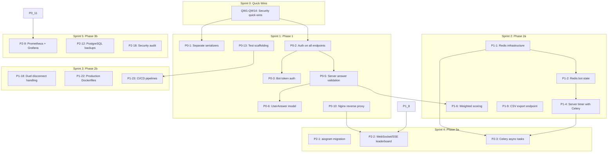

# Skill Division — Prioritized Action Plan & Roadmap

**Date:** 2026-04-03
**Prepared by:** Senior Technical Lead & Project Manager
**Audience:** Engineering Team, Stakeholders
**Team Size:** 4 developers (Backend, Frontend, Bot, DevOps)
**Sprint Cadence:** 2-week sprints

---

## 1. Executive Summary

### 1.1 Overall Project Health: 🔴 CRITICAL — NO-GO for Production

The Skill Division project has a solid architectural foundation (Django + DRF + PostgreSQL + React + TypeScript) but is **NOT production-ready** due to 17+ security vulnerabilities, zero test coverage, no CI/CD pipelines, and critical business logic gaps.

### 1.2 Go/No-Go Decision Matrix

| Criteria                       | Status    | Details                                               |
| ------------------------------ | --------- | ----------------------------------------------------- |
| Security vulnerabilities (P0)  | ❌ FAIL    | 5 critical vulnerabilities unaddressed                |
| Authentication & Authorization | ❌ FAIL    | All endpoints use AllowAny; auto-admin escalation     |
| Test coverage                  | ❌ FAIL    | 0% across all components                              |
| CI/CD pipelines                | ❌ FAIL    | Workflow files exist but reference non-existent tests |
| Data integrity                 | ❌ FAIL    | No answer validation; cheating trivial                |
| Infrastructure readiness       | ❌ FAIL    | DEBUG=True, ALLOWED_HOSTS=["*"], no Nginx, no SSL     |
| Documentation                  | ⚠️ PARTIAL | Core docs exist; test spec empty; ADRs missing        |
| Code quality tooling           | ✅ PASS    | Pre-commit, Ruff, ESLint configured                   |

### 1.3 Summary of Effort

| Phase                          | Duration | Sprints     | Story Points | Team Focus                                        |
| ------------------------------ | -------- | ----------- | ------------ | ------------------------------------------------- |
| Phase 1: Critical Fixes        | 2 weeks  | Sprint 1    | 40 SP        | Security, auth, data integrity                    |
| Phase 2: MVP Readiness         | 4 weeks  | Sprints 2-3 | 72 SP        | Infrastructure, reliability, testing foundation   |
| Phase 3: Quality & Reliability | 4 weeks  | Sprints 4-5 | 64 SP        | Monitoring, async, real-time, comprehensive tests |
| Phase 4: Post-MVP              | Ongoing  | Sprints 6+  | Variable     | Feature enhancements                              |

**Total to MVP-ready:** ~10 weeks (5 sprints), ~176 story points

---

## 2. Quick Wins (< 1 Day, High Impact)

These tasks can be completed immediately and provide disproportionate security/stability benefits.

| #    | Task                                                                     | Owner          | Effort | Impact   | Acceptance Criteria                                      |
| ---- | ------------------------------------------------------------------------ | -------------- | ------ | -------- | -------------------------------------------------------- |
| QW1  | Remove `correct_index` from public QuestionSerializer                    | Backend        | 1 hour | Critical | `/api/events/{id}/questions/` returns no correct answers |
| QW2  | Change `DEFAULT_PERMISSION_CLASSES` from `AllowAny` to `IsAuthenticated` | Backend        | 30 min | Critical | All API endpoints reject unauthenticated requests        |
| QW3  | Fix auto-admin privilege escalation in `CustomAuthToken`                 | Backend        | 30 min | Critical | New web logins get `participant` role by default         |
| QW4  | Set `DEBUG = False` via environment variable                             | Backend/DevOps | 30 min | High     | No stack traces exposed in production                    |
| QW5  | Restrict `ALLOWED_HOSTS` to specific domains                             | Backend/DevOps | 30 min | High     | Only configured domains accepted                         |
| QW6  | Remove database port 5432 from docker-compose.yml port mapping           | DevOps         | 15 min | Critical | DB only accessible via internal Docker network           |
| QW7  | Bind pgAdmin to `127.0.0.1:5050` only                                    | DevOps         | 15 min | High     | pgAdmin not accessible from external IPs                 |
| QW8  | Change hardcoded DB credentials to env vars                              | DevOps         | 30 min | Critical | `POSTGRES_PASSWORD` read from `.env`                     |
| QW9  | Add `timeout=10` to all `requests.*` calls in bot                        | Bot            | 1 hour | Medium   | Bot no longer hangs on unresponsive backend              |
| QW10 | Enable `verify_ssl_certs=True` for GigaChat                              | Bot            | 15 min | High     | SSL verification re-enabled                              |
| QW11 | Add `.env` to `.gitignore` (verify)                                      | DevOps         | 5 min  | Critical | Confirmed `.env` cannot be committed                     |
| QW12 | Generate unique `DJANGO_SECRET_KEY`                                      | DevOps         | 5 min  | High     | Secret key is 50+ random characters                      |
| QW13 | Create `CODEOWNERS` file                                                 | DevOps         | 30 min | Medium   | PRs auto-assign correct reviewers                        |
| QW14 | Create PR template                                                       | DevOps         | 1 hour | Medium   | All PRs follow consistent format                         |

**Total Quick Wins effort: ~5 hours (can be completed in a single half-day session)**

---

## 3. Technical Debt Register

These items block safe development and MUST be addressed before feature work continues.

| ID   | Debt Item                                                                    | Location                          | Risk     | Effort | Priority | Resolution Strategy                                            |
| ---- | ---------------------------------------------------------------------------- | --------------------------------- | -------- | ------ | -------- | -------------------------------------------------------------- |
| TD1  | No test files exist anywhere                                                 | All components                    | Critical | High   | P0       | Create test scaffolding + write first tests                    |
| TD2  | In-memory bot state (`user_data = {}`, `rooms = {}`)                         | `bot/bot.py:148-150`              | Critical | Medium | P0       | Migrate to Redis-backed state                                  |
| TD3  | No server-side answer validation                                             | `backend/api/views.py:173-210`    | Critical | Medium | P0       | Implement `SubmitAnswerView` with server-side verification     |
| TD4  | Thread-unsafe `threading.Timer` for quiz delays                              | `bot/bot.py:465`                  | High     | Medium | P0       | Replace with server-side timer (Celery)                        |
| TD5  | Scoring formula mismatch (documented vs actual)                              | All components                    | High     | Medium | P1       | Implement server-authoritative scoring with difficulty weights |
| TD6  | No 10-second timer exists (only 0.5s delay)                                  | `bot/bot.py:465`                  | High     | Medium | P1       | Implement Celery-based timer with 10s timeout                  |
| TD7  | `QuizResult` has no individual answer records                                | `backend/api/models.py`           | High     | Low    | P1       | Add `UserAnswer` model for audit trail                         |
| TD8  | No database indexes on FK fields                                             | `backend/api/models.py`           | Medium   | Low    | P1       | Add explicit `db_index=True` and composite indexes             |
| TD9  | No input validation on score submission                                      | `backend/api/views.py:173`        | High     | Low    | P0       | Add serializer validation + view-level checks                  |
| TD10 | Version mismatch: Django 4.2.16 LTS vs `>=5.0` in requirements               | `requirements.txt`                | Medium   | Low    | P1       | Pin to Django 5.x and update all dependencies                  |
| TD11 | Bot library mismatch: `pyTelegramBotAPI` vs documented `python-telegram-bot` | `bot/requirements.txt`            | Medium   | High   | P2       | Migrate to `aiogram 3.x` (async)                               |
| TD12 | Empty `utils/` directory in bot                                              | `bot/utils/`                      | Low      | Low    | P2       | Either implement or remove empty files                         |
| TD13 | Empty test specification document                                            | `docs/ru/4_test_specification.md` | Medium   | Medium | P1       | Populate with test scenarios                                   |
| TD14 | No API versioning                                                            | Global                            | Medium   | Low    | P2       | Add URL-based versioning (`/api/v1/`)                          |
| TD15 | `HashRouter` instead of `BrowserRouter` in frontend                          | `frontend/App.tsx`                | Low      | Low    | P2       | Migrate to `BrowserRouter` with Nginx config                   |

---

## 4. Phase 1: Critical Fixes (P0)

**Goal:** Make the application safe for internal testing. Eliminate all critical security vulnerabilities.
**Duration:** 2 weeks (Sprint 1)
**Story Points:** 40 SP
**Team Allocation:** All 4 developers

### 4.1 Tasks

| ID    | Task                                                               | Owner         | SP  | Dependencies | Acceptance Criteria                                                                                   |
| ----- | ------------------------------------------------------------------ | ------------- | --- | ------------ | ----------------------------------------------------------------------------------------------------- |
| P0-1  | Create separate serializers for public vs admin question responses | Backend       | 3   | QW1          | `QuizQuestionSerializer` excludes `correct_index`; `QuestionAdminSerializer` includes it              |
| P0-2  | Add authentication to all API endpoints                            | Backend       | 5   | QW2          | All endpoints return 401 for unauthenticated requests; bot uses token auth                            |
| P0-3  | Implement bot token authentication                                 | Backend + Bot | 5   | P0-2         | Bot sends `TG_BOT_TOKEN` header; backend validates against env var                                    |
| P0-4  | Fix auto-admin escalation; default to `participant`                | Backend       | 2   | QW3          | New web users get `participant` role; existing admin users preserved via migration                    |
| P0-5  | Implement server-side answer validation endpoint                   | Backend       | 8   | P0-2         | `POST /api/events/{id}/submit-answer/` validates answer against DB, calculates score server-side      |
| P0-6  | Add `UserAnswer` model for audit trail                             | Backend       | 3   | P0-5         | Model stores `session`, `question`, `answer_index`, `is_correct`, `response_time_ms`, `points_earned` |
| P0-7  | Add input validation to score submission                           | Backend       | 3   | P0-5         | Rejects negative scores, scores > max_score, non-integer values                                       |
| P0-8  | Add rate limiting to all API endpoints                             | Backend       | 3   | P0-2         | DRF throttling: 100/hour anon, 1000/hour authenticated, 10/hour login                                 |
| P0-9  | Replace `runserver` with Gunicorn                                  | DevOps        | 2   | QW4          | Backend runs `gunicorn skill_division.wsgi:application --workers 3`                                   |
| P0-10 | Add Nginx reverse proxy with SSL termination                       | DevOps        | 5   | P0-9         | Nginx routes `/api/` to backend, `/` to frontend; self-signed SSL for dev                             |
| P0-11 | Add health checks to all services                                  | DevOps        | 3   | P0-9         | `/health/` endpoint returns 200; docker-compose healthcheck for all services                          |
| P0-12 | Add resource limits to all containers                              | DevOps        | 2   | —            | CPU and memory limits defined in docker-compose                                                       |
| P0-13 | Create test scaffolding for all components                         | All           | 5   | —            | `pytest` configured for backend/bot; `vitest` configured for frontend; first passing test             |
| P0-14 | Write unit tests for serializers and views (critical paths)        | Backend       | 5   | P0-13        | 40% backend coverage on serializers and views                                                         |

### 4.2 Phase 1 Acceptance Criteria

- [ ] Zero critical security vulnerabilities remain
- [ ] All API endpoints require authentication
- [ ] Answers are validated server-side before scoring
- [ ] No correct answers exposed to quiz participants
- [ ] Gunicorn serves backend (not `runserver`)
- [ ] Nginx reverse proxy routes all traffic
- [ ] Health checks pass for all services
- [ ] At least 40% backend test coverage on critical paths
- [ ] `DEBUG=False` in production configuration

### 4.3 Phase 1 Risk Mitigation

| Risk                                            | Probability | Impact | Mitigation                                          |
| ----------------------------------------------- | ----------- | ------ | --------------------------------------------------- |
| Breaking bot auth during token migration        | Medium      | High   | Implement backward-compatible transition period     |
| Server-side answer validation changes quiz flow | High        | Medium | Test with existing quiz scenarios before deployment |
| Nginx config breaks Vite HMR in development     | Medium      | Medium | Separate dev/prod Nginx configs                     |

---

## 5. Phase 2: MVP Readiness (P1)

**Goal:** Make the application reliable, testable, and deployable for MVP launch.
**Duration:** 4 weeks (Sprints 2-3)
**Story Points:** 72 SP
**Team Allocation:** All 4 developers

### 5.1 Sprint 2 Tasks (Weeks 3-4)

| ID    | Task                                                     | Owner                    | SP  | Dependencies | Acceptance Criteria                                                      |
| ----- | -------------------------------------------------------- | ------------------------ | --- | ------------ | ------------------------------------------------------------------------ |
| P1-1  | Add Redis to docker-compose and integrate with bot       | DevOps + Bot             | 5   | P0-2         | Redis container runs; bot stores session state in Redis hashes           |
| P1-2  | Replace in-memory `user_data` with Redis-backed state    | Bot                      | 5   | P1-1         | Bot survives restart without losing active quiz sessions                 |
| P1-3  | Replace in-memory `rooms` and `quick_queue` with Redis   | Bot                      | 5   | P1-1         | Duel rooms persist across bot restarts                                   |
| P1-4  | Implement server-authoritative timer with Celery         | Backend                  | 8   | P0-5, P1-1   | 10-second timer enforced server-side; timeout applies penalty            |
| P1-5  | Implement `QuizSession` model with state machine         | Backend                  | 5   | P0-6         | Sessions track `active/completed/expired` status                         |
| P1-6  | Implement proper scoring formula with difficulty weights | Backend                  | 5   | P0-5, P1-4   | Score = Σ(correct × difficulty + speed_bonus) - penalties                |
| P1-7  | Add database indexes on FK and frequently queried fields | Backend                  | 3   | —            | Migrations add `idx_quizresult_event_score`, `idx_quizresult_user_score` |
| P1-8  | Add caching layer (Redis) for stats and leaderboard      | Backend                  | 5   | P1-1         | Stats endpoint cached for 60s; leaderboard cached for 30s                |
| P1-9  | Implement CSV export backend endpoint                    | Backend                  | 3   | P0-2         | `GET /api/events/{id}/export_csv/` returns downloadable CSV              |
| P1-10 | Connect frontend CSV export button to backend            | Frontend                 | 2   | P1-9         | Download triggers browser file save                                      |
| P1-11 | Implement event lifecycle state machine                  | Backend                  | 5   | —            | Event transitions: draft → scheduled → active → completed → archived     |
| P1-12 | Add role-based access control to all views               | Backend                  | 5   | P0-2         | `IsAdmin`, `IsHR`, `IsAdminOrHR` permission classes enforced             |
| P1-13 | Fix version mismatches (Django, bot library)             | Backend + Bot            | 3   | —            | `requirements.txt` matches actual installed versions                     |
| P1-14 | Write integration tests for API contract                 | Backend + Bot + Frontend | 5   | P0-13        | Contract tests validate request/response schemas                         |
| P1-15 | Populate test specification document                     | All                      | 3   | —            | `docs/ru/4_test_specification.md` contains test scenarios                |

### 5.2 Sprint 3 Tasks (Weeks 5-6)

| ID    | Task                                                  | Owner         | SP  | Dependencies | Acceptance Criteria                                                                   |
| ----- | ----------------------------------------------------- | ------------- | --- | ------------ | ------------------------------------------------------------------------------------- |
| P1-16 | Add idempotency to score/answer submission            | Backend       | 3   | P0-6         | Duplicate answer submissions return existing result (409 or 200 with cached response) |
| P1-17 | Add data consent mechanism to Profile model           | Backend       | 3   | —            | `data_consent` boolean field; export excludes non-consenting users                    |
| P1-18 | Implement duel disconnect detection and handling      | Bot + Backend | 5   | P1-3         | Detects player disconnect; awards win after 60s grace period                          |
| P1-19 | Add reconnection support for duels                    | Bot + Backend | 5   | P1-18        | Player can rejoin duel within 2-minute grace period                                   |
| P1-20 | Add comprehensive input sanitization to bot           | Bot           | 3   | —            | All user inputs HTML-escaped; max length enforced                                     |
| P1-21 | Add error handling and retry logic to bot API calls   | Bot           | 3   | —            | Failed API calls retry 3 times with exponential backoff                               |
| P1-22 | Implement production Dockerfiles (multi-stage builds) | DevOps        | 5   | P0-9         | Backend, frontend, bot use multi-stage builds; non-root users                         |
| P1-23 | Set up CI/CD pipelines with security scanning         | DevOps        | 5   | P0-13        | GitHub Actions run lint, test, build, security scan on every PR                       |
| P1-24 | Achieve 60% backend test coverage                     | Backend       | 5   | P0-14        | pytest-cov reports 60%+ coverage                                                      |
| P1-25 | Achieve 50% frontend test coverage                    | Frontend      | 5   | P0-13        | vitest reports 50%+ coverage                                                          |
| P1-26 | Achieve 50% bot test coverage                         | Bot           | 5   | P0-13        | pytest-cov reports 50%+ coverage                                                      |

### 5.3 Phase 2 Acceptance Criteria

- [ ] Bot state persists across restarts (Redis-backed)
- [ ] Server-enforced 10-second timer with penalty system
- [ ] Difficulty-weighted scoring formula implemented
- [ ] CSV export functional from frontend
- [ ] Event lifecycle state machine operational
- [ ] RBAC enforced on all endpoints
- [ ] Duel disconnect and reconnection handled
- [ ] Production Dockerfiles with multi-stage builds
- [ ] CI/CD pipelines pass on every PR
- [ ] 60% backend, 50% frontend, 50% bot test coverage
- [ ] All version mismatches resolved

---

## 6. Phase 3: Quality & Reliability (P2)

**Goal:** Achieve production-grade reliability, monitoring, and developer experience.
**Duration:** 4 weeks (Sprints 4-5)
**Story Points:** 64 SP
**Team Allocation:** All 4 developers

### 5.4 Sprint 4 Tasks (Weeks 7-8)

| ID   | Task                                               | Owner              | SP  | Dependencies | Acceptance Criteria                                                              |
| ---- | -------------------------------------------------- | ------------------ | --- | ------------ | -------------------------------------------------------------------------------- |
| P2-1 | Migrate bot to aiogram 3.x (async)                 | Bot                | 13  | P1-2, P1-3   | All bot handlers use async/await; built-in FSM replaces Redis manual management  |
| P2-2 | Add WebSocket/SSE for real-time leaderboard        | Backend + Frontend | 8   | P1-8         | Dashboard updates without polling when scores change                             |
| P2-3 | Add message queue (Celery + Redis) for async tasks | Backend + DevOps   | 5   | P1-1, P1-4   | Celery worker processes background tasks (AI generation, notifications, exports) |
| P2-4 | Implement AI question generation on backend        | Backend            | 5   | P2-3         | GigaChat called server-side; results stored in DB                                |
| P2-5 | Add comprehensive test suite (backend 80%)         | Backend            | 5   | P1-24        | pytest-cov reports 80%+ coverage                                                 |
| P2-6 | Add comprehensive test suite (frontend 70%)        | Frontend           | 5   | P1-25        | vitest reports 70%+ coverage                                                     |
| P2-7 | Add comprehensive test suite (bot 75%)             | Bot                | 5   | P1-26        | pytest-cov reports 75%+ coverage                                                 |
| P2-8 | Add E2E tests with Playwright                      | All                | 5   | P2-5, P2-6   | Critical user journeys tested end-to-end                                         |

### 5.5 Sprint 5 Tasks (Weeks 9-10)

| ID    | Task                                           | Owner    | SP  | Dependencies | Acceptance Criteria                                                     |
| ----- | ---------------------------------------------- | -------- | --- | ------------ | ----------------------------------------------------------------------- |
| P2-9  | Set up monitoring stack (Prometheus + Grafana) | DevOps   | 5   | P0-11        | Dashboards for API response time, error rate, DB connections, memory    |
| P2-10 | Add log aggregation (Loki + Grafana or ELK)    | DevOps   | 5   | P0-11        | Structured JSON logs from all services aggregated and searchable        |
| P2-11 | Add alerting thresholds                        | DevOps   | 3   | P2-9         | Alerts fire when: API p95 > 500ms, error rate > 1%, memory > 80%        |
| P2-12 | Implement backup strategy for PostgreSQL       | DevOps   | 3   | —            | Automated daily backups with 30-day retention; tested restore procedure |
| P2-13 | Add Sentry for error tracking                  | DevOps   | 3   | —            | Errors captured with stack traces, user context, release version        |
| P2-14 | Complete empty documentation files             | All      | 3   | —            | `4_test_specification.md` populated; ADRs created for key decisions     |
| P2-15 | Add API versioning (`/api/v1/`)                | Backend  | 3   | —            | All endpoints prefixed with `/api/v1/`; old routes redirect             |
| P2-16 | Migrate frontend to `BrowserRouter`            | Frontend | 2   | P0-10        | Nginx serves `index.html` for all non-API routes                        |
| P2-17 | Add performance benchmarks                     | Backend  | 3   | P2-5         | Load test results: 100 concurrent users, p95 < 500ms                    |
| P2-18 | Security audit and penetration testing         | DevOps   | 5   | All P0-P1    | External or internal pen test; all findings documented and triaged      |

### 5.6 Phase 3 Acceptance Criteria

- [ ] Bot runs on aiogram 3.x with async handlers
- [ ] Real-time leaderboard via WebSocket/SSE
- [ ] Celery processes async tasks (AI, notifications, exports)
- [ ] 80% backend, 70% frontend, 75% bot test coverage
- [ ] E2E tests cover critical user journeys
- [ ] Prometheus + Grafana monitoring operational
- [ ] Log aggregation functional and searchable
- [ ] Alerting thresholds configured and tested
- [ ] PostgreSQL backup and restore tested
- [ ] Sentry error tracking active
- [ ] All documentation complete and reviewed

---

## 7. Phase 4: Post-MVP Enhancements (P3)

**Goal:** Feature enhancements and scale preparation for growth.
**Duration:** Ongoing (Sprint 6+)
**Team Allocation:** Feature-driven

| ID   | Task                                     | Owner              | Priority | Description                                                               |
| ---- | ---------------------------------------- | ------------------ | -------- | ------------------------------------------------------------------------- |
| P3-1 | Mass messaging / broadcast functionality | Backend + Bot      | High     | Admin can send broadcast messages to all participants or filtered groups  |
| P3-2 | Configurable skill matrix weights        | Backend + Frontend | Medium   | Admin can configure Junior/Middle/Senior thresholds per event             |
| P3-3 | Multi-language support (i18n)            | All                | Medium   | Bot and frontend support Russian and English; backend stores translations |
| P3-4 | Advanced analytics dashboard             | Frontend + Backend | Medium   | Per-question analytics, skill gap analysis, trend charts                  |
| P3-5 | Question bank management                 | Backend + Frontend | Medium   | Reusable question pool with tagging, search, and quality scoring          |
| P3-6 | Team-based competitions                  | Backend + Bot      | Low      | Teams compete instead of individuals; aggregate team scores               |
| P3-7 | Anti-cheating measures                   | Backend            | Low      | Answer shuffling, time-window analysis, duplicate detection               |
| P3-8 | Horizontal scaling preparation           | DevOps             | Low      | PgBouncer connection pooling, read replicas, load balancer config         |
| P3-9 | Kubernetes migration path                | DevOps             | Low      | Helm charts, K8s manifests, autoscaling policies                          |

---

## 8. Sprint-by-Sprint Roadmap

### Team Composition

| Role                   | Responsibilities                                         |
| ---------------------- | -------------------------------------------------------- |
| **Backend Developer**  | Django, DRF, models, views, serializers, Celery tasks    |
| **Frontend Developer** | React, TypeScript, components, services, charts          |
| **Bot Developer**      | Telegram bot, handlers, AI integration, state management |
| **DevOps Engineer**    | Docker, Nginx, CI/CD, monitoring, infrastructure         |

### Sprint Calendar

```
Sprint 0 (Pre-work, 1 week) — Quick Wins
├── All team: Complete QW1-QW14 (half-day session)
└── DevOps: Set up branch protection, CODEOWNERS, PR templates

Sprint 1 (Weeks 1-2) — Phase 1: Critical Fixes
├── Backend: P0-1, P0-2, P0-4, P0-5, P0-6, P0-7, P0-8
├── Bot: P0-3 (bot token auth)
├── Frontend: Update API calls for auth headers
├── DevOps: P0-9, P0-10, P0-11, P0-12
└── All: P0-13, P0-14 (test scaffolding + first tests)
Deliverable: Secure, authenticated, server-validated quiz flow

Sprint 2 (Weeks 3-4) — Phase 2a: Reliability Foundation
├── Backend: P1-4, P1-5, P1-6, P1-7, P1-8, P1-9, P1-11, P1-12, P1-13
├── Bot: P1-2, P1-3 (Redis state migration)
├── Frontend: P1-10 (CSV export integration)
├── DevOps: P1-1 (Redis infrastructure)
└── All: P1-14, P1-15 (integration tests, test spec)
Deliverable: Persistent state, server timers, weighted scoring, CSV export

Sprint 3 (Weeks 5-6) — Phase 2b: MVP Completeness
├── Backend: P1-16, P1-17, P1-24
├── Bot: P1-18, P1-19, P1-20, P1-21, P1-26
├── Frontend: P1-25
├── DevOps: P1-22, P1-23 (production Docker, CI/CD)
└── All: Cross-component integration testing
Deliverable: MVP-ready application with 60/50/50% test coverage

Sprint 4 (Weeks 7-8) — Phase 3a: Quality & Async
├── Backend: P2-3, P2-4, P2-5
├── Bot: P2-1 (aiogram migration)
├── Frontend: P2-2 (WebSocket/SSE integration), P2-6
├── DevOps: P2-3 (Celery infrastructure)
└── All: P2-8 (E2E tests)
Deliverable: Async bot, real-time updates, AI question generation

Sprint 5 (Weeks 9-10) — Phase 3b: Monitoring & Polish
├── Backend: P2-15, P2-17
├── Frontend: P2-16 (BrowserRouter migration)
├── Bot: P2-7 (test coverage to 75%)
├── DevOps: P2-9, P2-10, P2-11, P2-12, P2-13
└── All: P2-14, P2-18 (docs, security audit)
Deliverable: Production-ready with monitoring, logging, backups

Sprint 6+ (Weeks 11+) — Phase 4: Post-MVP
├── P3-1: Mass messaging
├── P3-2: Configurable skill weights
├── P3-3: Multi-language support
└── ... as prioritized by product owner
```

### Gantt Overview

```
Week:    0    1    2    3    4    5    6    7    8    9    10   11+
        ├────┼────┼────┼────┼────┼────┼────┼────┼────┼────┼────┤
Sprint 0│ QW │
        ├────┼────┼────┼────┼────┼────┼────┼────┼────┼────┼────┤
Sprint 1│    │████████ Phase 1: Critical Fixes ████████│
        ├────┼────┼────┼────┼────┼────┼────┼────┼────┼────┼────┤
Sprint 2│    │    │    │████████ Phase 2a: Reliability ████████│
        ├────┼────┼────┼────┼────┼────┼────┼────┼────┼────┼────┤
Sprint 3│    │    │    │    │    │████████ Phase 2b: MVP Complete ████████│
        ├────┼────┼────┼────┼────┼────┼────┼────┼────┼────┼────┤
Sprint 4│    │    │    │    │    │    │    │████████ Phase 3a: Quality ████████│
        ├────┼────┼────┼────┼────┼────┼────┼────┼────┼────┼────┤
Sprint 5│    │    │    │    │    │    │    │    │    │████████ Phase 3b: Monitor ████████│
        ├────┼────┼────┼────┼────┼────┼────┼────┼────┼────┼────┤
Sprint 6│    │    │    │    │    │    │    │    │    │    │    │Phase 4→│
```

---

## 9. Testing Strategy

### 9.1 Coverage Targets

| Component    | Minimum | Critical Modules                  | E2E Coverage               |
| ------------ | ------- | --------------------------------- | -------------------------- |
| **Backend**  | 80%     | 95% (serializers, views, models)  | Critical user journeys     |
| **Frontend** | 70%     | 90% (services, hooks, API layer)  | Page rendering, user flows |
| **Bot**      | 75%     | 90% (handlers, API client, state) | Command flows              |

### 9.2 Framework Selection

| Component | Unit Testing             | Integration Testing       | E2E Testing | Mocking                    | Coverage          |
| --------- | ------------------------ | ------------------------- | ----------- | -------------------------- | ----------------- |
| Backend   | pytest + pytest-django   | pytest + APIClient        | Playwright  | pytest-mock, responses     | pytest-cov        |
| Frontend  | Vitest + Testing Library | MSW (Mock Service Worker) | Playwright  | MSW, vi.fn()               | vitest --coverage |
| Bot       | pytest + pytest-asyncio  | pytest + aioresponses     | —           | unittest.mock, pytest-mock | pytest-cov        |

### 9.3 Test Pyramid

```
                    ┌─────────────┐
                   │   E2E Tests  │     ← 5-10% of tests (~15 tests)
                  │  (Playwright) │
                 └───────┬───────┘
                ┌────────▼────────┐
               │ Integration Tests│    ← 20-30% of tests (~60 tests)
              │  (API contracts) │
             └────────┬─────────┘
            ┌─────────▼──────────┐
           │    Unit Tests       │   ← 60-75% of tests (~180 tests)
          │  (pytest, Vitest)   │
         └──────────────────────┘
```

### 9.4 Implementation Plan

#### Sprint 1 (P0-13, P0-14)

- [ ] Configure pytest with pytest-django, pytest-cov
- [ ] Configure vitest with @testing-library/react
- [ ] Write tests for all serializers (QuestionSerializer, EventSerializer)
- [ ] Write tests for authentication middleware
- [ ] Write tests for answer validation endpoint
- **Target:** 40% backend coverage on critical paths

#### Sprint 2 (P1-14)

- [ ] Write API contract tests (validate request/response schemas)
- [ ] Write bot API client tests (mock backend responses)
- [ ] Write frontend service tests (mock API responses with MSW)
- **Target:** 50% across all components

#### Sprint 3 (P1-24, P1-25, P1-26)

- [ ] Expand backend tests to 60% (views, models, permissions)
- [ ] Expand frontend tests to 50% (components, pages)
- [ ] Expand bot tests to 50% (handlers, state management)

#### Sprint 4 (P2-5, P2-6, P2-7, P2-8)

- [ ] Backend: 80% coverage (all views, serializers, models, tasks)
- [ ] Frontend: 70% coverage (all components, services, hooks)
- [ ] Bot: 75% coverage (all handlers, API client, FSM)
- [ ] E2E: Critical user journeys (quiz flow, duel, dashboard, CSV export)

#### Sprint 5 (P2-17)

- [ ] Performance benchmarks: 100 concurrent users, p95 < 500ms
- [ ] Load testing with Locust or k6

### 9.5 Test Execution in CI

| Test Type         | Trigger       | Timeout | Fail Pipeline?      |
| ----------------- | ------------- | ------- | ------------------- |
| Lint + Type Check | Every PR      | 5 min   | Yes                 |
| Unit Tests        | Every PR      | 10 min  | Yes                 |
| Integration Tests | Every PR      | 15 min  | Yes                 |
| E2E Tests         | Merge to main | 30 min  | Yes                 |
| Performance Tests | Weekly        | 20 min  | No (report only)    |
| Security Scan     | Every PR      | 10 min  | Yes (critical only) |

### 9.6 Test Quality Gates

- **No flaky tests:** Flaky tests must be fixed or quarantined within 1 sprint
- **Test review:** All tests reviewed in PR (same standards as production code)
- **Coverage enforcement:** Codecov blocks PR if coverage drops below threshold
- **Mutation testing:** Consider mutmut for backend in Phase 4

---

## 10. Monitoring & Logging Strategy

### 10.1 Monitoring Stack

```
┌─────────────────────────────────────────────────────┐
│                    Grafana Dashboard                  │
│  ┌──────────┐  ┌──────────┐  ┌──────────────────┐   │
│  │  API     │  │  Bot     │  │  Infrastructure  │   │
│  │  Metrics │  │  Metrics │  │  Metrics         │   │
│  └────┬─────┘  └────┬─────┘  └────────┬─────────┘   │
│       │              │                 │              │
│  ┌────▼──────────────▼─────────────────▼─────────┐   │
│  │              Prometheus                        │   │
│  │  (metrics collection & alerting)               │   │
│  └────────────────────┬───────────────────────────┘   │
│                       │                                │
│  ┌────────────────────▼───────────────────────────┐   │
│  │              Exporters                          │   │
│  │  • node_exporter (host metrics)                 │   │
│  │  • postgres_exporter (DB metrics)               │   │
│  │  • redis_exporter (cache metrics)               │   │
│  │  • Django middleware (app metrics)              │   │
│  └─────────────────────────────────────────────────┘   │
└─────────────────────────────────────────────────────┘
```

### 10.2 Key Metrics & Alerting Thresholds

| Metric                  | Source            | Warning      | Critical     | Action                            |
| ----------------------- | ----------------- | ------------ | ------------ | --------------------------------- |
| API Response Time (p95) | Prometheus        | > 300ms      | > 500ms      | Scale workers, check DB queries   |
| API Response Time (p99) | Prometheus        | > 500ms      | > 1000ms     | Investigate slow endpoints        |
| Error Rate (5xx)        | Prometheus        | > 0.5%       | > 1%         | Check logs, rollback if needed    |
| Error Rate (4xx)        | Prometheus        | > 5%         | > 10%        | Check for abuse or broken clients |
| Database Connections    | postgres_exporter | > 60% of max | > 80% of max | Add PgBouncer, optimize queries   |
| Memory Usage            | node_exporter     | > 70%        | > 85%        | Scale containers, check for leaks |
| CPU Usage               | node_exporter     | > 60%        | > 80%        | Scale horizontally                |
| Disk Usage              | node_exporter     | > 70%        | > 85%        | Clean logs, expand storage        |
| Redis Memory            | redis_exporter    | > 70%        | > 85%        | Evict old sessions, expand        |
| Bot Response Time       | Custom metric     | > 2s         | > 5s         | Check API latency, bot load       |
| Celery Queue Depth      | Custom metric     | > 100        | > 500        | Scale workers                     |
| Quiz Session Failures   | Custom metric     | > 1%         | > 5%         | Investigate timer/scoring bugs    |

### 10.3 Logging Strategy

#### Log Format (Structured JSON)

```python
# backend/skill_division/settings.py
LOGGING = {
    'version': 1,
    'disable_existing_loggers': False,
    'formatters': {
        'json': {
            '()': 'pythonjsonlogger.jsonlogger.JsonFormatter',
            'format': '%(asctime)s %(levelname)s %(name)s %(message)s %(pathname)s %(lineno)d'
        }
    },
    'handlers': {
        'console': {
            'class': 'logging.StreamHandler',
            'formatter': 'json',
        },
    },
    'root': {
        'handlers': ['console'],
        'level': 'INFO',
    },
    'loggers': {
        'django.security': {
            'level': 'WARNING',
            'propagate': False,
        },
        'api': {
            'level': 'DEBUG',
            'propagate': False,
        },
    },
}
```

#### Log Fields (Standardized)

| Field         | Type     | Description                           |
| ------------- | -------- | ------------------------------------- |
| `timestamp`   | ISO 8601 | When the event occurred               |
| `level`       | string   | DEBUG, INFO, WARNING, ERROR, CRITICAL |
| `service`     | string   | backend, frontend, bot                |
| `logger`      | string   | Module name                           |
| `message`     | string   | Human-readable description            |
| `user_id`     | int      | Authenticated user ID (if applicable) |
| `request_id`  | UUID     | Unique request identifier for tracing |
| `duration_ms` | int      | Request/operation duration            |
| `status_code` | int      | HTTP status code (API requests)       |
| `error`       | object   | Exception type, message, traceback    |

#### Log Aggregation Architecture

```
┌──────────┐  ┌──────────┐  ┌──────────┐
│ Backend  │  │ Frontend │  │   Bot    │
│ (JSON)   │  │ (console)│  │ (JSON)   │
└────┬─────┘  └────┬─────┘  └────┬─────┘
     │              │              │
     └──────────────┼──────────────┘
                    │
             ┌──────▼──────┐
             │   Fluentd   │
             │  (collector)│
             └──────┬──────┘
                    │
             ┌──────▼──────┐
             │    Loki     │
             │  (storage)  │
             └──────┬──────┘
                    │
             ┌──────▼──────┐
             │   Grafana   │
             │  (query/UI) │
             └─────────────┘
```

### 10.4 Error Tracking (Sentry)

| Integration | Configuration                              |
| ----------- | ------------------------------------------ |
| Django      | `sentry-sdk[django]` with release tracking |
| React       | `@sentry/react` with user context          |
| Bot         | `sentry-sdk` manual capture for bot errors |

**Sentry Alert Rules:**

- New error in release → Immediate notification
- Error rate spike (> 2x baseline) → Warning
- Critical error (unhandled exception) → Page team on-call

### 10.5 Uptime Monitoring

| Tool                      | Purpose               | Check Interval |
| ------------------------- | --------------------- | -------------- |
| Uptime Kuma (self-hosted) | HTTP health checks    | 30 seconds     |
| Telegram bot health       | Bot responsiveness    | 5 minutes      |
| Database connectivity     | Internal health check | 1 minute       |

---

## 11. Scaling Roadmap

### 11.1 Current Architecture (MVP: ~100 Concurrent Users)

```
┌─────────────────────────────────────────────────┐
│                   Single Server                  │
│  ┌────────┐  ┌────────┐  ┌──────┐  ┌────────┐  │
│  │ Nginx  │  │Gunicorn│  │ Bot  │  │Postgres│  │
│  │  :80   │→ │  :8000 │  │      │  │  :5432 │  │
│  └────────┘  └───┬────┘  └──┬───┘  └───┬────┘  │
│                  │           │           │       │
│              ┌───▼───────────▼───────────▼───┐   │
│              │          Redis                │   │
│              │  (cache + session + queue)    │   │
│              └───────────────────────────────┘   │
└─────────────────────────────────────────────────┘

Capacity: ~100 concurrent users
Bottleneck: Single server, single DB instance
Cost: ~$50-100/month (VPS)
```

### 11.2 Scale to 1,000 Concurrent Users

```
┌──────────────────────────────────────────────────────────────┐
│                        Load Balancer                          │
│                        (Nginx/HAProxy)                        │
└──────────┬───────────────────────┬──────────────────┬─────────┘
           │                       │                  │
    ┌──────▼──────┐         ┌──────▼──────┐    ┌──────▼──────┐
    │  Backend #1 │         │  Backend #2 │    │  Backend #3 │
    │  Gunicorn   │         │  Gunicorn   │    │  Gunicorn   │
    │  4 workers  │         │  4 workers  │    │  4 workers  │
    └──────┬──────┘         └──────┬──────┘    └──────┬──────┘
           │                       │                  │
           └───────────────────────┼──────────────────┘
                                   │
              ┌────────────────────┼────────────────────┐
              │                    │                    │
       ┌──────▼──────┐      ┌──────▼──────┐      ┌──────▼──────┐
       │   Redis #1   │      │   Redis #2   │      │  PostgreSQL │
       │   (cache)    │      │   (session)  │      │  (primary)  │
       └──────────────┘      └──────────────┘      └──────┬──────┘
                                                          │
                                                   ┌──────▼──────┐
                                                   │  PostgreSQL │
                                                   │  (replica)  │
                                                   └─────────────┘

Changes from MVP:
• Horizontal backend scaling (3 instances, 12 workers total)
• Redis split: cache vs session (dedicated instances)
• PostgreSQL read replica for leaderboard/stats queries
• Load balancer with health checks
• PgBouncer connection pooling

Capacity: ~1,000 concurrent users
Bottleneck: Bot (single instance, polling-based)
Cost: ~$300-500/month (cloud VPS)
```

### 11.3 Scale to 10,000+ Concurrent Users

```
┌──────────────────────────────────────────────────────────────────────┐
│                          Cloud Load Balancer                          │
│                        (AWS ALB / GCP LB / Nginx)                     │
└──────┬──────────────┬──────────────┬──────────────┬──────────────────┘
       │              │              │              │
  ┌────▼────┐    ┌────▼────┐    ┌────▼────┐    ┌────▼────┐
  │Backend #1│    │Backend #2│    │Backend #3│    │Backend #N│
  │(Auto-scale│    │(Auto-scale│    │(Auto-scale│    │(Auto-scale│
  │ 4-20 pods)│    │ 4-20 pods)│    │ 4-20 pods)│    │ 4-20 pods)│
  └────┬─────┘    └────┬─────┘    └────┬─────┘    └────┬─────┘
       │               │               │               │
       └───────────────┴───────┬───────┴───────────────┘
                               │
              ┌────────────────┼────────────────┐
              │                │                │
       ┌──────▼──────┐  ┌──────▼──────┐  ┌──────▼──────┐
       │  Redis Cluster│  │  Celery     │  │  PostgreSQL │
       │  (6 nodes)    │  │  Workers    │  │  Cluster    │
       │  Sentinel     │  │  (4-12)     │  │  (1 primary │
       └───────────────┘  └─────────────┘  │   2 replicas)│
                                           └──────┬──────┘
                                                  │
                                           ┌──────▼──────┐
                                           │   S3/GCS    │
                                           │  (backups)  │
                                           └─────────────┘

Changes from 1K users:
• Kubernetes orchestration (EKS/GKE)
• Auto-scaling backend pods (HPA based on CPU/memory)
• Redis Cluster with Sentinel for HA
• Celery workers auto-scale with queue depth
• PostgreSQL cluster with automatic failover
• CDN for static assets (frontend build)
• Bot scaled horizontally with webhook mode (not polling)

Capacity: ~10,000+ concurrent users
Bottleneck: PostgreSQL write throughput
Cost: ~$1,500-3,000/month (cloud infrastructure)
```

### 11.4 Scaling Preparation Tasks (Phase 4)

| Task                        | When     | Effort | Description                                          |
| --------------------------- | -------- | ------ | ---------------------------------------------------- |
| Add PgBouncer               | Sprint 6 | 2 SP   | Connection pooling for 1K+ users                     |
| Add read replica            | Sprint 7 | 3 SP   | Offload read-heavy queries (leaderboard, stats)      |
| Bot webhook mode            | Sprint 7 | 5 SP   | Replace polling with webhooks for horizontal scaling |
| CDN for static assets       | Sprint 6 | 1 SP   | Serve frontend build from edge locations             |
| Database query optimization | Sprint 5 | 3 SP   | Eliminate N+1 queries, add missing indexes           |
| Load testing                | Sprint 5 | 3 SP   | Benchmark at 100, 500, 1000 concurrent users         |

### 11.5 Scaling Decision Matrix

| Metric                | Threshold         | Action                                          |
| --------------------- | ----------------- | ----------------------------------------------- |
| Concurrent users      | > 200             | Add backend instance, increase Gunicorn workers |
| API p95 response time | > 500ms sustained | Add Redis caching, optimize slow queries        |
| DB connections        | > 70% of max      | Add PgBouncer                                   |
| Memory usage          | > 80% sustained   | Scale vertically or add instances               |
| Bot response time     | > 5s sustained    | Migrate to webhook mode, add workers            |
| Celery queue depth    | > 200 pending     | Scale Celery workers                            |

---

## 12. Risk Register

| ID  | Risk                                                 | Probability | Impact   | Severity | Mitigation                                                           | Owner         |
| --- | ---------------------------------------------------- | ----------- | -------- | -------- | -------------------------------------------------------------------- | ------------- |
| R1  | Security breach due to unpatched vulnerabilities     | Medium      | Critical | 🔴 HIGH   | Complete Phase 1 before any external testing; regular security scans | DevOps        |
| R2  | Data loss from bot restart (in-memory state)         | High        | High     | 🔴 HIGH   | P1-2, P1-3 (Redis migration) in Sprint 2                             | Bot Dev       |
| R3  | Cheating via API manipulation (no server validation) | High        | High     | 🔴 HIGH   | P0-5, P0-6 (server-side validation) in Sprint 1                      | Backend Dev   |
| R4  | API contract drift between backend and consumers     | High        | Medium   | 🟡 MEDIUM | P1-14 (contract tests); OpenAPI spec as source of truth              | All           |
| R5  | Team member leaves (knowledge silo)                  | Medium      | High     | 🟡 MEDIUM | Cross-component code reviews; ADRs; pair programming                 | Tech Lead     |
| R6  | GigaChat API unavailability                          | Medium      | Medium   | 🟡 MEDIUM | Fallback to static question bank; circuit breaker pattern            | Bot Dev       |
| R7  | Scope creep delays MVP launch                        | High        | Medium   | 🟡 MEDIUM | Strict phase boundaries; P3 items deferred to post-MVP               | Product Owner |
| R8  | Database migration conflicts                         | Low         | High     | 🟡 MEDIUM | DevOps approval for migrations; migration review process             | Backend Dev   |
| R9  | Frontend-backend integration bugs                    | Medium      | Medium   | 🟡 MEDIUM | Contract tests; MSW mocking; integration test suite                  | Frontend Dev  |
| R10 | Insufficient test coverage leads to regression       | High        | Medium   | 🟡 MEDIUM | Coverage gates in CI; minimum thresholds enforced                    | All           |
| R11 | Docker Compose environment drift                     | Low         | High     | 🟡 MEDIUM | Pin image versions; automated environment validation                 | DevOps        |
| R12 | Telegram API rate limiting affects bot               | Medium      | Low      | 🟢 LOW    | Implement request queuing; respect rate limits                       | Bot Dev       |
| R13 | PostgreSQL performance degradation at scale          | Medium      | High     | 🟡 MEDIUM | Add indexes, query optimization, read replica prep                   | Backend Dev   |
| R14 | AI-generated questions are low quality               | Medium      | Medium   | 🟡 MEDIUM | Human review workflow; quality scoring; fallback to manual           | Backend Dev   |
| R15 | GDPR compliance violation (data consent)             | Medium      | Critical | 🔴 HIGH   | P1-17 (consent mechanism) in Sprint 3; legal review                  | Backend Dev   |

### Risk Heat Map

```
Impact
  High  │  R1  R3         R2  R5
        │                    R8  R13
 Medium │        R4  R9  R10     R14
        │              R11         R15
  Low   │                    R12
        └────────────────────────────
         Low    Medium    High
              Probability
```

---

## Appendix A: Definition of Done

A task is considered **Done** when:

1. **Code complete:** All implementation code written and reviewed
2. **Tests pass:** Unit, integration, and E2E tests pass in CI
3. **Coverage met:** Coverage targets met or exceeded for affected modules
4. **Documentation updated:** Relevant docs, ADRs, and comments updated
5. **Security reviewed:** No new vulnerabilities introduced
6. **Deployed:** Merged to main and deployed to staging/production
7. **Monitored:** Metrics and logs confirm correct behavior in production

## Appendix B: Story Point Estimation Guide

| SP  | Effort    | Complexity        | Example                                           |
| --- | --------- | ----------------- | ------------------------------------------------- |
| 1   | < 2 hours | Trivial           | Add env var, fix typo                             |
| 2   | 2-4 hours | Simple            | Add serializer field, create model                |
| 3   | 4-8 hours | Moderate          | Add permission class, implement endpoint          |
| 5   | 1-2 days  | Complex           | Implement state machine, migrate library          |
| 8   | 2-3 days  | Very Complex      | Server-side timer with Celery, aiogram migration  |
| 13  | 3-5 days  | Extremely Complex | Full test suite for a component, monitoring stack |

## Appendix C: Dependency Graph



---

*This action plan is a living document. Update it at the end of each sprint based on velocity, feedback, and changing priorities.*
