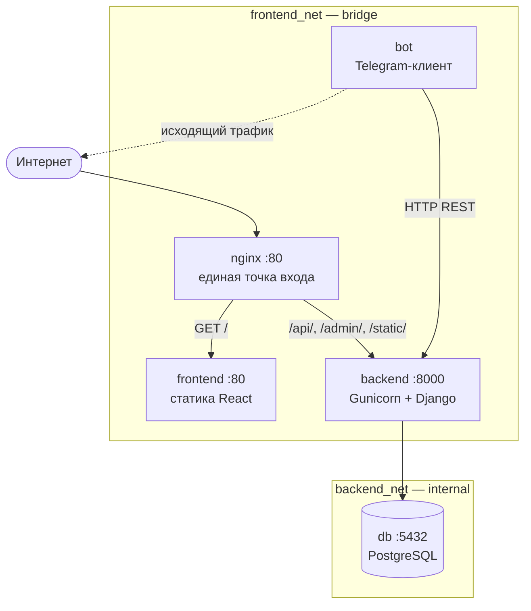
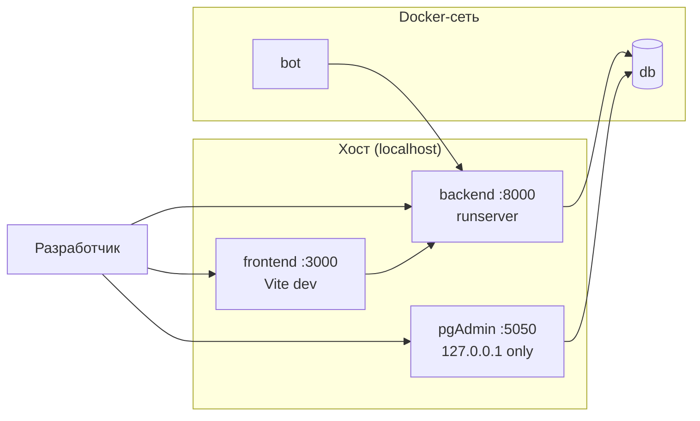
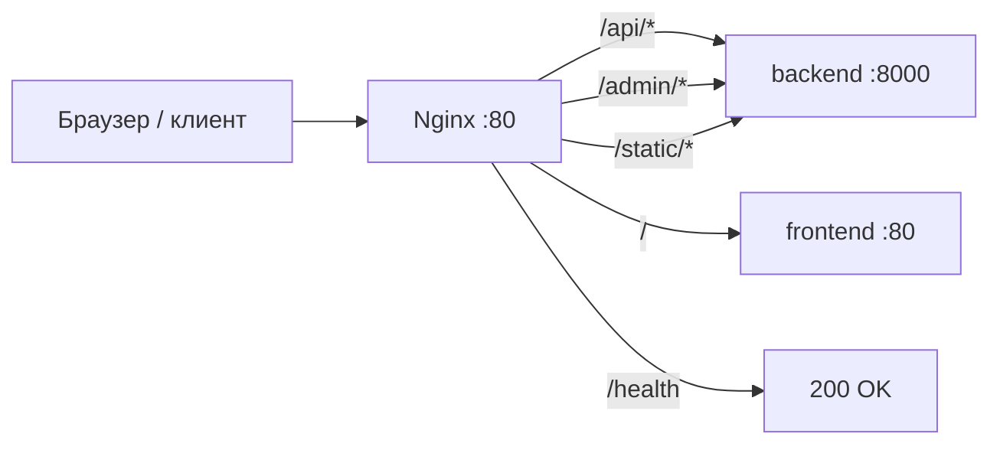
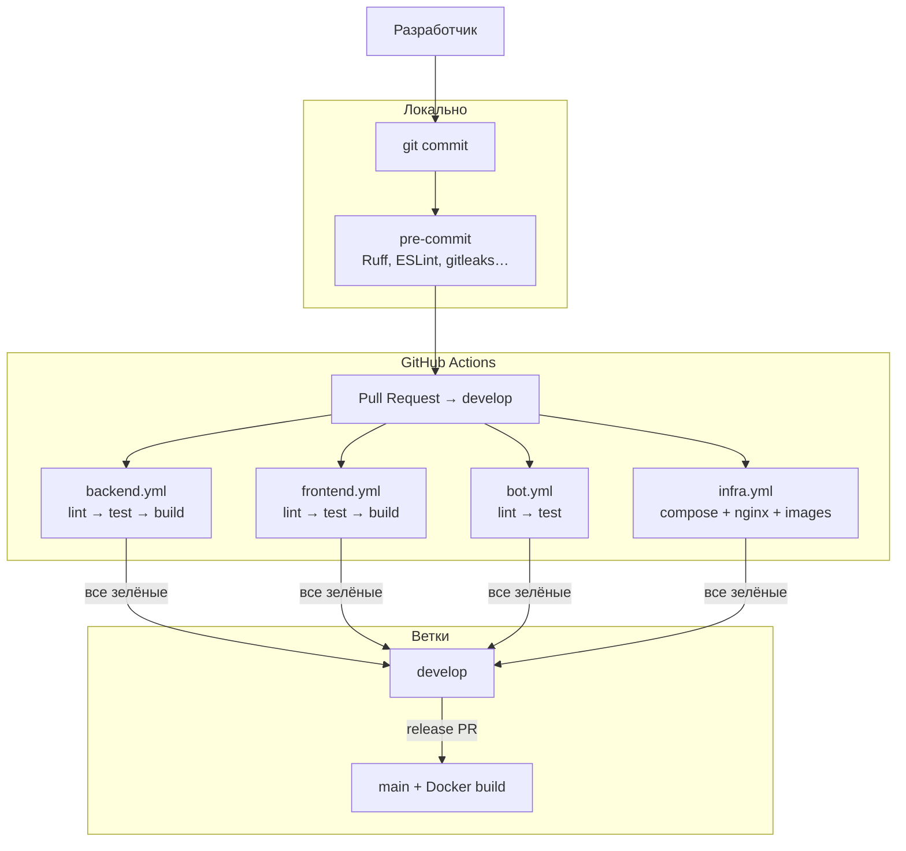

# Руководство по развёртыванию Skill Division

## Содержание

- [Требования к окружению](#требования-к-окружению)
- [Структура инфраструктуры](#структура-инфраструктуры)
- [Топология сети контейнеров](#топология-сети-контейнеров)
- [Управление конфигурацией и секретами](#управление-конфигурацией-и-секретами)
- [Развёртывание в среде разработки (dev)](#развёртывание-в-среде-разработки-dev)
- [Развёртывание в production](#развёртывание-в-production)
- [Конфигурация Nginx](#конфигурация-nginx)
- [Конвейер непрерывной интеграции](#конвейер-непрерывной-интеграции)
- [Бэкап базы данных](#бэкап-базы-данных)
- [Полезные команды](#полезные-команды)

---

## Требования к окружению

| Инструмент | Минимальная версия | Назначение |
|---|---|---|
| Docker Engine | 24.0 | Запуск контейнеров |
| Docker Compose | v2.20 | Оркестрация сервисов |
| Git | 2.40 | Клонирование и управление ветками |

Все сервисы (Backend, Frontend, Bot, PostgreSQL) работают внутри Docker — дополнительная установка Python, Node.js или PostgreSQL на хост не требуется.

---

## Структура инфраструктуры

Программный комплекс состоит из пяти контейнерных сервисов:

| Сервис | Образ / Сборка | Роль |
|---|---|---|
| `nginx` | `nginx:1.25-alpine` | Обратный прокси, точка входа |
| `backend` | `./backend/Dockerfile.prod` | Django + Gunicorn, REST API |
| `frontend` | `./frontend/Dockerfile.prod` | React SPA, собранный статикой |
| `bot` | `./bot/Dockerfile` | Telegram-бот |
| `db` | `postgres:14.12-alpine` | База данных PostgreSQL |

Для разработки используется `docker-compose.yml` (dev), для боевого развёртывания — `docker-compose.prod.yml` (prod). Оба файла читают переменные из одного `.env` в корне проекта.

---

## Топология сети контейнеров

### Production (`docker-compose.prod.yml`)



### Development (`docker-compose.yml`)



**Правила сетевой изоляции:**

- `backend_net` — сеть с флагом `internal: true`. DB видна только Backend, прямого доступа извне нет.
- `frontend_net` — обычная bridge-сеть. Nginx, Backend, Frontend и Bot.
- PostgreSQL не имеет открытого порта на хост ни в dev, ни в prod.
- pgAdmin в dev доступен только на `127.0.0.1:5050` (не в публичную сеть).

**Таблица портов:**

| Среда | Сервис | Хост → Контейнер | Примечание |
|---|---|---|---|
| Dev | Backend | `0.0.0.0:8000 → 8000` | Прямой доступ для разработки |
| Dev | Frontend | `0.0.0.0:3000 → 3000` | Vite dev-сервер с HMR |
| Dev | pgAdmin | `127.0.0.1:5050 → 80` | Только localhost |
| Prod | Nginx | `0.0.0.0:80 → 80` | Единственная точка входа |
| Оба | DB | — | Только внутри Docker-сети |

---

## Управление конфигурацией и секретами

Все чувствительные параметры хранятся в файле `.env` в корне проекта. Файл добавлен в `.gitignore` и **никогда не попадает в систему контроля версий**.

В репозитории хранится `.env.example` — шаблон со всеми необходимыми переменными:

```env
# Database
POSTGRES_DB=skilldivision
POSTGRES_USER=postgres
POSTGRES_PASSWORD=change-me-in-production

# Django
DJANGO_SECRET_KEY=change-me-generate-random-key
DJANGO_DEBUG=True
DJANGO_ALLOWED_HOSTS=localhost,127.0.0.1,backend

# Telegram Bot
TG_TOKEN=your-telegram-bot-token
BACKEND_API_URL=http://backend:8000/api

# AI
GIGACHAT_TOKEN=your-gigachat-credentials
GEMINI_API_KEY=your-gemini-api-key

# Frontend
VITE_API_URL=http://localhost:8000/api   # dev
# VITE_API_URL=/api                      # prod
```

Для генерации `DJANGO_SECRET_KEY`:

```bash
python -c "from django.core.management.utils import get_random_secret_key; print(get_random_secret_key())"
```

Дополнительный уровень защиты — pre-commit хук **gitleaks**, который сканирует каждый коммит на наличие секретов и блокирует коммит при их обнаружении.

---

## Развёртывание в среде разработки (dev)

### Первый запуск

```bash
# 1. Скопировать шаблон переменных
cp .env.example .env
# Заполнить TG_TOKEN, GIGACHAT_TOKEN и остальные значения

# 2. Собрать образы и запустить контейнеры
docker compose up -d --build

# 3. Применить миграции БД
docker compose exec backend python manage.py migrate

# 4. Создать суперпользователя (для входа в веб-интерфейс)
docker compose exec backend python manage.py createsuperuser
```

### Адреса после запуска

| Интерфейс | URL |
|---|---|
| Веб-приложение (React) | <http://localhost:3000> |
| Backend API | <http://localhost:8000/api/> |
| Django Admin | <http://localhost:8000/admin/> |
| pgAdmin | <http://localhost:5050> (host: `db`, port: `5432`) |

### Управление

```bash
# Перезапуск одного сервиса
docker compose restart backend

# Просмотр логов в реальном времени
docker compose logs -f backend
docker compose logs -f bot

# Остановка без удаления данных
docker compose down

# Полный сброс (включая volumes с данными БД)
docker compose down -v
```

---

## Развёртывание в production

### Подготовка `.env` для prod

Перед первым запуском в production обязательно измените:

```env
DJANGO_DEBUG=False
DJANGO_SECRET_KEY=<длинная случайная строка>
POSTGRES_PASSWORD=<надёжный пароль>
DJANGO_ALLOWED_HOSTS=yourdomain.com,www.yourdomain.com
CORS_ALLOWED_ORIGINS=https://yourdomain.com
VITE_API_URL=/api
```

### Запуск

```bash
docker compose -f docker-compose.prod.yml up -d --build

# Миграции
docker compose -f docker-compose.prod.yml exec backend python manage.py migrate

# Суперпользователь
docker compose -f docker-compose.prod.yml exec backend python manage.py createsuperuser
```

### Адрес после запуска

| Интерфейс | URL |
|---|---|
| Веб-приложение + API | <http://yourdomain.com> |
| API | <http://yourdomain.com/api/> |
| Django Admin | <http://yourdomain.com/admin/> |

### Отличия prod от dev

| Параметр | Dev | Prod |
|---|---|---|
| Web-сервер Django | `runserver` | Gunicorn (3 воркера) |
| Фронтенд | Vite dev-сервер (HMR) | Собранный `dist/` через Nginx |
| Маршрутизация | Прямые порты 3000/8000 | Единый Nginx :80 |
| DB порт на хост | — | — (оба без) |
| `DEBUG` | `True` | `False` |
| Hot reload | Да | Нет |

---

## Конфигурация Nginx

В production Nginx выступает единственной точкой входа и выполняет три функции:

1. **Маршрутизация трафика** — разделяет запросы к API и статическому фронтенду.
2. **Проксирование** — перенаправляет запросы на нужные контейнеры по Docker DNS.
3. **Изоляция** — Backend и Frontend не имеют открытых портов на хост.

Таблица маршрутов (`nginx/nginx.conf`):

| Путь | Назначение | Контейнер |
|---|---|---|
| `/api/*` | REST API | `backend:8000` |
| `/admin/*` | Django Admin | `backend:8000` |
| `/static/*` | Статика Django | `backend:8000` |
| `/` | React SPA | `frontend:80` |
| `/health` | Healthcheck Nginx | Возвращает `200 healthy` |



Имена контейнеров (`backend`, `frontend`) резолвятся через встроенный Docker DNS (`resolver 127.0.0.11`) в runtime, а не при старте Nginx. Это позволяет корректно проверять синтаксис конфига (`nginx -t`) в CI-окружении без реальной Docker-сети.

---

## Конвейер непрерывной интеграции

В репозитории настроены четыре GitHub Actions workflow:

| Workflow | Триггер | Задачи |
|---|---|---|
| `backend.yml` | Push/PR в `backend/**` | Ruff, mypy, pytest (4 smoke-теста), сборка образа (только `main`) |
| `frontend.yml` | Push/PR в `frontend/**` | ESLint, tsc, vitest, сборка dist |
| `bot.yml` | Push/PR в `bot/**` | Ruff, mypy, тесты (если есть) |
| `infra.yml` | Push/PR в `docker-compose*`, `nginx/**`, `Dockerfile*` | Валидация compose-файлов, nginx -t, сборка всех образов |

**Двухуровневая защита качества:**

- **pre-commit** (локально, до отправки) — Ruff, mypy, ESLint, gitleaks, markdownlint.
- **GitHub Actions** (в облаке, при PR) — полный набор проверок в изолированном окружении.



Слияние в ветку `develop` возможно только после прохождения всех CI-проверок.

---

## Бэкап базы данных

Ручной дамп (dev и prod):

```bash
# Создать дамп
docker compose exec db pg_dump -U $POSTGRES_USER $POSTGRES_DB > backup_$(date +%Y%m%d_%H%M%S).sql

# Восстановить из дампа
docker compose exec -T db psql -U $POSTGRES_USER $POSTGRES_DB < backup.sql
```

Для prod — автоматизированный скрипт `scripts/backup-db.sh` (cron, ежедневно в 02:00):

```bash
# Добавить в crontab на сервере
0 2 * * * /path/to/project/scripts/backup-db.sh >> /var/log/skilldivision-backup.log 2>&1
```

---

## Полезные команды

```bash
# Статус всех контейнеров
docker compose ps

# Просмотр логов конкретного сервиса
docker compose logs -f backend

# Выполнить команду Django
docker compose exec backend python manage.py <команда>

# Проверить конфигурацию compose без запуска
docker compose config -q
docker compose -f docker-compose.prod.yml config -q

# Пересобрать один образ
docker compose build backend

# Подключиться к PostgreSQL
docker compose exec db psql -U $POSTGRES_USER $POSTGRES_DB
```
